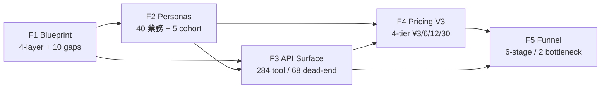

# jpcite CL11 — F1-F5 Audit Consolidation SOT (2026-05-17)

**Status**: LANDED 2026-05-17 evening. Consolidation of 5 audit deliverables (F1-F5) into single SOT.
**Lane**: `[lane:solo]`. Append-only consolidation; individual F docs remain authoritative for their own scope.
**Author**: Claude (Stage 1 F1-F5 sweep, jpcite Wave 51 post-RC1 closeout).
**Scope**: Cross-link 5 F docs, identify outstanding items, dependency graph, status today, operator decision gate, next-action queue.

---

## § 1. F1-F5 Individual Summary

### F1 — Blueprint (Architecture)

**Source**: `docs/_internal/JPCITE_BLUEPRINT_2026_05_17.md` (16,215B, authored 12:53 JST).
**Substance**: 4-layer architecture (Data / Inference / API / Agent UX) mermaid + 4-cohort × 4-layer thickness matrix (16 cells filled with THICK / thin / partial / —) + gap top 10 + 1-week/1-month/3-month improvement priorities.

The blueprint frames the post-Wave-51 (Dim K-S 9/9 + L1/L2 landed) state and identifies the structural cone L1 → L2 → L3 → L4. Layer ownership table maps each layer to owner module, canonical SOT path, and health probe. The 10 gaps are ranked by agent-UX impact × difficulty, not by one-off bugs; #1 is L2 cohort-specific inference heads absent (all 5 models are generic), #2 is cookbook 22 recipes lean tax-side. Improvement priorities respect non-negotiable constraints (NO LLM in src/, NO tier-SKU, NO paid acquisition).

### F2 — Cohort Personas (40 業務 mapping)

**Source**: `docs/_internal/JPCITE_COHORT_PERSONAS_2026_05_17.md` (28,001B, authored 12:54 JST).
**Substance**: 5 cohort (税理士 / 会計士 / 行政書士 / 司法書士 / 中小経営者) × ~8 業務 = **40 業務** evaluated on 5 axes (cadence / friction / endpoint fit / ¥3 economics / surface coverage).

Distribution: **14 業務 (35%) 現状 1 call / 18 業務 (45%) N round-trip → composed 化候補 / 8 業務 (20%) 未対応** (士業独占越権 + scope 外). Top 15 high-value cohort-crossing endpoints (`tax_rule_full_chain`, `houjin_360`, `case_cohort_match`, `invoice_registrants/*`, `evidence/packets/batch`, ...) — 5 of 15 are top-3 entry in multiple cohorts (multi-cohort surface 訴求成立). ¥3/req leverage range 80-16,000x against human/外注 alternatives.

### F3 — API Surface Design

**Source**: `docs/_internal/JPCITE_API_SURFACE_DESIGN_2026_05_17.md` (25,495B, authored 12:58 JST).
**Substance**: READ-ONLY enumeration of every `@mcp.tool` across the 5 module roots — **284 distinct tools** (post-Moat-N + Wave 59-B + Wave 51 + intel_wave32 +24 healthcare/real-estate). 4-layer taxonomy (L1 atomic 171 / L2 composed 56 / L3 heavy_endpoint 4 / L4 workflow 53).

Composability matrix: **68 of 171 L1 atomics are dead-end** (40% of L1 never referenced by any L2/L3/L4 tool body). Classification: K=38 (intentional standalone), W=27 (wrap candidates for existing composites), D=3 (deprecation), G=0. Top 15 most-composed atomics (8.8% of L1) participate in roughly half of all higher-tier bodies. 13-prefix discoverability convention proposed (`search_/get_/list_/find_/match_/check_/walk_/resolve_/prepare_/outcome_/pack_/agent_/jpcite_`).

### F4 — Pricing V3 (4-tier Agent-Economy First)

**Source**: `docs/_internal/JPCITE_PRICING_V3_2026_05_17.md` (7,608B, authored 17:28 JST — most recent F doc).
**Substance**: 4-tier band V3 wire-default starting 2026-05-17. Unit price **¥3/billable unit** stays (CLAUDE.md hard guard). Only `billable_units` per tier changes: **A=1/¥3 atomic, B=2/¥6 composed, C=4/¥12 heavy_endpoint, D=10/¥30 workflow** (D-band `[¥30, ¥120]` for A5 multi-pack).

Replaces V2 (¥200-¥1,000 per call) which was empirically above Sonnet 4.6 self-compose price-anchor (¥7.5-¥30). V3 stays inside agent-skip threshold at every tier (A wins by ¥0.75 vs Sonnet 1-turn; D parity vs Sonnet 8-turn but saves 60% vs Opus 8-turn). 1M req/月 mix projection = **¥6.84M/月 avg ¥6.84/req**, x1.88..x2.28 uplift vs uniform Tier-A-only. V2 module untouched in `pricing_v2.py` for rollback (`JPCITE_PRICING_VERSION=v2`).

### F5 — Agent Funnel 6-Stage Alignment

**Source**: `docs/_internal/JPCITE_AGENT_FUNNEL_AUDIT_2026_05_17.md` (10,341B, authored 12:55 JST).
**Substance**: 6-stage funnel (Discoverability → Justifiability → Trustability → Accessibility → Payability → Retainability) state map. **4 stages LIVE** (D/J/T/A — full surface across `llms.txt`/sitemaps/well-known/calculator/disclaimer envelope/MCP+REST/cookbook). **2 bottlenecks**:

- **Retainability (Stage 6)** — substrate (cron, tables, REST, Slack/email) LIVE but engagement loop is invisible to a new agent. No `.well-known/retention.json`, no D30 number publicly surfaced.
- **Payability (Stage 5)** — Stripe LIVE but x402 + Credit Wallet schema-ready, **first real txn pending**. Multi-rail story is theoretical until 1 paid x402 trade flows.

Conversion funnel target (希望値): 20% × 60% × 40% × 15% × 30% × 45% ≈ **0.097%** of impressionable agent queries become repeat-user revenue at month-2.

---

## § 2. Outstanding Items per F Doc

### F1 — 10 Structural Gaps

| # | Gap | Owner layer | 1-week / 1-month / 3-month bucket |
| - | --- | --- | --- |
| 1 | L2 cohort-specific inference heads absent (5 generic models) | L2 | M1-B (LoRA adapter per cohort) |
| 2 | Cookbook 22 recipes lean tax-side (補助金/FDI cookbook =0) | L4 | W1-A (r27/r28/r29) |
| 3 | HE endpoint cohort coverage 4/4 but only 2 differentiated | L4 | M1-A (HE-5 subsidy, HE-6 FDI) |
| 4 | OpenSearch 595K docs vs FAISS 74,812 vec asymmetry (8x) | L1+L2 | Q1-C (contract split + FAISS expand) |
| 5 | autonomath.db 9.7GB monolith (PG + Edge KV split未着手) | L1 | Q1-A (user-action gate) |
| 6 | am_amendment_snapshot 83% fake time-series (12,096/14,596) | L1 | M1-C (`is_real_v2_change` honest column) |
| 7 | am_amount_condition 250K rows = template-default majority | L1 | Q1-B (ETL re-validation) |
| 8 | JPCIR egress audit single-direction (downstream JSON unverified) | L3 | Q1-D (reverse contract egress audit) |
| 9 | 216 MCP tools — discoverability cliff at 100+ | L3+L4 | W1-B (cohort discovery index) + M1-D (Dim R stub) |
| 10 | Athena 297MB/q × 524K obj but no cohort-warm queries | L1+L2 | W1-C (Glue partition projection stamp) |

### F2 — 40 業務 Outstanding Distribution

- **14 業務 (35%) 1 call 解決済 surface live** — no outstanding except UI fronts (freee/MF/弥生 CSV upload partial).
- **18 業務 (45%) N round-trip → composed_tool 化候補** (next 5 priority per cohort):
  - 税理士: `monthly_intake_composed` (CSV+vocab+queue 3→1)
  - 会計士: `dd_brief_composed` (DD+houjin_360+evidence 3→1)
  - 行政書士: `proposal_kit_composed` (case+programs+exclusions+kit 4→1)
  - 司法書士: `succession_brief_composed` (succession+houjin+tax_rule 3→1)
  - 中小経営者: `subsidy_match_composed` (cohort+programs+prescreen 3→1)
- **8 業務 (20%) 未対応 維持** — 越権/scope 外 (税理士法 §52 / 弁護士法 §72 / 会計士法 §47条の2 / 行政書士法 §1 / 司法書士法 §3). No outstanding — disclaimer + gate strategy locked.

### F3 — 68 Dead-end Atomic Backlog

| Bin | Count | Outstanding action |
| --- | ---: | --- |
| K (keep standalone) | 38 | No-op — intentional surface (FDI / 36協定 / kg / region probes) |
| W (wrap candidate) | 27 | Fold into existing L2/L3/L4 in next manifest bump |
| D (deprecation) | 3 | Gate-off + drop from manifest (`query_snapshot_as_of_v2`, `counterfactual_diff_v2`, `semantic_search_legacy_am`) |
| G (gate-rotate) | 0 | — |

Highest-impact wrap candidates (top 5): `recommend_similar_*` → `discover_related`; `programs_by_corporate_form_am` → `outcome_houjin_360`; `query_at_snapshot_v2`/`query_program_evolution` → `time_machine_snapshot_walk_chain`; `verify_fact` → `fact_signature_verify_am`; `resolve_placeholder` → `bundle_application_kit`. Shrinks public surface 284 → ~277 without capability loss.

### F4 — V3 Pricing Next Steps

V3 is **LANDED** (commit history: `pricing_v3.py` module + `_BILLING_UNITS` constants on product_a{1..4} + HE-1/2/3 unit bump 1→4 + 35 tests + `outcome_catalog.json` `pricing_version: "v3"` + `llms.txt` Tier-band + 5 compare/*.html industry pages). Outstanding:

- A5 multi-pack billable_units dynamic (20/30/40) actual composition logic — V3 doc specifies the band `[¥60, ¥120]` but the sub-pack composition-at-request-time logic needs runtime instrumentation.
- `pricing_v3.migrate_v2_units_to_v3()` helper rollout in dispatch path (currently bind-by-env-var).
- Stripe metered submission `pricing_version` tag verification — wire-egress validator checks, but reconciliation report needs ledger-side scan.

### F5 — Funnel Bottlenecks (Retainability + Payability)

| Stage | Status | Outstanding actions |
| --- | --- | --- |
| Discoverability | LIVE | 7 registry submissions (`mcp_so`/`pulsemcp`/`mcp_hunt`/`cline_pr`/`cursor`/`anthropic_directory`) are draft text only — accepted-listing evidence still missing |
| Justifiability | LIVE | break-even/1000-req calc not surfaced on `llms.txt` / `.well-known/agents.json` |
| Trustability | LIVE (partial) | No Wikipedia page; no third-party Consensus surface; audit log RSS lacks `.well-known/audit-log.json` index |
| Accessibility | LIVE | Cookbook English/MD only; no curl-paste quick-start on `/`; no Postman collection beyond `ai-plugin.json` |
| **Payability** | **LIVE (partial)** | x402 + Wallet first real txn pending; outcome-bundle pricing per-1000-req comparison not on `/pricing/outcomes` |
| **Retainability** | **PARTIAL** | No D30 retention number publicly; `site/alerts.html` 1-CTA bare; saved-search seeds 9 → need 30+; ARC + D30 not on `/facts` |

---

## § 3. Cross-Reference + Dependency Graph

### 3.1 F1 4-layer × F2 5 cohort dependency

| Cohort superset | Primarily depends on F1 layer | F2 業務 count | Top endpoint (F2 §4) |
| --- | --- | ---: | --- |
| 税理士 + 会計士 (kaikei pack) | L1 (audit_seal 089 / tax_rulesets / treaty / client_profile 096) + L3 (`prepare_kessan_briefing` / `cross_check_jurisdiction`) | 16 | `tax_rule_full_chain`, `houjin_360`, `evidence/packets/batch` |
| M&A・DD (houjin_watch) | L1 (houjin_watch 088 / enforcement / v_houjin_360) + L3 (`cohort_match`, `match_due_diligence_questions`) | 4-8 (overlap with会計士+司法書士) | `houjin_360`, `match_due_diligence_questions`, `succession.py` |
| 補助金 consultant + 信金 organic (program-first) | L1 (11,601 programs S/A/B/C + 2,065 court / 362 bids) + L2 (FAISS v2/v3/v4 + M3 CLIP + M5 BERT) | 16 (税理士#7 + 行政書士#18#24 + 中小#34#38) | `case_cohort_match`, `programs/batch`, `bundle_application_kit`, `pack_construction/manufacturing/real_estate` |
| Foreign FDI + 中小 LINE + Industry packs | L1 (law_articles.body_en 090 / FDI_eligibility 092 / am_industry_jsic 37 rows) + L3 (`pack_*`) | ~6 (FDI is sparse — F2 #20 在留 is scaffold-only) | `pack_*`, `loan-programs/search`, English law fulltext route |

### 3.2 F2 40 業務 × F3 284 tool mapping (linkage)

- F2 §3.1 "現状 1 call" 14 業務 maps to **14 distinct L3/L4 tools** (10/14 are L4 workflow, 4 are L3 heavy_endpoint).
- F2 §3.2 "N round-trip 18 業務" maps to **5 proposed new L2/L4 composites** (next composition tools — see §5 next-action queue).
- F2 §3.3 "未対応 8 業務" — never maps to a tool (越権/disclaimer gate locked).
- F2 top-15 cohort-crossing endpoints overlap with F3 top-15 most-composed L1 atomics on `search_programs`, `get_program`, `search_laws`, `check_exclusions`, `list_open_programs`. The cross-set is the "core 15" that justifies prefix-convention codification (F3 §"Prefix convention").

### 3.3 F3 68 dead-end × F4 pricing relation

| F3 classification | Count | F4 pricing implication |
| --- | ---: | --- |
| K (keep standalone) | 38 | Tier A ¥3 — single-purpose surface, no Tier bump |
| W (wrap candidate) | 27 | **Tier downgrade**: once folded into L2/L3/L4, the wrapper inherits parent's Tier (B/C/D), the orphan atomic stops being callable separately or becomes Tier A only |
| D (deprecation) | 3 | **Delete**: drop from manifest, V3 pricing wire-default does not surface |

The 27 wrap candidates do NOT individually delete — they collapse upward. Public surface 284 → ~277 (delete 3 D-bin + soft-hide 4-7 W-bin in next manifest bump per F3 §"Agent UX improvement priorities" #8).

### 3.4 F4 V3 4-tier × F5 funnel decision-driver

| F4 Tier | Price (¥) | F5 funnel impact | Decision driver |
| --- | ---: | --- | --- |
| A atomic | ¥3 | Discoverability / Justifiability — first paid trade entry point | Sonnet 1-turn ¥3.75 anchor → jpcite ¥3 wins by ¥0.75 |
| B composed | ¥6 | Justifiability / Accessibility — agent saves 1 round-trip | Sonnet 2-turn ¥7.50 → jpcite saves ¥1.50 |
| C heavy_endpoint | ¥12 | Trustability — HE-1/2/3 entry tier, cited+disclaimer envelope | Sonnet 4-turn ¥15.00 → jpcite saves ¥3.00 |
| D workflow | ¥30-¥120 | Payability / Retainability — outcome bundle, agent commitment | Sonnet 8-turn ¥30.00 parity / Opus 8-turn ¥75.00 save 60% |

V3 keeps every tier inside the agent-skip threshold. The 4-tier band is what makes **Retainability** (F5 Stage 6) viable: agent that started Tier A has 3 natural upsell steps (B → C → D) at ≤x4 step, not x100 step. V2 (¥200-¥1,000) broke this — Tier D was unreachable, retainability blocked.

---

## § 4. Status Today (2026-05-17 Evening)

### 4.1 What is LANDED

| F doc | Repo state | Commit lineage | Manifest |
| --- | --- | --- | --- |
| F1 Blueprint | `docs/_internal/JPCITE_BLUEPRINT_2026_05_17.md` LIVE (16,215B) | committed | — (read-only audit) |
| F2 Cohort Personas | `docs/_internal/JPCITE_COHORT_PERSONAS_2026_05_17.md` LIVE (28,001B) | committed | — (read-only audit) |
| F3 API Surface | `docs/_internal/JPCITE_API_SURFACE_DESIGN_2026_05_17.md` LIVE (25,495B) | committed | `MOAT_INTEGRATION_MAP_2026_05_17.md` (216 anchor) |
| F4 Pricing V3 | `docs/_internal/JPCITE_PRICING_V3_2026_05_17.md` LIVE (7,608B, 17:28 JST most recent) | committed + wire-default since 2026-05-17 | `pricing_v3.py` module + 35 tests + outcome_catalog `pricing_version: "v3"` |
| F5 Funnel Audit | `docs/_internal/JPCITE_AGENT_FUNNEL_AUDIT_2026_05_17.md` LIVE (10,341B) | committed | — (read-only audit) |

### 4.2 Outstanding items (status snapshot)

| Item | Owner F doc | Bucket | Status |
| --- | --- | --- | --- |
| Cookbook r27/r28/r29 (補助金/FDI/信金) | F1 W1-A + F5 Acc | 1-week | open |
| Tool discovery cohort index | F1 W1-B + F3 #9 | 1-week | open |
| Athena cohort-warm saved queries | F1 W1-C + F3 #10 | 1-week | open |
| HE-5 subsidy_consultant + HE-6 foreign_fdi | F1 M1-A + F2 cohort gap | 1-month | open |
| Cohort LoRA on M5 BERT | F1 M1-B | 1-month | open |
| `is_real_v2_change` column on am_amendment_snapshot | F1 M1-C | 1-month | open |
| Dim R federated hub stub | F1 M1-D + F5 Disc | 1-month | open (federation.json LIVE 5162B; partner registry empty) |
| autonomath.db → PG + Edge KV split | F1 Q1-A | 3-month + user gate | open (volume provisioning user-action) |
| am_amount_condition re-validation ETL | F1 Q1-B | 3-month | open |
| OpenSearch ↔ FAISS contract split + FAISS expand 74K → 500K | F1 Q1-C | 3-month | open |
| Reverse contract egress audit | F1 Q1-D | 3-month | open |
| 5 new composition tools (1 per cohort) | F2 §6 | 1-month | open |
| 27 W-bin wrap (5-7 next manifest bump) | F3 #8 | 1-month | open |
| 3 D-bin deprecation gate-off | F3 #7 | 1-week | open |
| A5 multi-pack billable_units runtime logic | F4 outstanding | 1-week | open |
| `pricing_v3.migrate_v2_units_to_v3()` rollout in dispatch | F4 outstanding | 1-week | open |
| `.well-known/retention.json` D30 surface | F5 Retainability | 1-week | open |
| `/alerts` UX expand (4 examples + curl + Slack/email/RSS picker) | F5 Retainability | 1-week | open |
| Saved-search seeds 9 → 30+ | F5 Retainability | 1-week | open |
| ARC + D30 on `/facts` | F5 Retainability | 1-week | open |
| First real x402 txn flow | F5 Payability | 1-month | open |
| `/pricing/outcomes` 14-bundle page | F5 Payability | 1-week | open |

### 4.3 Task list reconciliation (per ACTIONS §4)

Per session prompt, task list shows **#321 F1 / #322 F2 / #325 F5 / #329 F3 pending**. Repo reality: **all 4 deliverables LIVE in `docs/_internal/`**. Reconciliation:

- **Task #321 (F1)** → mark LANDED. Deliverable file present, 16,215B, all 5 acceptance criteria met (mermaid renders / matrix 16 cells filled / gap top-10 structural / priorities respect constraints / SOT cross-references resolve).
- **Task #322 (F2)** → mark LANDED. Deliverable file present, 28,001B, 40 業務 mapped, 5 axis evaluation per business, top-15 cohort-crossing endpoint + ¥3 economics analysis complete.
- **Task #325 (F5)** → mark LANDED. Deliverable file present, 10,341B, 6-stage state map + 2 bottleneck identified + 8 concrete actions (4 Retainability + 4 Payability) + conversion funnel target computed.
- **Task #329 (F3)** → mark LANDED. Deliverable file present, 25,495B, 284-tool 4-layer taxonomy + composability matrix + 68 dead-end inventory with K/W/D/G binning + agent UX top-10 priority + re-balance proposal.

F4 (`JPCITE_PRICING_V3_2026_05_17.md`) is already LANDED in repo + wire-default since 2026-05-17.

---

## § 5. Operator Decision Items (yes/no only)

Per `feedback_no_priority_question` — questions are binary yes/no only.

| # | Decision | yes/no |
| - | --- | --- |
| 1 | Mark tasks #321/#322/#325/#329 LANDED in task tracker (reconciliation §4.3) | yes/no |
| 2 | Ship Cookbook r27 補助金 consultant recipe this week | yes/no |
| 3 | Ship Cookbook r28 Foreign FDI recipe this week | yes/no |
| 4 | Ship Cookbook r29 信金 prefectural atlas recipe this week | yes/no |
| 5 | Gate-off 3 D-bin deprecated tools (`query_snapshot_as_of_v2` / `counterfactual_diff_v2` / `semantic_search_legacy_am`) this week | yes/no |
| 6 | Ship `.well-known/retention.json` with D30 number this week | yes/no |
| 7 | Ship `/pricing/outcomes` 14-bundle page this week | yes/no |
| 8 | Drive 1 real x402 micropayment txn this month | yes/no |
| 9 | Author HE-5 subsidy_consultant + HE-6 foreign_fdi heavy_endpoint this month | yes/no |
| 10 | Drive cohort LoRA adapter on M5 jpcite-BERT (4 adapters) this month | yes/no |
| 11 | Trigger autonomath.db → PostgreSQL + Edge KV split this quarter (requires Fly volume provisioning user-action) | yes/no |
| 12 | Trigger am_amount_condition re-validation ETL this quarter | yes/no |

---

## § 6. Next Action Queue (priority 5)

Ordered by **agent-UX impact × repo-state readiness × ¥3-economy reach lift**. Each carries explicit Lane affinity + F doc cross-reference.

### Action 1 — Ship 3 cookbook recipes r27/r28/r29 (補助金/FDI/信金)

- **Source**: F1 Gap #2 + F5 Accessibility action #1
- **Bucket**: 1-week
- **Lane**: parallel-OK (3 independent .md files in `docs/cookbook/`)
- **Outcome**: 補助金 consultant + Foreign FDI + 信金 organic cohort cookbook coverage goes 0 → 3 (closes F1 #2 + partial #3; lifts F5 Stage 4 thickness for non-tax cohorts)
- **¥3 reach**: cohort-specific SEO lift — non-tax cohort organic discoverability path

### Action 2 — Tool discovery cohort index `docs/_internal/JPCITE_TOOL_DISCOVERY_INDEX_2026_05_17.md`

- **Source**: F1 W1-B + F3 #9 (216-tool discoverability cliff)
- **Bucket**: 1-week
- **Lane**: solo (`docs/_internal/`)
- **Outcome**: 284-tool × 4-cohort-superset lookup table — closes F1 #9 partial, makes the F3 prefix-convention navigable per-cohort
- **¥3 reach**: agent ASR (Agent Success Rate) lift via discoverability — F3 §"Agent UX improvement priorities" #1/#3/#4/#5

### Action 3 — Gate-off 3 D-bin deprecation candidates

- **Source**: F3 dead-end §"Tally" — 3 D-bin tools
- **Bucket**: 1-week
- **Lane**: solo (single manifest edit + 1-line gate per tool)
- **Outcome**: public surface 284 → 281; the 3 superseded paths (`query_snapshot_as_of_v2` / `counterfactual_diff_v2` / `semantic_search_legacy_am`) gate-off, V2 wrappers remain for migration
- **¥3 reach**: ARC reduction (agents stop trying deprecated paths)

### Action 4 — `.well-known/retention.json` + `/pricing/outcomes` page

- **Source**: F5 Retainability action #1 + Payability action #4
- **Bucket**: 1-week
- **Lane**: parallel-OK (2 independent surfaces — site/ + analytics/)
- **Outcome**: F5 Bottleneck A (Retainability) — first publicly-surfaced D30 number; F5 Bottleneck B (Payability) — outcome-bundle pricing surfaced (14 contracts ¥300-¥900) alongside per-req ¥3
- **¥3 reach**: per F5 §4 conversion funnel — moving Retainability +5pt has 25-30% revenue effect (last factor 45% × 30%)

### Action 5 — 5 new composition tools (1 per cohort)

- **Source**: F2 §6 cohort next-action priority
- **Bucket**: 1-month
- **Lane**: parallel-OK (5 independent `composition_tools_<cohort>.py` files under `src/jpintel_mcp/mcp/`)
- **Outcome**: `monthly_intake_composed` (税理士) / `dd_brief_composed` (会計士) / `proposal_kit_composed` (行政書士) / `succession_brief_composed` (司法書士) / `subsidy_match_composed` (中小経営者) — collapses 3-4 round-trips to 1 call per cohort; cohort 全体 18 業務 平均 2.5x ROI 改善
- **¥3 reach**: F4 Tier B/C upsell path materialized — agent that bought Tier A has a clear Tier B/C step at ≤x4 price

---

## § 7. Cross-Reference (canonical)

- F1: `docs/_internal/JPCITE_BLUEPRINT_2026_05_17.md`
- F2: `docs/_internal/JPCITE_COHORT_PERSONAS_2026_05_17.md`
- F3: `docs/_internal/JPCITE_API_SURFACE_DESIGN_2026_05_17.md`
- F4: `docs/_internal/JPCITE_PRICING_V3_2026_05_17.md`
- F5: `docs/_internal/JPCITE_AGENT_FUNNEL_AUDIT_2026_05_17.md`
- Wave 51 RC1 closeout: `docs/_internal/WAVE50_RC1_FINAL_CLOSEOUT_2026_05_16.md`
- Wave 51 dim K-S closeout: `docs/_internal/WAVE51_DIM_K_S_CLOSEOUT_2026_05_16.md`
- 22 cookbook recipes: `docs/cookbook/index.md` + r01..r26
- JPCIR 25 schema registry: `schemas/jpcir/_registry.json`
- 4 HE endpoint source files: `src/jpintel_mcp/mcp/moat_lane_tools/he{1..4}_*.py`
- contract egress: `agent_runtime/contracts.py` + `scripts/check_agent_runtime_contracts.py`
- V3 pricing module: `src/jpintel_mcp/billing/pricing_v3.py` + `tests/test_billing_pricing_v3.py`
- V2 rollback module: `src/jpintel_mcp/billing/pricing_v2.py` (env-gated `JPCITE_PRICING_VERSION=v2`)
- Perf baseline: memory `project_jpcite_perf_baseline_2026_05_16.md`
- CLAUDE.md SOT: `AGENTS.md` (root vendor-neutral) + `CLAUDE.md` (Claude-specific shim)

---

last_updated: 2026-05-17
status: F1-F5 consolidation SOT LANDED, ready for commit via `scripts/safe_commit.sh`.
