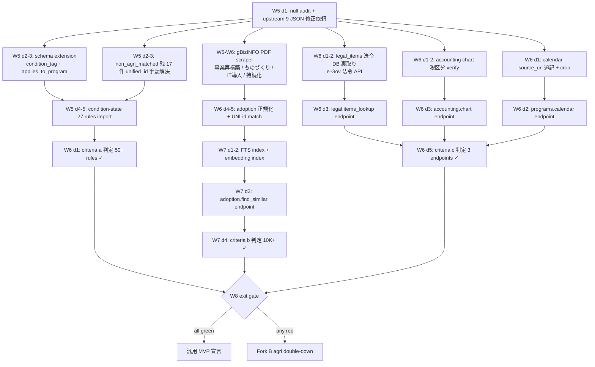
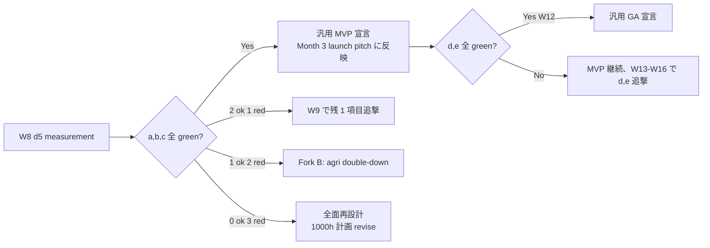

# GENERALIZATION ROADMAP (AutonoMath)

> 農業 niche → 汎用 日本制度データ API への転換計画。
> 対象週: **W5-W8** (1000h 成長計画の後半 4 週)。
> 前提: W1-W4 は [project_jpintel_1000h_plan] に従い「公開品質 / 流入 / 汎用深化 / 顧客 pipeline」を走らせる。このドキュメントはその「汎用深化 + 顧客 pipeline」部分を具体化する。
> 最終更新: 2026-04-23

---

## 1. 定義: 「汎用化 achieved」 とは何か (exit criteria)

5 軸 **全て** green で「汎用」と宣言。どれか一つでも欠けたら宣言しない。

| # | 基準 | 閾値 | 測定方法 |
|---|------|------|---------|
| (a) | 非農業 exclusion rules coverage | **50+ rules**、うち program-to-program 30 以上 + condition-state 20 以上 | `SELECT count(*) FROM exclusion_rules WHERE rule_id NOT LIKE 'agri-%'` |
| (b) | `adoption.find_similar` 動作 | 10,000+ 採択事例に対する類似検索が < 300ms P95 で動く | `/v1/adoption/find_similar?unified_id=...&limit=20` を 100 req で P95 計測 |
| (c) | legal / accounting / calendar の 3 endpoint が public | 3 tool 全て MCP + REST で公開、1st fetch 成功 | `/v1/legal/items?domain=labor`, `/v1/accounting/chart`, `/v1/programs/calendar` が 200 返却 |
| (d) | Tier B+ 件数の昇格 | **S+A = 584 → 2,000 以上** (quality score ≥ 0.6) | `SELECT count(*) FROM programs WHERE tier IN ('S','A') AND quality_score >= 0.6` |
| (e) | enrichment null ratio | 全 10 次元 (A-J) で null < 10% | `scripts/audit_nulls.py` の平均値 |

(a)+(b)+(c) = W8 最低ライン (「汎用 MVP」)。(d)+(e) = W12 までに補正 (「汎用 GA」)。
W8 で (a)(b)(c) の 3 つが揃わなければ **section 6 の Fork B (agri double-down)** に切り替える。

---

## 2. 現状 gap 定量化

2026-04-23 時点。source: README / `docs/exclusions.md` / `research/non_agri_exclusion_schema_gap.md` / `research/non_agri_unmatched.md` / `research/jgrants_ingest_plan.md`。

| 次元 | current | target | blocker | ETA |
|------|---------|--------|---------|-----|
| Agri program-to-program rules | 22 | 22 (done) | — | done ✓ |
| Non-agri program-to-program rules | 13 | 30 | `non_agri_matched.json` の残 17 件 unified_id 解決 | W5 3d |
| **Condition-state rules** | 0 | 27 | schema extension (Option A, 8-10h)。`research/non_agri_unmatched.md` に 51 placeholders = 実体 27-30 rules 推定 | W5-W6 |
| Same-program self-mutex rules | 0 | ~15 | schema tweak (AND/OR group key) | W6 |
| **gBizINFO 採択事例 ingest** | 0 件 | 20K-30K (W8 MVP) / 138K (W12) | PDF per-round scraper (`jgrants_ingest_plan.md` で詳述済み)。無い CSV、PDF ocr + 正規化が本体 | W5-W8 |
| **Legal items** endpoint | 0 / 188 rows prepped | public endpoint + 法令 DB 裏取り 80% | `legal_items.json` の `law` フィールドを e-Gov 法令 API で一次裏取り | W6 |
| **Accounting chart** endpoint | 0 / 116 accounts | public endpoint + 青色申告要件付 | `chart_of_accounts.json` の 税区分 verify | W6 |
| **Calendar** endpoint | 0 / 122 events | public endpoint + 日次 refresh | `calendar_2026.json` の source_url 追記、cron 設計 | W6 |
| Tier B→A promotion (S+A 584 → 2,000) | 8.6% | 29.5% | 7-rung walker で enrichment 拡充 (agri で実績あり) | W7 |
| **Prefecture null** 4,311 / 6,658 (64.8%) | null 64.8% | null < 40% | `scripts/prefecture_walker.py` 拡張 + 「全国」フラグ区別 | W5-W7 |
| enrichment dimension null rate (A-J) | 未測定 | < 10% | `scripts/audit_nulls.py` 新設 | W5 d1 (測定) |
| Autonomath 壊れ enriched (9 JSON) | 9 件 | 0 件 | upstream Autonomath 側修正 (`autonomath_invalid_enriched.md`) | W5 d1 (依頼) |

---

## 3. 汎用化 execution order (dependency graph)



**Critical path**: A → F → G → H → I → J (採択事例の ingest)。
Schema extension (B) と legal/accounting/calendar (K/M/O) は並列可能。
採択事例 PDF scraper が最大のリスク — **単独で lag すると (b) が落ちる**。

---

## 4. per-task effort estimates (W5-W8, 合計 ~240h / ~6 時間/日 × 40 day)

W5-W8 は 1000h 計画の後半 250h 枠。残り 10h は予備 (incident / review / 返信)。

### W5 (60h) — schema + foundation

| task | h | detail |
|------|---|--------|
| T1. null audit script (`scripts/audit_nulls.py`) | 4 | A-J 10 次元の null ratio を `meta` に出す。(e) 基準 baseline |
| T2. Autonomath 9 JSON 修正依頼 + re-ingest | 2 | `autonomath_invalid_enriched.md` の verify loop 実行 |
| T3. **schema extension**: `condition_tag` + `applies_to_program` カラム追加 + migration 004 | 10 | Option A (`non_agri_exclusion_schema_gap.md`)。rules API の return 型拡張、FTS/index 影響確認 |
| T4. Non-agri 残 17 件 unified_id 手動解決 | 8 | `research/non_agri_unmatched.md` の 51 placeholders から condition_state (27) を分離 → 実 program 17 件を fuzzy match + 目視 |
| T5. Condition-state 27 rules import | 8 | T3 の新スキーマで rules_import_condition.py |
| T6. Prefecture walker 拡張 | 12 | `全国` フラグと null を区別、6,658 件の 4,311 null を 7-rung walker で再 resolve |
| T7. gBizINFO PDF scraper (事業再構築 rounds 8-13) | 16 | `jgrants_ingest_plan.md` に沿う。PDF 正規化は pdfplumber + column 別 parser |

### W6 (70h) — endpoints + adoption ingest 続き

| task | h | detail |
|------|---|--------|
| T8. gBizINFO scraper (ものづくり + IT導入 + 持続化) | 24 | 各 PDF 事務局の parser 3 個、column drift に頑健に。target = 計 20K-30K record |
| T9. adoption dedup + UNI-id match | 16 | 法人番号優先 + NFKC + 株式会社正規化。match rate < 60% なら industry/prefecture で faceted search に倒す |
| T10. Legal items endpoint + e-Gov 裏取り | 10 | 188 rows の `law` を e-Gov 法令 API で一次 source_url 紐付け。紐付かないものは `source_status=unverified` tag |
| T11. Accounting chart endpoint | 6 | 116 accounts + tax_division + 青色申告要件 JSON を REST expose |
| T12. Calendar endpoint + 日次 cron | 8 | 122 events に source_url 追記、Fly Cron で毎日 refresh、diff を changelog に吐く |
| T13. 非農業 mutex rules 検証テスト | 6 | 実 unified_id で `/v1/exclusions/check` を 50 req 叩いて regression |

### W7 (70h) — adoption.find_similar + quality

| task | h | detail |
|------|---|--------|
| T14. adoption FTS5 index | 10 | plan_title + plan_summary + industry の trigram |
| T15. embedding index (multilingual-e5-small, 384 dim) | 14 | DuckDB + hnswlib or sqlite-vss。local inference で cost ゼロ |
| T16. `adoption.find_similar` endpoint 実装 | 12 | unified_id → 同 program の過去採択 + cosine top-k、return は mask 済み |
| T17. `programs.find_similar_by_adoption` | 8 | 逆引き (採択事例 → 候補制度) |
| T18. Tier B→A 昇格 walker | 16 | enrichment A-J 次元を 7-rung で再 crawl、quality_score 再計算、2,000 target |
| T19. MCP wrapper 追加 (find_similar / legal / accounting / calendar) | 10 | FastMCP に 4 tool 追加、mcp-tools.md 更新 |

### W8 (40h) — gate + docs + fallback

| task | h | detail |
|------|---|--------|
| T20. Measurement run (criteria a/b/c/d/e) | 6 | 数字を `/meta` に反映、docs を更新 |
| T21. docs/generalization 章追加 | 8 | api-reference に legal/accounting/calendar/adoption 4 節追加 |
| T22. 長文記事 (汎用化向け: 非農業サンプル 10 例) | 14 | 各 5K 字、1000h 計画の流入 W2 と合流 |
| T23. regression 59 test → 120 test | 8 | 各 endpoint に unit + contract test |
| T24. W8 exit review + fork decision | 4 | (a)(b)(c) 判定 → GA 宣言 or Fork B |

**合計: 60 + 70 + 70 + 40 = 240h** (250h 枠に対し 10h 余裕)。

---

## 5. リスク / 越えられない壁

### R1. gBizINFO / 事務局 PDF の license drift
- `/v1/adoption` が依存する PDF は各事務局 (中企庁・SMRJ・商工会議所連合会) が改元・年度切替で URL を捨てる。**snapshot を独自 S3 に保存** (`source_checksum` + `fetched_at` 付) しないと再生成不能になる。
- Fallback: license 撤回時は `source_url=archive.org/web/...` を一次とし、endpoint 継続。再配布条件 (出典明記 + 事業者名 mask) は現状の README に既記載。

### R2. **`legal_items.json` の primary source reliability**
- 188 items の `law` フィールド (例: 「労働基準法第15条第1項」) は文字列で、e-Gov 法令 API との紐付けは未実装。**「Autonomath 内製 legal KB」を そのまま ship するのは危険** — 条文改正の反映漏れが起きる可能性。
- 判定: T10 で e-Gov 法令 API 裏取り率が 80% 未満なら **endpoint を不採用**、docs に「legal_items は beta、source 要確認」と明記し MCP tool に入れない。(c) の判定では 3/3 揃わないので代替として `programs.compliance_tags` など別角度を候補に。

### R3. unified_registry の語彙ドリフト (memory ref: `project_registry_vocab_drift`)
- target_types / funding_purpose / crop_categories は英日混在 (`corporation` vs `法人`、`tax` vs `税制` 等)。非農業 rules を足す前に **ALIAS 正規化を matcher 側で実装** しないと、`program_a=...-seisyain` と registry の `unified_id` がヒットしない事案が起きる。
- 対処: T4 の前に `scripts/registry_vocab_normalize.py` で ALIAS dict を dump → 照合。W5 d1 に 2h 追加 (T1 の隣で実施)。

### R4. Autonomath 8-9 broken enriched JSON
- upstream 責任だが、修正が間に合わないと **Tier regrade が 9 件分古い** まま。
- 対処: T2 で修正依頼を出しつつ、修正待ちの間は **last-good cache を `data/fallback_enriched/` に凍結** (upstream が落ちても 6,658 件 ingest 可能)。

### R5. 採択事例の法人名 mask 要件
- 個情法では法人名は個情とみなされないが、**代表者氏名 (個人事業主)** が混ざる PDF がある (持続化補助金 R6 17 回 11,928 件は個人含む)。mask 漏れ = 個情法抵触リスク。
- 対処: T9 で `is_individual` フラグ判定 (業種 "農業" + 法人番号 null など) → 個人は `entity_name` を「非公開 (個人事業主)」に置換。

### R6. 非農業 condition-state の絶対数推定ズレ
- section 2 で「27 rules」と書いたが、`research/non_agri_unmatched.md` 51 placeholders のうち真の condition_state は 27-35 の幅。27 は下限。
- 対処: T4 の手動分類で確定、target を (27, 35) range で exit gate を「20+ で green」に緩める。

---

## 6. 汎用化に失敗した場合の Fork B: Agri double-down

W8 exit gate で (a)(b)(c) の **2 つ以上が red** なら Fork B へ切替 (1 つ red なら W9 で追撃)。

### Fork B の positioning
「**the agri-subsidy AI layer**」— 幅より深さ。

### Fork B scope (W9-W12 の 250h 再割当)

| task | h | detail |
|------|---|--------|
| F1. 採択事例 ingest を **農業関連のみ** ~12K | 40 | 全 138K から業種 "農業" フィルタ。事業再構築 / ものづくり / スーパー L / 持続化 (農業者) |
| F2. 農政 timeline | 30 | 2015-2026 の農政転換 (認定農業者制度改正、スマート農業促進法、みどり戦略) を programs にリンク |
| F3. 農業 KPI (`agri.crop_kpi`) | 20 | 47 都道府県 × 30 作物の作付面積 / 単収 / 所得を e-Stat から ingest |
| F4. 農業 SaaS 連携 (agri-note / farmnote / kubota KSAS との API bridge) | 40 | OEM ではなく、彼らの内製 RAG から叩ける agri 特化 endpoint |
| F5. 農業向け長文 20 本 (作物 × 制度) | 60 | programmatic 禁止、深い記事 5K 字 × 20 |
| F6. docs rebrand (AGRI-FIRST タイトル) | 20 | landing + pricing に「農業 AI 特化」を明示 |
| F7. 価格再設計 | 10 | 現行 ¥3/req は単一 (税別、`per_request_v3`)。tier/agri 単価倍増は廃止 (商業モデル「単一 metered」原則) |
| F8. 予備 | 30 | incident / review |

### Fork B の勝ち筋
- 農業 niche は競合ゼロ (Jグランツ MCP は汎用、agri-SaaS は制度 API 無)。
- 客単価は上がり (¥3/req 統一で月 30K-100K req のヘビーユーザー = ¥90K-300K/月想定)、ターゲット client は agri-tech startup 50 社 + 農協系 IT 部隊。
- Y1 ARR ¥1,000 万 の中央値は同じ、**下限 ¥100 万の riskfloor を上げられる** (agri is proven niche)。

### Fork B の敗け条件
- 5 年後に agri niche 市場が伸びない → pivot 先 (不動産 / 税制 / 士業) を 2028 に検討。

---

## 7. Measurement gate (W8 exit)

W8 d5 に以下を **自動測定** し、一発で判定。

```bash
# criteria a
sqlite3 data/jpintel.db "SELECT count(*) FROM exclusion_rules WHERE rule_id NOT LIKE 'agri-%'"
# ≥ 50 で green

# criteria b
curl -s "http://localhost:8000/v1/adoption/find_similar?unified_id=UNI-keiei-kaishi-shikin&limit=20" | jq '.results | length'
curl -s "http://localhost:8000/meta" | jq '.adoption_total'
# length ≥ 20, adoption_total ≥ 10000 で green

# criteria c
for ep in legal/items accounting/chart programs/calendar; do
  code=$(curl -s -o /dev/null -w "%{http_code}" "http://localhost:8000/v1/$ep")
  echo "$ep $code"
done
# 3 つとも 200 で green

# criteria d
sqlite3 data/jpintel.db "SELECT count(*) FROM programs WHERE tier IN ('S','A') AND quality_score >= 0.6"
# ≥ 2000 で green (この d は W12 まで後ろ倒し可)

# criteria e
python3 scripts/audit_nulls.py --dimensions A,B,C,D,E,F,G,H,I,J --threshold 0.1
# 全次元 < 10% で green
```

### Decision tree



**宣言可能 claim**:
- MVP: "AutonoMath exposes 50+ non-agri exclusions, 10K+ adoption records, legal/accounting/calendar"
- GA: 上記 + "Tier S/A 2,000+ programs, enrichment null < 10%"

宣言前はマーケ文言に「汎用」「日本制度データ API フル」を使わない — agri-focused のまま。`README.md#7` の Month 2+ 記述を「W8 exit で達成予定」に変更済みとする (このファイル生成と同時に更新する候補)。

---

## 8. 付記

- 本ファイルは W5 開始時に再点検。gBizINFO PDF scraper の h 見積は actual run で ±30% 振れる可能性あり、W5 d3 で T7 の進捗から W6 を再計画。
- Fork B に入った場合でも T1 (null audit) / T2 (9 JSON 修正) / T6 (prefecture walker) / T18 (Tier 昇格) は**共通資産**として継続。
- 関連 memory: `project_jpintel_1000h_plan`, `project_jpintel_1000h_gaps`, `project_jpintel_trademark_intel_risk` (商標衝突は汎用化前に rebrand 要否決定)。
- **Preview endpoints (legal / accounting / calendar)** の contract-only scaffold は既に配置済み (`docs/preview_endpoints.md`)。`JPINTEL_ENABLE_PREVIEW_ENDPOINTS=true` で 501 応答がマウントされ、OpenAPI に露出。W6-W8 の T10/T11/T12 は **この router を埋める** 作業になる (新設 route は最小)。

---

最終更新: 2026-04-23 (初版)
Author: Claude (executor for AutonoMath)
