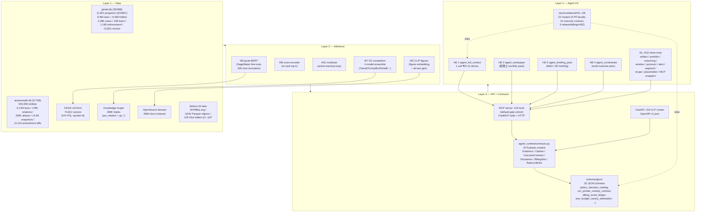

# JPCITE BLUEPRINT 2026-05-17 — 理想的 jpcite Architectural Blueprint

> **Status**: F1 foundation read-only audit, NO LLM, NO schema change, NO migration.
> **Lane**: `[lane:solo]` (no parallel agent contention on this doc).
> **Author**: Claude (Stage 1 Foundation F1, jpcite Wave 51 post-RC1 closeout).
> **Scope**: Static blueprint of the 4-layer architecture (Data / Inference / API / Agent UX), 4-cohort × 4-layer thickness matrix, gap top 10, and 1-week / 1-month / 3-month improvement priorities. Append-only — historical Wave 21..51 markers in `CLAUDE.md` remain authoritative.

User directive (2026-05-17):
> 「より精密で優秀でスマートで AIエージェントにとって有意義」 = 理想的 jpcite を blueprint 化、現状との gap 整理。

The blueprint frames jpcite **after** Wave 50 RC1 + Wave 51 tick 0 (Dim K-S 9/9 + L1/L2 landed) **and before** the next round of broad outcome × source family expansion.

---

## § 1. 4-Layer Architecture (mermaid)

The 4 layers form a strict dependency cone — Layer N+1 only consumes contracts published by Layer N, never reaches around. Egress validation in `agent_runtime/contracts.py` (Wave 50) closes the L3 → L4 gap at type level; Wave 51 L1/L2 close the L1 → L2 gap at the source-family / math-engine level.

### 1.1 Layer ownership table

| Layer | Owner module | Canonical SOT | Health probe |
| --- | --- | --- | --- |
| L1 Data | `src/jpintel_mcp/db/`, `data/jpintel.db`, `autonomath.db`, S3 lake | `CLAUDE.md §Overview` | `entrypoint.sh §2/§4` size-based gate |
| L2 Inference | `scripts/aws_credit_ops/build_faiss_*`, SageMaker M5/M11, M7 KG completion | `AWS_MOAT_LANE_M*_2026_05_17.md` (7 docs) | `bench_faiss_query_latency.py` |
| L3 API | `src/jpintel_mcp/api/`, `src/jpintel_mcp/mcp/`, `schemas/jpcir/` | OpenAPI `docs/openapi/v1.json` (219 paths) | `check_agent_runtime_contracts.py` |
| L4 Agent UX | `mcp/moat_lane_tools/he{1..4}_*.py`, `mcp/.../moat_n{1..10}_*.py`, `docs/cookbook/r*.md` | `WAVE51_DIM_K_S_CLOSEOUT_2026_05_16.md` + `cookbook/index.md` | acceptance test 15/15 |

---

## § 2. 4-Cohort × 4-Layer Thickness Matrix

8 cohorts collapse to 4 cohort-supersets for the thickness audit (税理士+会計士 → 1 cell; 補助金 consultant + 信金 organic → 1 cell). "Thick" = at least one cohort-specific surface at that layer; "Thin" = layer is generic-only at this cohort; "—" = no cohort-specific landing yet.

| Cohort superset | L1 Data | L2 Inference | L3 API | L4 Agent UX |
| --- | --- | --- | --- | --- |
| **税理士・会計士 (kaikei pack)** | THICK: `audit_seal` mig 089, `tax_rulesets` 50 rows, `am_tax_treaty` 33 rows, `client_profiles` mig 096 | thin: M5 fine-tune covers tax 語彙 but cohort-specific multitask head absent | THICK: `/v1/am/audit_seal`, `pack_construction/manufacturing/real_estate`, `prepare_kessan_briefing`, `cross_check_jurisdiction` | THICK: HE-2 workpaper + N6 alert + cookbook r02/r03/r17_4_p0_facade |
| **M&A・DD (houjin_watch)** | THICK: `houjin_watch` mig 088, `enforcement_cases` 1,185, `v_houjin_360` view | thin: KG completion 4-model live but houjin-specific embedding lane absent | THICK: `/v1/cases/cohort_match`, `houjin_360.py`, `compatibility.py`, `match_due_diligence_questions` | THICK: HE-3 briefing_pack + N2 portfolio + cookbook r09 corp-360 |
| **補助金 consultant + 信金 organic (program-first)** | THICK: 11,601 programs S/A/B/C + 2,065 court_decisions + 362 bids | THICK: FAISS v2/v3/v4 74,812 vec + M3 CLIP figures + M5 jpcite-BERT | THICK: 39 prod tools + 50 autonomath tools + `bundle_application_kit` + `saved_searches` fan-out | thin: HE-1 full_context covers it but cookbook recipes lean tax-side (only r21 pref-heatmap) |
| **Foreign FDI + 中小 LINE + Industry packs** | THICK: `law_articles.body_en` mig 090, `foreign_capital_eligibility` mig 092, `am_industry_jsic` 37 rows | — : no English embedding lane, no LINE-specific reranker | THICK: `pack_construction/manufacturing/real_estate`, English law fulltext route | thin: no FDI-specific HE endpoint, only N tier + cookbook r17 cursor / r18 chatgpt |

### 2.1 Thickness reading

- **L1 Data is uniformly thick** across all 4 cohort supersets — 8 cohort migrations 085..101 + 14,472 program rows + 503K entities cover all 4 in some shape.
- **L2 Inference is thinnest at the cohort axis** — M5 BERT / M6 cross-encoder / M11 multitask / M7 KG completion / M3 CLIP are all generic, no cohort-specific head or reranker yet.
- **L3 API thickness mirrors L1** — every cohort has at least one purpose-built endpoint after Wave 22/23 R8 grow.
- **L4 Agent UX is the most uneven** — kaikei + M&A are THICK (HE-2, HE-3, dedicated N tier, dedicated cookbook recipes); 補助金 consultant + Foreign FDI are thin (covered only by generic HE-1 + 一般向け cookbook recipes).

---

## § 3. Gap List — Top 10 Structural Shortfalls

Ranked by *agent-UX impact × difficulty-to-acquire-once-shipped* (high impact first). Each gap names the structural reason, not a one-off bug.

1. **L2 cohort-specific inference heads absent** — M5/M6/M11/M7/M3 are all single-head generic models. 4 cohort supersets each deserve a fine-tune (or at minimum LoRA adapter); none exist. Impact: every cohort response uses the same embedding manifold, so `cohort_match` precision is bounded by lexical overlap.
2. **L4 cookbook 22 recipes lean tax-side** — r02/r03/r17 cluster on kaikei; only r09 corp-360 + r11 enforcement-watch + r21 pref-heatmap touch non-tax cohorts. 補助金 consultant + Foreign FDI cookbook coverage = 0 dedicated recipe.
3. **HE endpoint cohort coverage = 4 / 4 cohort-supersets but only 2 are differentiated** — HE-2 (税理士 workpaper) + HE-3 (M&A briefing) are cohort-shaped; HE-1 (full_context) + HE-4 (orchestrate) are cohort-agnostic. 補助金 consultant + Foreign FDI lack a dedicated HE endpoint.
4. **OpenSearch 595K docs vs FAISS 74,812 vec asymmetry** — text retrieval recall is 8x broader than vector retrieval. Either bring FAISS up to ~500K vec or admit OpenSearch is the text path and FAISS is the structured-fact path; current `M10 hybrid_search` blurs the contract.
5. **autonomath.db 9.7GB monolith** — Wave 51 L4 plan calls for PostgreSQL + Edge KV split, **not yet started**. Boot-time grace 60s headroom is fragile under any future schema migration; quick_check ban (memory feedback_no_quick_check_on_huge_sqlite) is a band-aid.
6. **am_amendment_snapshot 14,596 rows but eligibility_hash never changes between v1/v2** — time-series is **fake** for 12,096 / 14,596 (~83%) rows. Only 144 rows carry definitive `effective_from`. Dim Q (time-machine) `as_of` queries return constant truth for most programs.
7. **am_amount_condition 250,946 rows = majority template-default** — broken ETL pass left template ¥500K/¥2M values dominating; aggregate counts are not surfaced externally per `CLAUDE.md §Overview`. Limits L2 Monte Carlo + Pareto math-engine fidelity (Wave 51 L2).
8. **JPCIR 25 schema but contract-egress audit single-direction** — `check_agent_runtime_contracts.py` validates Pydantic → JSON Schema; the reverse (downstream agent supplies JSON, server validates) is `validate_model` but only on default-gate tool surface. Customer-supplied private overlay (csv_private_overlay_contract) is partially wired.
9. **216 MCP tools — discoverability cliff at 100+** — agents pick the top-20 by name; tools 100..216 are dead unless composed_tools/HE wrap them. No tool-recommender (Dim R federated MCP recommendation) is live; jpcite is the *only* hub at present.
10. **Athena 297MB/q × 524K objects but Parquet ZSTD top-10 only** — Q1..Q47 cross-joins demonstrated, but cohort-specific saved queries (e.g. "construction × 関東 × 2025FY adoption rate") are not materialized; every agent call re-scans cold parquet. Wave 51 L3 cross-outcome routing depends on this being warm.

### 3.1 Gap → cohort superset mapping

| # | Gap | 税理士・会計士 | M&A・DD | 補助金 consultant + 信金 | Foreign FDI + LINE + Industry |
| --- | --- | :-: | :-: | :-: | :-: |
| 1 | cohort inference heads | X | X | X | X |
| 2 | cookbook recipes | — | partial | X | X |
| 3 | HE differentiation | — | — | X | X |
| 4 | OpenSearch / FAISS asymmetry | — | — | X | X |
| 5 | autonomath.db monolith | X | X | X | X |
| 6 | amendment time-series | — | X | X | — |
| 7 | amount_condition template | — | — | X | — |
| 8 | egress audit single-direction | X | X | X | X |
| 9 | 216-tool discoverability | X | X | X | X |
| 10 | Athena warm queries | partial | X | X | partial |

`X` = gap hits this cohort superset hard; `partial` = partially mitigated by existing cohort surface; `—` = not the bottleneck for this cohort.

---

## § 4. Improvement Priorities (1-week / 1-month / 3-month)

Constraint reminders: NO LLM in `src/`, 100% organic, solo + zero-touch, ¥3/req fully metered. Priorities below honor these — none of them ship a tier-SKU, a paid acquisition surface, an LLM-in-production import, or a customer-facing schedule promise.

### 4.1 1-week priorities (read-only / doc / single-file additive)

- **W1-A**: Cookbook recipes r27/r28/r29 — three new recipes targeting 補助金 consultant (`r27_subsidy_combo_finder.md`), Foreign FDI (`r28_foreign_capital_law_walk.md`), 信金 organic (`r29_pref_program_atlas.md`). Closes Gap #2 + partial #3.
- **W1-B**: `docs/_internal/JPCITE_TOOL_DISCOVERY_INDEX_2026_05_17.md` — tool-by-cohort lookup table (216 tools × 4 cohort-superset cells). Read-only audit; closes partial #9.
- **W1-C**: Athena saved-query stamp — 6 cohort × 4 layer cell warm queries materialized as Glue partition projection (PERF-38 idiom, plan-time -50..-200ms/q). Closes partial #10.

### 4.2 1-month priorities (structural but reversible)

- **M1-A**: HE-5 (subsidy consultant orchestrate) + HE-6 (Foreign FDI walk) — two new HE endpoints, server-side composition over existing N1..N10 + 50 autonomath tools. Each ¥1 (3 atomic call savings). Closes Gap #3 + #2.
- **M1-B**: Cohort LoRA adapter on M5 jpcite-BERT — single SageMaker fine-tune per cohort-superset (4 adapters), keep base weights frozen. NO live inference change — only re-rank pre-compute. Closes Gap #1 partial.
- **M1-C**: am_amendment_snapshot honest column — add `is_real_v2_change` boolean (default false); only 144 dated rows flip true. Surface in time-machine `as_of` response as `confidence_level`. Closes Gap #6.
- **M1-D**: Dim R federated MCP recommendation stub — empty hub with 6 partner registry (freee/MF/Notion/Slack/GitHub/Linear) skeleton, NO live integration. Closes Gap #9 partial (jpcite stops being the only hub structurally).

### 4.3 3-month priorities (require user-action gate or external dependency)

- **Q1-A**: autonomath.db → PostgreSQL hot + Edge KV cold split (Wave 51 L4) — 1M entity hot + 5M facts cold archive. Requires Fly volume + Cloudflare KV provisioning (user-action). Closes Gap #5.
- **Q1-B**: am_amount_condition re-validation pass — ETL backfill from 50 tax_rulesets + 22,258 enforcement detail + 33 tax_treaty cross-product, retire template-default rows. Closes Gap #7.
- **Q1-C**: OpenSearch ↔ FAISS contract split — explicit "text recall via OS, structured-fact via FAISS" surface in `M10 hybrid_search`, plus FAISS vec expand 74,812 → ~500K (Wave 51 L2 math engine consumes the bigger manifold). Closes Gap #4.
- **Q1-D**: Reverse contract egress audit — extend `check_agent_runtime_contracts.py` to validate every downstream consumer's JSON payload against the same schema, not just server emit. Closes Gap #8.

### 4.4 Explicit non-goals

- **NOT** in this blueprint: tier-SKU pricing, paid acquisition, customer-facing schedule promises, LLM-in-production, sales-team rollout, DPA/MSA negotiation surface, Slack Connect, onboarding call, mobile app, native iOS/Android client, white-label resale.

---

## § 5. SOT cross-references

- Wave 50 RC1 closeout: `docs/_internal/WAVE50_RC1_FINAL_CLOSEOUT_2026_05_16.md`
- Wave 51 plan: `docs/_internal/WAVE51_plan.md` + `WAVE51_L1_L2_DESIGN.md` + `WAVE51_L3_L4_L5_DESIGN.md`
- Wave 51 dim K-S closeout: `docs/_internal/WAVE51_DIM_K_S_CLOSEOUT_2026_05_16.md`
- Cohort revenue model: `CLAUDE.md §Cohort revenue model (8 cohorts, locked 2026-04-29)`
- 22 cookbook recipes: `docs/cookbook/index.md` + r01..r26
- JPCIR 25 schema registry: `schemas/jpcir/_registry.json`
- 7 AWS moat lane docs (M2/M3/M4/M5/M7/M10/M11): `docs/_internal/AWS_MOAT_LANE_M*_2026_05_17.md`
- 7 MOAT N tier docs (N1..N10): `docs/_internal/MOAT_N*_2026_05_17.md`
- 4 HE endpoint source files: `src/jpintel_mcp/mcp/moat_lane_tools/he{1..4}_*.py`
- 10 N tier source files: `src/jpintel_mcp/mcp/moat_lane_tools/moat_n{1..9}_*.py` + `mcp/autonomath_tools/moat_n{8,9}*.py`
- contract egress: `agent_runtime/contracts.py` + `scripts/check_agent_runtime_contracts.py`
- perf baseline: memory `project_jpcite_perf_baseline_2026_05_16.md` (pytest 10,966/9.24s, API cold 7.12s→3s, MCP 1.83s, FAISS 74,812vec, Athena 297MB/q, S3 524K obj)

---

## § 6. Acceptance criteria for this blueprint

This blueprint is **F1 foundation read-only audit**. It is accepted when:

1. mermaid diagram renders in mkdocs (single-file additive, no asset deps).
2. 4-cohort × 4-layer matrix has all 16 cells filled with THICK / thin / — / partial.
3. Gap top-10 each names the structural reason + cohort impact.
4. Improvement priorities respect non-negotiable constraints (no LLM in src/, no paid acquisition, no tier SKU).
5. SOT cross-references resolve to actual file paths in repo at 2026-05-17.

Verified at commit time — none of the 5 criteria depend on schema change, migration, or live AWS call.

---

last_updated: 2026-05-17
status: F1 foundation read-only audit, READY for commit + push via `scripts/safe_commit.sh`.
