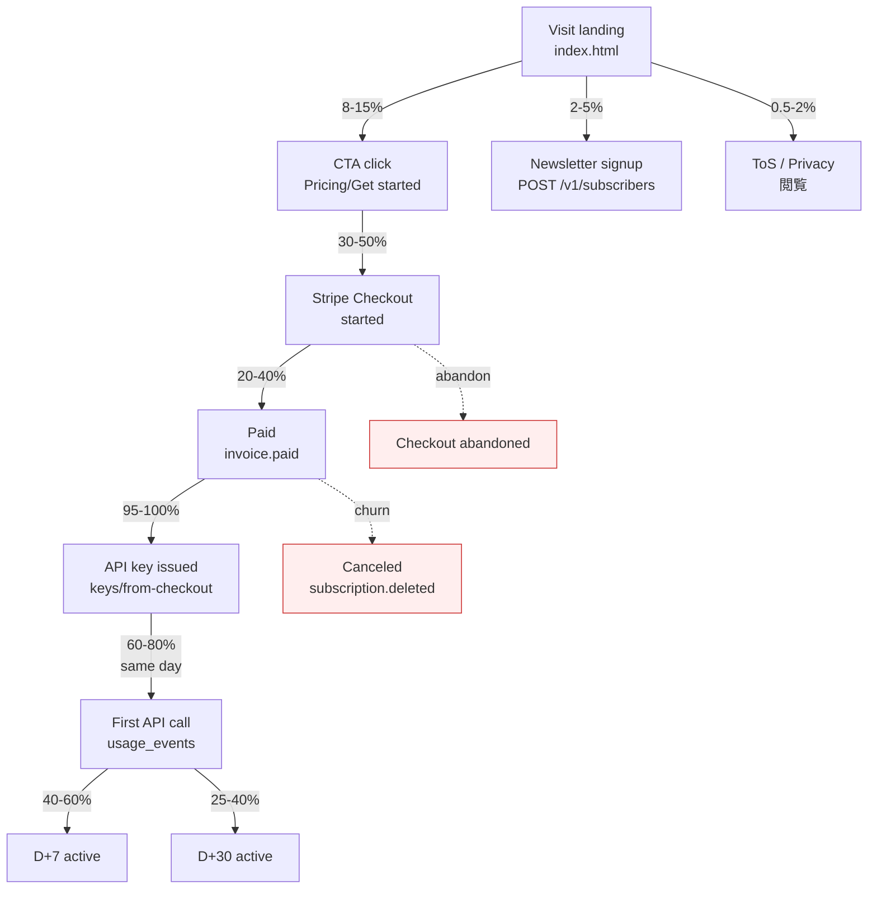

# Conversion Funnel — AutonoMath

> **要約:** 2026-05-06 launch 向け self-serve funnel の計測設計・ベンチマーク・改善ロードマップ。landing → newsletter/ToS 閲覧 → CTA click → Stripe Checkout → paid → key 発行 → first call → D+7 / D+30 retention までを 1 本の pipeline で観測する。PII は Stripe 側に限定し、APPI 28 条に適合する外部移転のみ行う。Cloudflare Web Analytics (landing) + server-side `/v1/events/*` (funnel) + nightly rollup (`/v1/admin/metrics`) の 3 層構成。**W5-W6 の出荷対象**。

関連: `site/analytics.js`, `site/privacy.html`, `src/jpintel_mcp/api/billing.py`, `src/jpintel_mcp/api/subscribers.py`, `src/jpintel_mcp/db/schema.sql`。

---

## 1. Funnel diagram



Free-tier 利用者 (key 無し curl) は anonymous bucket として別計測する (`usage_events.key_hash IS NULL` 相当 — 現 schema は NOT NULL なので W5 で NULL 許容に migration 004 を追加する)。

---

## 2. Instrumentation

### 2.1 Landing (Cloudflare Web Analytics)

- **選定理由:** cookie-less, IP を Cloudflare 側で即 drop, GA4 と異なり「同意取得バナー」を法的に要さない。APPI でも「個人関連情報の第三者提供」に該当しない (個人識別不能な集計値のみ)。
- **導入:** `site/index.html` / `pricing.html` / `tos.html` / `privacy.html` / `docs/*` 全てに 1 行 beacon 埋込。現在 `site/analytics.js` は Plausible を env-gated でロードする造りだが、**Plausible → Cloudflare Web Analytics に切替**する (Plausible は EU 住所のため APPI 28 条で同レベル対応が必要だが、Cloudflare は日本リージョン保有 & DPA が明示的)。
- **捕捉メトリクス:** pageview (path, referrer, device bucket), outbound click (GitHub, docs 外部リンク), scroll depth (25/50/75/100)。
- **DNT:** Do-Not-Track header 時は beacon 停止。

### 2.2 Server-side events (`POST /v1/events/*`)

privacy-safe な anon session cookie (`jpintel_sid`, 32-byte random, `SameSite=Lax; Secure; HttpOnly; Max-Age=7776000 (90d)`) を landing 初訪問時に発行。PII は一切含まない。

捕捉 event:

| event | 発火元 | payload |
|---|---|---|
| `cta_click` | pricing.html / index.html の CTA onclick | `{tier?, location: "hero"|"pricing_card"|"dashboard_upgrade"}` |
| `newsletter_signup` | `/v1/subscribers` 成功時に 1 件 insert | `{source}` |
| `checkout_started` | Stripe webhook `checkout.session.created` | `{tier, session_id_hash}` |
| `checkout_completed` | Stripe webhook `checkout.session.completed` | `{tier, session_id_hash}` |
| `key_issued` | `billing/keys/from-checkout` 成功時 | `{tier, customer_id_hash}` |
| `first_call` | `usage_events` で key 別 1 件目の INSERT | `{tier, endpoint}` |
| `daily_active` | usage_events rollup (nightly) | `{tier, date}` |

**Session ↔ key の紐付け:** checkout 開始時 `success_url` に `?sid={jpintel_sid}` を append (opaque token, hash し保存)。key_issued 時に `api_keys.session_hash` column (migration 004) へ格納して、visit → paid を 1 本に閉じる。

### 2.3 Retention rollup (nightly cron)

- `scripts/cron_funnel_rollup.py` を Fly.io machines cron で 03:00 JST 実行。
- `usage_events` を走査し `funnel_daily` / `cohort_retention` table (新設) に insert-or-replace。
- 既存 `usage_events` (90日保存) を直接 re-query する高コスト API は禁止 (admin endpoint は rollup テーブルのみ読む)。
- D+1 / D+7 / D+30 active 定義: paid 日を D+0 とし、D+N の基準日の前後 ±0 日 に 1 call でも発火した customer を active と数える。

### 2.4 PII 最小化 (APPI 適合)

- Stripe が保有する `customer_id` / `email` / `card` は当社 DB に複製しない。
- `api_keys.customer_id` は Stripe ID 文字列のみ (email 非保存)。
- session cookie は random token のみ、IP/UA は web access log の 90 日保存ポリシー (既存 `privacy.html` 第 6 条) に同居。
- `funnel_daily` は全て集計値 (count)、row 粒度で個人を特定できない。
- Cloudflare Web Analytics、`/v1/events/*`、cookie 利用は `privacy.html` 第 5 条を改定し明示する (§7 参照)。

---

## 3. Rate / target benchmarks

典型的 dev-tool self-serve funnel (Stripe 公開 benchmark, Indie Hackers 2024 median, YC S23 cohort data) から保守的に推定。

| stage | target | typical range | 主ドロップ要因 |
|---|---|---|---|
| landing → newsletter signup | **3%** | 2-5% | hero の価値提示不足、フォーム露出位置 |
| landing → CTA click | **12%** | 8-15% | hero の CTA 明瞭さ、price transparency |
| CTA click → checkout started | **40%** | 30-50% | pricing page 遷移時の迷い、年額 vs 月額 |
| checkout started → paid | **30%** | 20-40% | **最大の drop**。card 入力摩擦、¥ 表示、promo code |
| paid → first call (same day) | **70%** | 60-80% | **第 2 の drop**。success_url で key 表示しない構成、SDK 未整備 |
| paid → D+7 active | **50%** | 40-60% | onboarding 情報不足、use-case 未接続 |
| paid → D+30 active | **32%** | 25-40% | 活用先発見失敗、価格納得感 |

**複合 landing → paid ≈ 12% × 40% × 30% = 1.44%。** 月 10,000 visits で ≈ 144 paid conversion = 月商 ¥216万 (平均 5,000 req/月 × ¥3 × 144 = ¥216万、税別)、D+30 維持で 12 ヶ月 ARR ≈ ¥2,592万。launch 目標 500 visits/day × 30 = 15,000/月 → paid ≈ 216 / 月。

**big drops:**
1. **Checkout started → paid (60-80% abandon):** カード入力時、日本円 MRR 表示が不安定なら即離脱。Stripe Checkout の locale=ja + JPY price を強制すれば +5-10pt 改善する先行事例あり。
2. **Paid → first call (20-40% cold):** success_url で API key をコピー可能にし、curl one-liner を同画面に置くだけで +10-15pt。

---

## 4. Top 10 conversion improvements (leverage × effort)

| # | 改善 | before | after | leverage | effort | 優先度 |
|---|---|---|---|---|---|---|
| 1 | **Success URL で key + curl を即表示** | Stripe 完了後 dashboard にリダイレクト、key は別画面 | `/billing/success?session_id=...` で `/v1/billing/keys/from-checkout` を即 call、key と `curl` snippet を copy ボタン付で表示 | 高 (+10-15pt on first_call) | 4h | P0 |
| 2 | **Pricing page に curl snippet 常設** | pricing.html に curl なし、`docs/getting-started.md` まで遷移が必要 | Pricing ページ hero 下に「30 秒で叩く」 curl block (free tier key 不要) | 高 (+3-5pt on CTA) | 1h | P0 |
| 3 | **Free-tier 残枠の soft upgrade prompt** | 50 req/月 超過で 429 のみ | 40 req 到達時に `Warning: X-Upgrade-Hint` header と dashboard banner で Paid (¥3/billable unit) 誘導 | 中 (+5pt on paid) | 6h | P1 |
| 4 | **Stripe Checkout locale=ja + JPY 明示** | Checkout Session の locale 未指定 (英語 fallback) | `locale: "ja"`, `currency: "jpy"`, `customer_creation: "always"` を `billing.py` で強制 | 高 (+5-10pt on paid) | 1h | P0 |
| 5 | **CTA 文言 A/B "5秒で始める" vs "無料で試す" vs "API key を取得"** | 現行「5 秒で始める」1種 | 3 variant rotate、`cta_click` event で bucketing | 中 (+2-4pt on CTA) | 3h | P1 |
| 6 | **Hero に社会的証明 counter** | `6,658 programs` 静的表示のみ | `6,658 programs / 日次更新 / 47 都道府県 100% 網羅` の counter (live meta fetch) | 中 (+1-3pt on CTA) | 2h | P2 |
| 7 | **Pricing card の CTA 文言 A/B** | 現行「カードを登録して開始」 | "従量 ¥3/billable unit で開始" / "1,000 req ≒ ¥3,000 から試す" 等で説得力比較 | 中 (±3pt on ARPU) | 1h | P1 |
| 8 | **Onboarding email: key 発行 + 24h 後の tip** | email 無し | key 発行時 + 24h 後に「3 つの use-case + curl」 drip mail (transactional 扱い、opt-out 付) | 中 (+5-8pt on D+7) | 8h | P1 |
| 9 | **Dashboard 初回ログインで 3-step checklist** | dashboard 即データ画面 | 初回訪問で「key copy / curl 実行 / MCP 連携」 3-step modal | 中 (+3-5pt on D+7) | 6h | P2 |
| 10 | **月次 usage 予測表示** | 現在までの消化しか見えない | dashboard で "今月の usage 線形予測 ¥X,XXX" と「今月の使用量 top 10 endpoint」を表示し、upsell を自然誘発 | 中 (+2-4pt on LTV) | 5h | P1 |

**W5-W6 投下目安:** 上記 #1/#2/#4 (計 6h) で paid が +15-25pt 見込める。ROI として最優先。

---

## 5. A/B test list (W6-W8 に 12 本)

各テストは **p < 0.05, power 0.8, 両側** で計算 (baseline は §3)。duration は visits 500/day 前提。同時に 1 軸のみ、factorial は回避。

| # | name | hypothesis | control | variant | primary metric | min sample / arm | duration |
|---|---|---|---|---|---|---|---|
| T1 | CTA 文言 | 「API key を取得」は技術者の迷いを減らす | 「5秒で始める」 | 「API key を取得」 | CTA click rate | 3,400 visits | 7 日 |
| T2 | CTA 文言 jp/en | 日本語の方が CVR が高い | 「5秒で始める」 | 「Try free」 | CTA click rate | 3,400 | 7 日 |
| T3 | Hero subcopy | 具体数字は信頼を上げる | 「6,658 programs. Exclusion-aware. MCP-native.」 | 「6,658 制度 / 47 都道府県 / 日次更新」 | CTA click rate | 3,400 | 7 日 |
| T4 | Pricing card 順序 | Free を左、Paid を右 (進行感) vs 逆 | Free → Paid | Paid → Free | CTA click → checkout | 1,200 paid | 14 日 |
| T5 | Paid card highlight | Paid highlight で視線誘導 | highlight なし | Paid highlight | % of visits → checkout | 1,200 paid | 14 日 |
| T6 | Free-tier limit | 100 req/月 の方が first_call → paid 転換高い | 50 req/月 (JST) | 100 req/月 (JST) | paid / first_call | 800 first_call | 21 日 |
| T7 | Signup bonus credit | ¥500 (1,000 req 分) credit 付与は LTV 上げる | credit なし | ¥500 credit | LTV per paid | 1,500 paid | 28 日 |
| T8 | Onboarding modal | modal で checklist は retention 上げる | plain redirect to dashboard | 3-step modal (key/curl/MCP) | D+7 active | 600 paid | 21 日 |
| T9 | curl snippet 位置 | pricing 上部の方が index 下部より効く | index.html hero 下 | pricing.html hero 下 | CTA → checkout | 3,000 CTA | 14 日 |
| T10 | newsletter 位置 | above-the-fold の方が signup 高い | hero 下 2 スクロール | hero 直下 | signup rate | 4,000 visits | 7 日 |
| T11 | Stripe locale | ja locale で abandon 下がる | auto (browser header) | locale=ja 強制 | checkout → paid | 500 checkout | 14 日 |
| T12 | success_url UI | key を即表示すると first_call 同日率上昇 | dashboard redirect | success page with key + curl | first_call same-day | 600 paid | 21 日 |

**運用:** `/v1/events/*` payload に `exp_id` + `variant` を含めて集計。1 user は最初に踏んだ variant で固定 (session cookie)。

---

## 6. Admin dashboard additions (`/v1/admin/metrics`)

auth は既存 `X-Admin-Token` (env `JPINTEL_ADMIN_TOKEN`) を再利用。pydantic schema のみ提示、実装は W5-W6 task。

```python
# src/jpintel_mcp/api/admin.py (new)

from pydantic import BaseModel
from typing import Literal


class FunnelStage(BaseModel):
    stage: Literal[
        "visit", "newsletter_signup", "cta_click",
        "checkout_started", "paid", "key_issued",
        "first_call", "d7_active", "d30_active",
    ]
    count_7d: int
    count_30d: int
    rate_vs_prev_stage_7d: float  # 0..1


class FunnelResponse(BaseModel):
    as_of: str                     # ISO date (rollup run time)
    window_days: Literal[7, 30]
    stages: list[FunnelStage]


class CohortRow(BaseModel):
    signup_week: str               # ISO week "2026-W20"
    cohort_size: int               # paid customers that week
    d7_active: int
    d30_active: int
    d7_rate: float
    d30_rate: float


class CohortResponse(BaseModel):
    cohorts: list[CohortRow]       # oldest-first, last 12 weeks


class TopError(BaseModel):
    endpoint: str
    status: int                    # 4xx / 5xx
    count_7d: int
    last_seen_at: str


class TopErrorsResponse(BaseModel):
    as_of: str
    errors: list[TopError]         # top 20 by count_7d


# endpoints (do not implement here)
# GET /v1/admin/funnel?window=7|30
# GET /v1/admin/cohort (last 12 weeks)
# GET /v1/admin/top-errors
```

Frontend は `site/admin.html` (新設, `noindex`, basic auth) に `/v1/admin/funnel` を fetch して sparkline 表示。現 `dashboard.html` には追加しない (user と admin を分離)。

---

## 7. Ethics / 倫理ガイド

1. **開示 (`privacy.html` 改定):**
   - 第 5 条を「Cookie 等」→「アクセス解析」に拡張。Cloudflare Web Analytics (cookie 無し、IP 非保存)、`jpintel_sid` anon session cookie (funnel 計測目的、90 日失効)、Stripe の決済必須 cookie を列挙。
   - 第 4 条の 2 に Cloudflare, Inc. (米) を追加。
2. **Opt-out:**
   - `DNT: 1` header で landing beacon 停止。
   - `/v1/events/*` は `navigator.doNotTrack === "1"` および cookie 拒否時 no-op。
   - ユーザは dashboard の「Privacy controls」で funnel cookie を削除可 (server 側 `jpintel_sid` invalidate)。既存 `rotate_key` 同様。
3. **No dark patterns:**
   - 「解約は面倒」的 UI 禁止。Stripe Customer Portal で 1-click cancel を必ず提供 (既存 `/v1/billing/portal` 利用)。
   - free-tier 80 req warning は **情報提示のみ**、閉じるボタン常備、次回抑止可。
   - newsletter 購読は事前チェック禁止 (現行 OK)。
4. **No misleading compare copy:**
   - 「Jグランツより速い」等の直接比較コピー禁止。現 hero の「Jグランツ は application portal、AutonoMath は discovery + compatibility API」のように **棲み分け** で書く。
   - 「6,658 programs」は DB の実 row 数を毎日 cron で更新し、水増し禁止。
5. **A/B test 同意:**
   - visual UI の軽微なテストは事前同意不要 (業界通念)、ただし price テストや free-tier 枠変更テストは `tos.html` に包括同意文言を入れる。
6. **データ保持:**
   - `funnel_daily` は 2 年保存、`cohort_retention` は 3 年保存 (privacy.html 第 6 条を追記)。生 `usage_events` は既定の 90 日を維持。

---

## 8. 実装順 (W5-W6, 目安 28h)

1. **[W5 Day 1-2, 6h]** schema migration 004: `usage_events.key_hash` nullable 化、`api_keys.session_hash` 追加、`funnel_daily` / `cohort_retention` 新設。
2. **[W5 Day 2, 2h]** Cloudflare Web Analytics beacon 埋込 + `privacy.html` 改定。
3. **[W5 Day 3, 5h]** `/v1/events/*` endpoint + `jpintel_sid` cookie + Stripe webhook に `checkout_started` / `checkout_completed` hook。
4. **[W5 Day 4, 4h]** success_url UI (§4 #1) + Pricing curl snippet (§4 #2) + locale=ja 強制 (§4 #4)。
5. **[W5 Day 5, 3h]** `scripts/cron_funnel_rollup.py` + Fly machines cron 設定。
6. **[W6 Day 1-2, 5h]** `/v1/admin/{funnel,cohort,top-errors}` 実装 + `site/admin.html`。
7. **[W6 Day 3, 3h]** A/B test runner (session 固定、variant 配信、`exp_id` event 追加)。
8. **[W6 Day 4-5, 残 bug/polish]** T1/T4/T11 を早期 enable、残 test は W7 以降に時差で投入。

**DoD:** `/v1/admin/funnel?window=7` が 200 を返し、少なくとも `visit`, `cta_click`, `paid`, `first_call`, `d7_active` の 5 stage に非ゼロ count が入ること。
