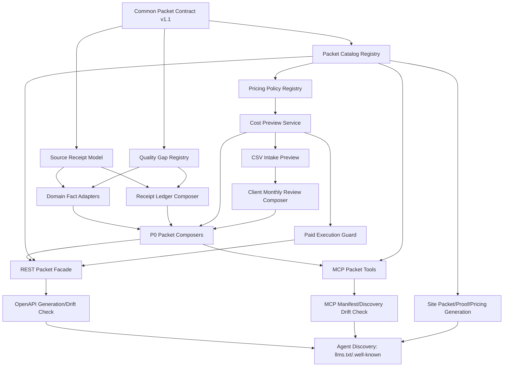

# Implementation sequence deep dive

Date: 2026-05-15
Lane: implementation sequence / task breakdown / acceptance criteria
Scope: pre-implementation planning only. This file does not declare shipped behavior.

## 0. Decision summary

Implement jpcite P0 in this order:

1. Freeze the additive packet contract and examples.
2. Add source receipt primitives and quality gaps behind the contract.
3. Add pricing/cost preview as a pure policy layer before paid execution.
4. Add CSV intake preview with no raw-row persistence.
5. Add packet composers and REST facade.
6. Add MCP wrappers and discovery metadata.
7. Generate public packet/proof/pricing pages from the same catalog.
8. Run cross-surface drift tests before release.

The critical rule is that docs, OpenAPI, MCP manifest, site metadata, and runtime catalog must be generated or verified from one packet catalog. If any surface hand-copies packet names, prices, required fields, or source-receipt rules, release should block.

## 1. Dependency graph

Hard dependencies:

| Task | Blocks | Reason |
| --- | --- | --- |
| Common packet contract | everything | All producers and examples need stable `packet`, `metrics`, `quality`, `fence`, `source_receipts`, `exports` fields. |
| Packet catalog registry | API/MCP/site/docs | Prevents drift across REST endpoint, MCP tool, public URL, billing policy, examples, and known gaps. |
| Source receipt model | P0 packets, proof pages, receipt ledger | GEO value depends on source accountability, not only narrative text. |
| Pricing policy registry | cost preview, paid execution, pricing page | Billing semantics must be identical before UI or endpoints expose execution. |
| CSV intake preview | client monthly review | CSV billing and privacy cannot be inferred after execution. |
| REST facade | OpenAPI and site examples | Public examples should point at actual route names and response schemas. |
| MCP wrappers | MCP discovery and agent routing | Agent-visible tooling must match REST catalog and pricing. |
| Site generation | release readiness | GEO discovery surfaces need packet/proof/pricing content and machine metadata. |

## 2. Module/file candidates

These are candidates, not implementation mandates. Prefer existing local patterns when editing.

| Layer | Candidate files/modules | Notes |
| --- | --- | --- |
| Packet contract | `src/jpintel_mcp/models/packet_contract.py`, `schemas/packet_contract.v1.json`, `tests/fixtures/p0_packets/*.json` | Additive overlay; do not break existing Evidence Packet or ArtifactResponse shapes. |
| Packet catalog | `src/jpintel_mcp/services/packet_catalog.py`, `src/jpintel_mcp/api/packets.py` | Single source for slug, REST route, MCP tool, billing unit, public URL, schema version, examples. |
| Source receipts | `src/jpintel_mcp/services/source_receipts.py`, `src/jpintel_mcp/services/evidence_packet.py`, `src/jpintel_mcp/services/quality_gaps.py` | Normalize required fields, completion score, claim-to-source mapping, missing-field gaps. |
| Pricing/cost preview | `src/jpintel_mcp/services/pricing_policy.py`, `src/jpintel_mcp/api/cost.py`, `src/jpintel_mcp/api/middleware/cost_cap.py`, `src/jpintel_mcp/billing/stripe_usage.py` | Keep preview pure and deterministic; metering only after validation, auth, idempotency, and cap checks. |
| CSV intake | `src/jpintel_mcp/services/csv_intake.py`, `src/jpintel_mcp/api/csv_intake.py`, `src/jpintel_mcp/security/pii_redact.py` | Analyze/preview/packet split; no raw rows, memo, personal names, bank details in packets or logs. |
| P0 composers | `src/jpintel_mcp/services/packets/evidence_answer.py`, `company_public_baseline.py`, `application_strategy.py`, `source_receipt_ledger.py`, `client_monthly_review.py`, `agent_routing_decision.py` | Thin composers over existing domain services where possible. |
| REST facade | `src/jpintel_mcp/api/packets.py`, `src/jpintel_mcp/api/main.py` | Routes: catalog, preview, six P0 packet endpoints. |
| MCP wrappers | `src/jpintel_mcp/mcp/jpcite_tools/packet_tools.py`, `src/jpintel_mcp/mcp/server.py`, `mcp-server.core.json`, `mcp-server.full.json` | Wrappers should call the same composers/catalog as REST. |
| OpenAPI/discovery | `site/openapi.agent.json`, `site/.well-known/openapi-discovery.json`, `.well-known/agents.json`, `.well-known/mcp.json`, `llms.txt` | Prefer generated or drift-tested outputs. |
| Site/docs | `docs/packets/*.md`, `docs/proof/*.md`, `docs/pricing.md`, `mkdocs.yml`, `docs/api-reference.md` | Public pages should expose same examples, pricing, receipts, known gaps, REST/MCP names. |
| Tests | `tests/test_p0_*`, `tests/test_packet_catalog_*`, `tests/test_cost_preview.py`, `tests/test_openapi_agent.py`, `tests/test_mcp_public_manifest_sync.py`, `tests/e2e/test_public_pages.py` | Add focused tests first, then cross-surface drift tests. |

## 3. Implementation task breakdown

### T0. Baseline inventory and no-regression guard

Work:
- Record current route list, MCP tool list, OpenAPI file paths, docs generation command, migration inventory command, and existing billing middleware behavior.
- Identify which existing endpoints already return `source_fetched_at`, `corpus_snapshot_id`, `_evidence`, or source metadata that can be adapted.

Acceptance tests:
- `tests/test_implementation_baseline_inventory.py::test_packet_lane_known_files_exist`
- `tests/test_implementation_baseline_inventory.py::test_existing_public_routes_unchanged`
- `tests/test_mcp_drift_version.py` still passes before packet work begins.

Exit criteria:
- Existing tests for OpenAPI, MCP manifest, billing, and evidence packet are green or known failures are explicitly tracked.

### T1. Common packet contract and examples

Work:
- Define additive common schema fields and validation helpers.
- Add minimal golden examples for six P0 packet types.
- Ensure legacy Evidence Packet and ArtifactResponse can be wrapped without changing their current fields.

Acceptance tests:
- `tests/test_p0_packet_contract.py::test_all_examples_validate_against_schema`
- `tests/test_p0_packet_contract.py::test_required_common_fields_present`
- `tests/test_p0_packet_contract.py::test_legacy_evidence_packet_shape_not_removed`
- `tests/test_p0_packet_contract.py::test_exports_include_json_markdown_csv_or_copy_contract`

Exit criteria:
- Contract helpers can validate examples without importing API server or MCP server.

### T2. Packet catalog registry

Work:
- Create runtime catalog entries for P0: `evidence_answer`, `company_public_baseline`, `application_strategy`, `source_receipt_ledger`, `client_monthly_review`, `agent_routing_decision`.
- Include REST route, MCP tool, public page URL, billing unit, metering policy, known gap enum, required preserve fields, sample input/output file paths.

Acceptance tests:
- `tests/test_p0_packet_catalog.py::test_catalog_returns_six_p0_packets`
- `tests/test_p0_packet_catalog.py::test_each_catalog_entry_has_rest_mcp_public_url_billing_and_examples`
- `tests/test_p0_packet_catalog.py::test_packet_slugs_are_stable_and_unique`
- `tests/test_p0_packet_catalog.py::test_catalog_known_gap_enums_are_closed`

Exit criteria:
- Catalog can be consumed by API, MCP, docs generation, and tests without circular imports.

### T3. Source receipt primitives

Work:
- Normalize source receipt required fields: source URL or identifier, source type, fetched timestamp, content hash or snapshot id when available, authority label, license/usage boundary, claim ids.
- Add completion scoring and quality gap generation for missing fields.
- Add a ledger composer that flattens receipts and claim mappings from inline packets.

Acceptance tests:
- `tests/test_p0_source_receipts_contract.py::test_all_claims_have_source_receipts_or_known_gap`
- `tests/test_p0_source_receipts_contract.py::test_missing_required_receipt_fields_create_quality_gap`
- `tests/test_p0_source_receipt_ledger_packet.py::test_inline_packet_ledgerizes_receipts`
- `tests/test_p0_source_receipt_ledger_packet.py::test_zero_receipts_is_not_billable_and_returns_gap`

Exit criteria:
- Receipt validation is independent of specific packet type.

### T4. Pricing policy and cost preview

Work:
- Centralize `pricing_version=2026-05-15`, unit price 3 JPY ex-tax / 3.3 JPY inc-tax, billing unit types, preview confidence levels, and non-billable rejection states.
- Add cost preview response shape and cap math before paid execution.
- Ensure paid POST/fanout/batch/CSV requires API key, `Idempotency-Key`, and hard cap before metering.

Acceptance tests:
- `tests/test_p0_cost_preview.py::test_each_p0_packet_price_matches_policy`
- `tests/test_p0_cost_preview.py::test_batch_csv_requires_cap_and_idempotency_before_execution`
- `tests/test_p0_cost_preview.py::test_validation_rejects_are_not_metered`
- `tests/test_p0_cost_preview.py::test_source_receipt_ledger_units_are_ceiling_unique_receipts_per_25`
- `tests/test_usage_billing_idempotency.py` continues to pass.

Exit criteria:
- No endpoint-specific pricing constants outside policy registry, except presentation copies verified by drift tests.

### T5. CSV intake preview

Work:
- Split CSV flow into analyze, preview, and packet execution.
- Count uploaded rows, rejected rows, duplicates, unresolved identities, accepted subjects, projected units, and cap requirement.
- Redact or avoid raw CSV values in logs, packets, examples, and generated docs.

Acceptance tests:
- `tests/test_p0_csv_intake.py::test_analyze_returns_structure_without_raw_rows`
- `tests/test_p0_csv_intake.py::test_preview_counts_duplicates_rejections_and_billable_subjects`
- `tests/test_p0_csv_intake.py::test_payroll_bank_or_private_rows_rejected_or_aggregated_only`
- `tests/test_p0_csv_intake.py::test_packet_execution_requires_preview_api_key_idempotency_and_cap`
- `tests/test_dim_n_pii_redact_strict.py` continues to pass.

Exit criteria:
- `client_monthly_review` can run from normalized `derived_business_facts` without raw CSV persistence.

### T6. Domain adapters and P0 packet composers

Work:
- Implement thin composers for six P0 packets using the common contract, receipt primitives, quality gaps, and pricing metadata.
- Keep final legal/accounting/tax judgment out of packet outputs.
- Make `company_public_baseline` require stable identity in P0; name-only can return identity-resolution gap or 422.

Acceptance tests:
- `tests/test_p0_evidence_answer_packet.py::test_preserves_sources_gaps_and_fence`
- `tests/test_p0_company_public_baseline_packet.py::test_source_receipts_complete_or_gapped`
- `tests/test_p0_application_strategy_packet.py::test_candidate_claims_have_source_receipts`
- `tests/test_p0_client_monthly_review_packet.py::test_derived_facts_create_subject_packets_without_raw_rows`
- `tests/test_p0_agent_routing_decision_packet.py::test_message_mentions_mcp_api_key_pricing_and_limits`
- `tests/test_p0_packet_fence.py::test_forbidden_final_judgment_claims_are_gapped_or_rejected`

Exit criteria:
- Each composer can be called directly in unit tests without HTTP or MCP transport.

### T7. REST packet facade

Work:
- Add packet catalog endpoint, preview endpoint, and P0 packet endpoints.
- Apply auth, validation, idempotency, cap, and metering order consistently.
- Return common packet fields plus legacy-compatible fields where required.

Acceptance tests:
- `tests/test_p0_packets_api.py::test_get_catalog_matches_runtime_catalog`
- `tests/test_p0_packets_api.py::test_post_packet_returns_common_contract`
- `tests/test_p0_packets_api.py::test_paid_execution_guard_order_is_auth_validation_idempotency_cap_metering`
- `tests/test_p0_packets_api.py::test_errors_use_existing_error_envelope`
- `tests/test_openapi_response_models.py` continues to pass.

Exit criteria:
- REST facade has no packet-specific copies of pricing or discovery metadata.

### T8. MCP packet tools

Work:
- Expose MCP tools for P0 packets with names from the catalog.
- Reuse the same composers and error mapping as REST.
- Include sample arguments and output contract metadata in manifest/discovery.

Acceptance tests:
- `tests/test_p0_packets_mcp.py::test_mcp_tools_match_packet_catalog`
- `tests/test_p0_packets_mcp.py::test_mcp_tool_sample_args_validate`
- `tests/test_p0_packets_mcp.py::test_mcp_outputs_preserve_source_receipts_known_gaps_and_pricing`
- `tests/test_mcp_public_manifest_sync.py` continues to pass.

Exit criteria:
- MCP wrapper behavior differs from REST only in transport envelope, not packet content.

### T9. Migration and persistence wiring

Work:
- Decide whether P0 supports only inline packets or introduces persisted `packet_runs`.
- If persistence is introduced, add migration for packet run metadata, source receipt indexes, idempotency linkage, and usage event linkage.
- If persistence is deferred, document `packet_persistence_unavailable` gap and keep ledger inline-only.

Acceptance tests:
- `tests/test_p0_packet_persistence.py::test_inline_mode_returns_documented_gap_when_packet_id_lookup_unavailable`
- If migrations are added: `tests/test_migration_header_consistency.py`, `tests/test_migration_inventory.py`, `tests/test_verify_migration_targets.py`
- `tests/test_usage_billing_idempotency.py::test_same_key_same_payload_maps_to_same_execution`

Exit criteria:
- Runtime cannot claim `packet_id` lookup support unless persistence and access control are implemented.

### T10. OpenAPI, docs, and site generation

Work:
- Generate or update OpenAPI examples from packet catalog.
- Generate packet catalog pages, proof pages, pricing page metadata, `llms.txt`, and `.well-known` discovery links.
- Ensure public pages include sample input, sample output, source receipts, known gaps, billing metadata, MCP tool, and REST endpoint.

Acceptance tests:
- `tests/test_p0_geo_discovery_surfaces.py::test_llms_well_known_openapi_mcp_link_packet_catalog`
- `tests/test_p0_public_packet_pages.py::test_each_page_has_sample_input_output_receipts_gaps_billing_rest_and_mcp`
- `tests/test_p0_openapi_mcp_catalog_drift.py::test_catalog_matches_openapi_and_mcp_manifest`
- `tests/test_p0_geo_forbidden_claim_scan.py::test_public_pages_openapi_mcp_examples_avoid_forbidden_claims`
- `tests/e2e/test_public_pages.py` covers top, pricing, proof, packet detail, and CSV intake.

Exit criteria:
- Agent discovery surfaces point to the same P0 packet catalog and examples.

### T11. Release hardening and CI gates

Work:
- Add a focused CI target for packet contract, pricing, receipts, CSV privacy, OpenAPI/MCP drift, public page scan.
- Add release notes and operator checklist for P0 packet behavior, non-billable rejections, and known limitations.

Acceptance tests:
- `pytest tests/test_p0_* tests/test_openapi_agent.py tests/test_mcp_public_manifest_sync.py tests/test_usage_billing_idempotency.py`
- Static scan for forbidden pricing and claim phrases: `税込3円`, `CSV 1ファイルいくら`, `AI費用削減保証`, `該当なしなので安全`.
- Static scan confirms no raw CSV fixture values leak into docs or examples.

Exit criteria:
- Release can be blocked by one command that checks packet contract and cross-surface drift.

## 4. Migration/API/docs/site connection order

1. Contract and catalog first: define packet names, fields, routes, MCP tools, pricing units, public URLs.
2. Migration decision second: choose inline-only P0 or persisted `packet_runs`; do not expose packet id lookup until persistence is real.
3. Service composers third: direct unit-callable composers produce contract-compliant packets.
4. API facade fourth: REST wraps composers and applies validation/auth/idempotency/cap/metering order.
5. OpenAPI fifth: generated from actual REST routes and examples that already validate.
6. MCP sixth: wrappers call the same composers and catalog; manifest generated or drift-tested against catalog.
7. Site generation seventh: packet/proof/pricing pages consume catalog examples and OpenAPI/MCP names.
8. Discovery last: `llms.txt`, `.well-known/agents.json`, `.well-known/mcp.json`, and OpenAPI discovery link to already generated surfaces.

Do not build public pages before runtime catalog is stable. They will otherwise become a second, stale source of truth.

## 5. Release blockers

| Blocker | Why it blocks | Required proof |
| --- | --- | --- |
| Packet catalog differs from OpenAPI or MCP manifest | Agents may call non-existent tools/routes or preserve wrong fields. | Catalog/OpenAPI/MCP drift test passes. |
| Pricing constants differ across API, MCP, docs, and site | Billing trust failure and support risk. | Pricing policy drift test passes and no duplicate constants are found. |
| Paid execution can meter before auth, validation, idempotency, or cap | Causes accidental charges and retry double billing. | Guard-order tests and idempotency tests pass. |
| Source receipts are optional on audit-grade packets without a known gap | GEO premise fails; outputs look like unsupported narrative. | Receipt completeness tests pass. |
| CSV raw rows or private values appear in packets, logs, docs, fixtures, or examples | Privacy and trust boundary violation. | CSV privacy tests and static leak scan pass. |
| `packet_id` lookup is documented without persistence/access control | API contract overpromises. | Either persistence tests pass or inline-only gap is documented. |
| Public pages make final legal/tax/accounting eligibility claims | Trust/safety boundary violation. | Forbidden claim scan passes. |
| CSV/batch can run without preview and hard cap | Billing surprise risk. | CSV execution guard tests pass. |
| Discovery files omit packet catalog or point to stale URLs | GEO discovery fails. | `.well-known`, `llms.txt`, OpenAPI discovery tests pass. |
| Migration inventory fails after schema changes | Deploy rollback and data consistency risk. | Migration header/inventory/target verification tests pass. |
| Existing Evidence Packet or ArtifactResponse clients break | P0 must be additive. | Legacy shape compatibility tests pass. |
| Site generation requires hand-edited packet metadata | Future drift becomes likely. | Site pages generated from or checked against catalog. |

## 6. Minimal release slice

If scope must be reduced, ship this minimal slice:

1. Common packet contract, packet catalog, source receipt validation.
2. `evidence_answer`, `source_receipt_ledger`, and `agent_routing_decision`.
3. Cost preview policy and non-billable guard order.
4. REST catalog and three packet endpoints.
5. MCP wrappers for the same three packet types.
6. Packet/proof/pricing pages for those three only.
7. Cross-surface drift tests.

Defer `company_public_baseline`, `application_strategy`, and `client_monthly_review` only if CSV privacy, identity resolution, or domain receipt coverage is not ready. Do not defer pricing guard order or source receipt validation.

## 7. Open questions before implementation

1. Persistence: inline-only P0 or `packet_runs` table in first release?
2. CSV input: upload endpoint in P0, or normalized `derived_business_facts` only?
3. Catalog generation: Python source-of-truth, JSON source-of-truth, or schema plus generated Python constants?
4. Metering for `agent_routing_decision`: free preflight or billable unit after anonymous quota?
5. Public docs generator: direct MkDocs markdown generation or runtime JSON consumed by existing docs build?

Recommended defaults:

| Question | Default |
| --- | --- |
| Persistence | Inline-only P0 with documented `packet_persistence_unavailable` gap. |
| CSV input | Analyze/preview allowed; packet execution from normalized derived facts first. |
| Catalog | Python registry with JSON export for docs/site/OpenAPI tests. |
| Agent routing metering | Free preflight with quota/rate limit; no meter event. |
| Docs generation | Generate checked-in Markdown from catalog examples, then drift-test. |

## 8. Suggested implementation PR order

| PR | Contents | Must pass before merge |
| --- | --- | --- |
| PR1 | Packet contract, examples, catalog registry | `test_p0_packet_contract`, `test_p0_packet_catalog` |
| PR2 | Source receipt primitives and ledger composer | `test_p0_source_receipts_contract`, `test_p0_source_receipt_ledger_packet` |
| PR3 | Pricing policy and cost preview | `test_p0_cost_preview`, existing billing/idempotency tests |
| PR4 | CSV analyze/preview and privacy tests | `test_p0_csv_intake`, PII/static leak scans |
| PR5 | P0 composers | all composer unit tests |
| PR6 | REST facade | API contract, error envelope, OpenAPI response model tests |
| PR7 | MCP wrappers | MCP catalog/manifest/sample-arg tests |
| PR8 | OpenAPI/docs/site/discovery generation | cross-surface drift, public page, GEO forbidden-claim tests |
| PR9 | Release hardening | full P0 CI target and operator checklist |

PRs 1-3 should be merged before multiple people implement packet-specific composers. Otherwise each composer will invent local copies of receipt, pricing, and quality rules.
