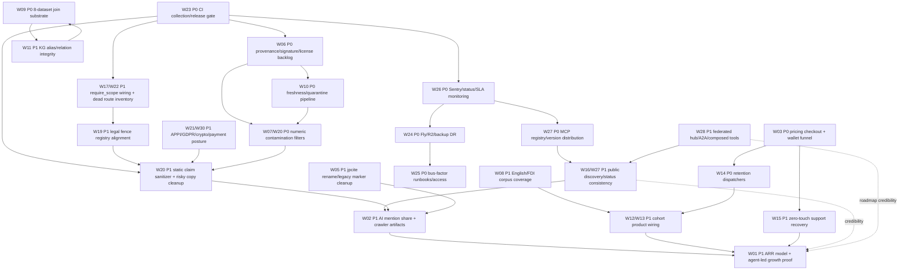

# jpcite Weakness Analysis - 2026-05-13

Scope: structural, business, data, brand, legal, operational vulnerability audit for `/Users/shigetoumeda/jpcite`.

Execution note: Wave 10 used 30 read-only audit lanes and 8 read-only synthesis lanes. This document is the only file written by the Wave 10 lane. All implementation specs below are intended to be actionable by a separate implementation CLI without reading the agent transcript.

## 1. Executive Summary

jpcite の Wave 10 弱点分析の結論は、機能量そのものではなく「公開契約・データ信頼・運用真実性・配布整合性」の 4 点が本番デプロイ前の主リスクです。過去 Wave で多くの hardening は進んでいますが、外部ユーザー、LLM crawler、MCP registry、決済導線、公開 status が見る面に、まだ実装実態とずれた主張が残っています。現時点の verdict は **NO-GO**。短期で閉じるべき対象は、CI/release gate、誤認表示、データ汚染、監視・DR、registry/package drift です。

Top 5 risks:

1. **CI/release gate が真の安全弁になっていない**: `W23` の pytest collection error、release gate の deselect/green 問題、route smoke の陳腐化により、修正後の安全確認が崩れます。ここを先に閉じないと後続修正の信頼性がありません。
2. **公開コピーと LLM artifact が法務・ブランドリスクを作っている**: `W20/W07/W16/W18` で、節約額、補助金額、最新性、AX score、trust count などに実装・データ実態とずれた表現があります。特に金額・採択・節約・「最新」表示は景表法、消費者契約法、詐欺的営業文脈に直結します。
3. **データ信頼基盤がプロダクト主張に追いついていない**: `W06/W07/W09/W10/W11` で、署名・license review・provenance・8 dataset join・freshness quarantine・KG integrity に未接続または未検証の穴があります。競争優位や explainable facts を打ち出す前に、DB-backed な証跡が必要です。
4. **運用の真実性が不足している**: `W24/W25/W26` で、Fly single-region、R2 backup verification、Sentry/SLA/status、bus-factor runbook、緊急アクセスが未成熟です。公開 status と deploy gate が矛盾する状態は、本番障害時に信頼を失います。
5. **MCP/registry/discovery の整合性が崩れている**: `W16/W17/W27/W28` で、tool count、manifest version、resource URI、A2A/federation/composed tools、PyPI/npm/DXT/Smithery の配布実態に drift があります。agent-led growth の入口がここなので、発見面の不整合は ARR に直撃します。

30 軸の圧縮 rollup としては、まず `W01-W05` は成長・ブランドの前提条件を問う領域です。¥3/req モデル、AI Mention Share、credit wallet、moat、rename は、現状だと主張が先行しており、DB-backed KPI と公開 artifact の一貫性が必要です。`W06-W11` はデータ信頼の中核で、license queue、numeric contamination、英語/FDI coverage、8 dataset 統合、freshness、knowledge graph integrity が未完です。ここが弱いまま営業面を強めると、法務・ブランド・解約リスクが増えます。

`W12-W15` は cohort/retention/zero-touch の実装接続です。M&A、税理士、外国 FDI、補助金 consultant、信金、industry packs は市場仮説としては強い一方、subscriber、dispatcher、saved search、webhook recovery、email onboarding がまだ revenue loop として閉じ切っていません。`W16-W18` は agent brand、AX coverage、trust infrastructure で、公開 status と実装のずれを解消する領域です。`W19-W21/W30` は legal/privacy/regulatory で、業法 fence、APPI/GDPR、x402/USDC、credit wallet の規制姿勢を公開 contract に落とす必要があります。

`W22-W23` は技術負債と CI discipline で、未 mounted routes、dead scope、mypy residual、functions tsconfig、zero-test routes が deploy confidence を下げています。`W24-W26` は vendor/DR/incident/bus factor で、solo operation 前提なら runbook は「存在する」だけでなく、実行可能で検証済みである必要があります。`W27-W28` は MCP distribution と federated hub vision で、現状は storage/manifest/test が先行し、公開 discovery・callable tools・durable A2A が追いついていません。`W29` は 1k req/sec、急減、訴訟、政府/native integration への stress scenario で、容量計画と競争応答の弱さを示しています。

Recommended execution stance:

1. **まず CI と release gate を修復する**: `W23` を最初に閉じ、collection error、release deselect、route smoke、coverage gate を正常化します。
2. **次に公開 claim を削る**: `W20/W07/W16/W18` をまとめて処理し、金額・節約・最新・AX/trust の誤認余地を落とします。
3. **データ信頼の P0 を閉じる**: `W06/W09/W10/W11` の provenance、freshness、join substrate、KG integrity を DB-backed にします。
4. **運用と配布を deploy-ready にする**: `W24/W25/W26/W27` で監視、DR、backup restore、registry version を揃えます。
5. **最後に成長・hub・cohort を再開する**: `W01/W02/W12/W13/W14/W28` は、信頼基盤が閉じた後に ARR/retention/discovery 施策として進めるべきです。

Final verdict: **本番デプロイはまだ不可**。ただし blocker は構造的に分解可能です。最短ルートは、新機能追加ではなく、CI 真実性、公開表示安全性、データ信頼、運用監視、配布整合性を順に閉じることです。

## 2. Implementation Quick Index

### Top 10 P0

| Rank | Finding | Title | Dependency |
|---:|---|---|---|
| 1 | [F-W23.P0.1](#f-w23-p0-1) | CI collection error makes main test gate unreliable | none |
| 2 | [F-W23.P0.2](#f-w23-p0-2) | Release gate can publish while main is red | F-W23.P0.1 |
| 3 | [F-W03.P0.1](#f-w03-p0-1) | Pricing checkout success URL invalid against allowlist | none |
| 4 | [F-W14.P0.3](#f-w14-p0-3) | Amendment alert webhook lookup uses wrong schema | none |
| 5 | [F-W10.P0.1](#f-w10-p0-1) | Refresh workflow passes unsupported args / wrong summary contract | none |
| 6 | [F-W10.P0.2](#f-w10-p0-2) | Source transport failures never quarantine | F-W10.P0.1 |
| 7 | [F-W07.P0.1](#f-w07-p0-1) | Amount totals use template/program hints as if reliable | none |
| 8 | [F-W20.P1.1](#f-w20-p1-1) | Public onboarding shows misleading savings copy | F-W07.P0.1 |
| 9 | [F-W28.P1.1](#f-w28-p1-1) | Public A2A creates pending tasks with no execution path | none |
| 10 | [F-W24.P0.1](#f-w24-p0-1) | Fly Tokyo single-region failover is manual/not provisioned | none |

### Top 30 P1

| Rank | Finding | Title | Dependency |
|---:|---|---|---|
| 1 | [F-W06.P0.1](#f-w06-p0-1) | Ed25519 / fact-signature schema absent in live DB | F-W18.P1.1 |
| 2 | [F-W06.P0.2](#f-w06-p0-2) | License review queue 1,425 pending | none |
| 3 | [F-W17.P1.2](#f-w17-p1-2) | `require_scope()` dead / canonical scopes unwired | none |
| 4 | [F-W22.P1.1](#f-w22-p1-1) | Route modules define routes but are not mounted | none |
| 5 | [F-W22.P1.3](#f-w22-p1-3) | `mypy` residual errors and soft CI | F-W23.P0.1 |
| 6 | [F-W22.P1.4](#f-w22-p1-4) | `functions/*.ts` lacks strict tsconfig / CI typecheck | F-W23.P0.1 |
| 7 | [F-W11.P1.2](#f-w11-p1-2) | Related programs query uses wrong alias column | none |
| 8 | [F-W11.P1.3](#f-w11-p1-3) | Relation target orphans | F-W11.P1.2 |
| 9 | [F-W09.P0.1](#f-w09-p0-1) | Cross-dataset join substrate missing or unseeded | F-W10.P0.1 |
| 10 | [F-W04.P1.1](#f-w04-p1-1) | 1M entity/stat moat not verifiable | F-W09.P0.1 |
| 11 | [F-W04.P1.2](#f-w04-p1-2) | MCP tool count contradictory | F-W16.P1.1 |
| 12 | [F-W16.P1.3](#f-w16-p1-3) | Public AX/status artifacts contain placeholder/overclaim data | F-W02.P1.1 |
| 13 | [F-W17.P1.3](#f-w17-p1-3) | Public AX dashboard fallback overclaims complete score | F-W16.P1.3 |
| 14 | [F-W18.P1.1](#f-w18-p1-1) | Cross-source agreement endpoint queries nonexistent column | none |
| 15 | [F-W18.P1.2](#f-w18-p1-2) | Public audit RSS stale/empty while DB newer | F-W10.P0.1 |
| 16 | [F-W20.P1.2](#f-w20-p1-2) | Actual response sample exposes large grant amount without verification | F-W07.P0.1 |
| 17 | [F-W20.P1.3](#f-w20-p1-3) | W07 amount caveat not propagated to LLM/public artifacts | F-W20.P1.2 |
| 18 | [F-W20.P1.4](#f-w20-p1-4) | Portfolio heatmap aggregates unqualified amount hints | F-W07.P0.1 |
| 19 | [F-W21.P1.1](#f-w21-p1-1) | LINE audit logs persist raw user/message IDs | none |
| 20 | [F-W21.P1.2](#f-w21-p1-2) | APPI/GDPR rights coverage incomplete | F-W21.P1.1 |
| 21 | [F-W03.P1.2](#f-w03-p1-2) | Zero-lost onboarding split across inconsistent flows | F-W03.P0.1 |
| 22 | [F-W03.P1.3](#f-w03-p1-3) | Wallet immediate top-up amount ignored | F-W03.P0.1 |
| 23 | [F-W14.P1.4](#f-w14-p1-4) | Predictive alert threshold/window not enforced | F-W14.P0.3 |
| 24 | [F-W14.P1.5](#f-w14-p1-5) | Alert delivery retry state incomplete | F-W14.P0.3 |
| 25 | [F-W15.P1.1](#f-w15-p1-1) | Onboarding/support copy invites human replies | none |
| 26 | [F-W24.P1.2](#f-w24-p1-2) | DB backup can skip R2 upload and remain green | F-W24.P0.1 |
| 27 | [F-W25.P1.4](#f-w25-p1-4) | Deploy path depends on operator ACK | F-W24.P0.1 |
| 28 | [F-W26.P1.3](#f-w26-p1-3) | SLA/uptime monitoring schema/workflow mismatch | F-W23.P0.1 |
| 29 | [F-W27.P1.3](#f-w27-p1-3) | Registry manifests/package versions drift | F-W04.P1.2 |
| 30 | [F-W28.P1.2](#f-w28-p1-2) | Federation discovery advertises example partners | F-W28.P1.1 |

### Dependency DAG



## 3. Cross-Axis Compound Risk

### CR-1: Revenue Promise Drift -> Legal Exposure -> Funnel Breakage

Axes/findings: W01 pricing viability, W03 funnel/wallet, W07 numeric contamination, W20 景表法, W23 CI coverage.

ARR targets depend on clear ¥3/req usage conversion, but public/onboarding copy still contains contradictory examples such as ¥330 vs ¥5,940, “節約額” phrasing, and unverified amount totals. W07’s amount contamination then turns pricing copy into legal risk because downstream agents may treat advisory or template-derived subsidy amounts as confirmed benefit. W23 makes this worse because static artifact claim checks are incomplete.

Implementation order: fix W20 public/static claim copy, fix W03 checkout success URL and wallet/top-up semantics, harden W07 amount totals to verified-only, then add W23 static artifact claim scanner across `site/`, `docs/`, README, feeds, and llms artifacts.

### CR-2: Public Contract Overclaim -> Agent Discovery Failure -> Registry Trust Loss

Axes/findings: W02 AI mention share, W16 agent brand, W17 AX coverage, W27 registry distribution, W28 federated MCP.

Public discovery surfaces disagree on tool counts, OpenAPI route counts, resources, streamable HTTP support, composed tools, federation metadata, and partner handoffs. W28 shows hub functionality is largely storage/docs, not callable product. W27 shows registry versions and namespace drift. W16/W17 show public AX artifacts are placeholders or overclaiming. Agents evaluate machine-readable manifests before prose; if manifests disagree, crawler and registry trust drops.

Implementation order: pick one manifest source of truth, regenerate MCP/OpenAPI/.well-known/llms surfaces from it, downgrade W28 hub claims until callable, and gate count/version/namespace/resource drift in CI.

### CR-3: Data Quality Gaps -> Legal Fence Weakness -> Professional Reliance Risk

Axes/findings: W06 license/provenance, W07 numeric contamination, W18 trust infra, W19 legal fence, W20 consumer/fraud.

Provenance/signature coverage is incomplete, trust endpoints contain stale or schema-mismatched data, amount/compat outputs expose advisory rows, and legal fence coverage differs between public docs, runtime registry, and manifest. This means a user can receive outputs that look compliance-grade while underlying source, license, amount, or professional-duty status is uncertain.

Implementation order: make amount/compat verified-only by default, normalize sensitive tool registry and public legal-fence counts, fix trust endpoints against live schema, add provenance/signature coverage gates, and ensure disclaimers are backed by machine-readable limitation fields.

### CR-4: Retention Surface Exists -> Delivery Path Broken -> Paid Usage Does Not Recur

Axes/findings: W12 cohorts, W13 FDI/industry packs, W14 retention, W15 support, W03 wallet.

Revenue cohorts depend on recurring signals: watches, saved searches, amendment alerts, predictive alerts, industry packs, foreign FDI updates, and webhook/email delivery. W14 finds several queues or recurring features have no reliable dispatcher or schema mismatch. W12/W13 show cohort-specific surfaces are cold, unmounted, or not manifested. W15 shows recovery paths remain support-heavy.

Implementation order: fix amendment alert webhook schema mismatch and cursor-on-failure behavior, add dispatchers for predictive alerts and recurring email courses, expose cohort APIs only when backed by data and delivery, add webhook reactivation, then wire wallet notifications to recurring usage thresholds.

### CR-5: Freshness Pipeline Drift -> Stale Public Claims -> Trust Center Contradiction

Axes/findings: W10 freshness, W18 trust infra, W20 stale latest copy, W24 DR, W26 monitoring.

Refresh workflows call unsupported flags, quarantine logic does not close the loop, public trust pages hard-code old snapshots as “latest”, audit RSS is stale, and backup/status probes can pass without proving data freshness. Freshness is both product quality and public trust claim. If refresh, trust center, backup verification, and status monitoring are not tied to the same source, the system can be stale while appearing healthy.

Implementation order: fix refresh CLI/workflow contract and quarantine semantics, add source freshness SOT endpoint with last verified time, regenerate trust/audit public artifacts from that SOT, fail closed when backup/status freshness cannot be verified, and add stale data alerts.

### CR-6: Single-Region/Solo Ops -> Incident Non-Recovery -> Public Availability Claims Fail

Axes/findings: W24 vendor/DR, W25 bus factor, W26 incident response, W27 registry distribution, W29 stress.

Runtime is Fly Tokyo-centered, registry republishing is manual across many surfaces, emergency access is founder-dependent, monitoring is incomplete, and stress/load tests are weak. A traffic spike, registry outage, billing incident, or founder absence can block recovery. Operational fragility becomes public product failure because MCP distribution has many registries and clients cache manifests.

Implementation order: define RTO/RPO and provision a tested fallback path, make registry publication a state-machine script, add non-founder emergency access verification, add incident artifact generation and rollback automation, and load-test with success/error budgets.

### CR-7: Privacy/Crypto/Wallet Ambiguity -> Payment Growth Blocker

Axes/findings: W03 credit wallet, W21 APPI/GDPR/PII/crypto, W30 regulatory future, W15 support, W01 business model.

Wallet/top-up design supports prepaid-like behavior, x402/USDC/Base posture is under-documented, customer data deletion is incomplete, webhook secrets and LINE IDs have PII exposure, and DSR flows rely on email/manual handling. Billing growth requires trust at the point where privacy/payment obligations are highest.

Implementation order: classify wallet as usage credit with expiry/refund/auto-topup controls, hash/encrypt sensitive webhook/LINE identifiers, implement DSR deletion/export workflows with identity verification, add x402 regulatory disclosure and prod-mode controls, and test wallet limits/deletion/secret redaction.

### CR-8: Tech Debt/Test Drift -> False Deploy Green -> Regression Accumulation

Axes/findings: W22 unwired routes/dead code, W23 test/CI gap, W04 moat evidence, W09 dataset integration, W11 graph integrity.

Many routes are unmounted or untested, canonical scopes are unused, mypy is non-blocking, OpenAPI smoke does not cover all paths, dataset join migrations are missing or seed no data, and graph aliases/relations contain orphans and duplicates. If tests validate schema existence or synthetic rows instead of live behavior, every audit finding can reappear after implementation.

Implementation order: turn collection errors and mypy residuals into tracked gates or explicit allowlists, generate route-to-test/mount coverage, add live DB integration probes for joins/graph/provenance, mark dead routes/scopes experimental until wired, and make release depend on same-SHA green CI.

## 4. Per-Finding Implementation Spec

Each row is intentionally compact. `Files affected` uses the most specific stable path or glob found by audit; use the `Verification` command to resolve exact current line numbers before editing. `Target state` is phrased as the copy-paste implementation intent for the downstream CLI.

| ID | Sev | Files affected | Current state | Target state | Verification | Dependencies | Memory citations | Risk if skipped |
|---|---|---|---|---|---|---|---|---|
| <a id="f-w01-p0-1"></a>F-W01.P0.1 | P0 | CLAUDE.md; docs/pricing/*; site/pricing.html | ARR targets are asserted without a request/conversion model. | Add revenue model with req/user, paid conversion, churn, ARPA sensitivity. | `rg -n "Y1|Y3|36|600M|ARR" CLAUDE.md docs site` | none | [[feedback_agent_pricing_models_hybrid_wins]] | ARR planning risk |
| <a id="f-w01-p0-2"></a>F-W01.P0.2 | P0 | docs/pricing/*; src/jpintel_mcp/api/credit_wallet.py | ¥3/req rail coexists with hybrid/pack language. | Make ¥3/req canonical; packs are prepaid credit only. | `rg -n "月額|seat|pack|¥3/req|¥3.30" docs src site` | none | [[feedback_agent_pricing_models_hybrid_wins]] | pricing confusion |
| <a id="f-w01-p1-3"></a>F-W01.P1.3 | P1 | docs/pricing/case_studies/*; site/onboarding.html | Tax-accountant request math conflicts. | Align all examples to one request model and one yen total. | `rg -n "100 req|1,800 req|¥330|¥5,940" docs site` | F-W20.P1.1 | [[feedback_billing_frictionless_zero_lost]] | legal/brand |
| <a id="f-w01-p1-4"></a>F-W01.P1.4 | P1 | mcp-server.json; site/.well-known/*; README.md | Sales surfaces have count/name drift. | Derive counts from one manifest exporter. | `python scripts/check_openapi_drift.py && rg -n "139|150|151" .` | W16 | [[feedback_agent_led_growth_replacing_plg]] | conversion loss |
| <a id="f-w01-p1-5"></a>F-W01.P1.5 | P1 | docs/for-agent-devs/*; site/llms*.txt | Agent-led activation unclear. | Add first-call, payment, retry, verification path. | `rg -n "first call|activation|x402|wallet" docs site` | none | [[feedback_agent_led_growth_replacing_plg]] | PLG failure |
| <a id="f-w02-p1-1"></a>F-W02.P1.1 | P1 | analytics/; docs/marketing/* | AI Mention Share KPI absent or DRY_RUN-backed. | Create measured KPI table and cron. | `rg -n "AI Mention|DRY_RUN|mention_share" .` | none | [[feedback_agent_new_kpis_8]] | acquisition blind spot |
| <a id="f-w02-p1-2"></a>F-W02.P1.2 | P1 | site/robots.txt; site/sitemap*.xml; site/llms*.txt | Crawler surfaces inconsistent/noindex conflict. | Align llms/sitemap/.well-known with indexable canonicals. | `rg -n "noindex|llms|sitemap" site` | W05 | [[feedback_collection_browser_first]] | discovery loss |
| <a id="f-w02-p1-3"></a>F-W02.P1.3 | P1 | site/.well-known/*; site/index.html | Homepage does not expose crawler handoffs. | Add machine links to agents/openapi/llms. | `rg -n ".well-known|agents.json|openapi|llms" site/index.html site/.well-known` | none | [[feedback_agent_new_kpis_8]] | low LLM citation |
| <a id="f-w02-p2-4"></a>F-W02.P2.4 | P2 | site/feed.*; scripts/*feed* | Feeds stale. | Regenerate in CI and fail on old pubDate. | `rg -n "pubDate|lastBuildDate" site/feed.* scripts` | none | [[feedback_collection_browser_first]] | stale discovery |
| <a id="f-w02-p2-5"></a>F-W02.P2.5 | P2 | site/llms*.txt | llms files omit measurement/provenance claims. | Add measured freshness/count caveats. | `rg -n "source_fetched_at|freshness|verified" site/llms*.txt` | W10 | [[feedback_agent_new_kpis_8]] | trust loss |
| <a id="f-w03-p0-1"></a>F-W03.P0.1 | P0 | site/pricing.html; src/jpintel_mcp/api/billing*.py | Checkout success URL `/success?...` not allowlisted. | Use `/success.html?...` and add allowlist regression test. | `rg -n "success\\?|success.html|allowed_success" site src tests` | none | [[feedback_billing_frictionless_zero_lost]] | paid conversion break |
| <a id="f-w03-p1-2"></a>F-W03.P1.2 | P1 | site/onboarding.html; docs/pricing/* | Zero-lost 4-step onboarding split. | Collapse to one self-serve path. | `rg -n "Step|wallet|checkout|API key" site/onboarding.html docs/pricing` | F-W03.P0.1 | [[feedback_billing_frictionless_zero_lost]] | funnel leakage |
| <a id="f-w03-p1-3"></a>F-W03.P1.3 | P1 | src/jpintel_mcp/api/credit_wallet.py | Topup ignores `immediate_amount`. | Honor field and add bounds/idempotency. | `pytest tests/test_credit_wallet*.py -q` | none | [[feedback_agent_credit_wallet_design]] | billing undercharge |
| <a id="f-w03-p1-4"></a>F-W03.P1.4 | P1 | src/jpintel_mcp/api/credit_wallet.py; scripts/cron/* | Auto-topup is schema-only. | Add threshold cron/Stripe flow. | `rg -n "auto_topup|threshold|immediate_amount" src scripts tests` | F-W03.P1.3 | [[feedback_agent_credit_wallet_design]] | failed payments |
| <a id="f-w03-p2-5"></a>F-W03.P2.5 | P2 | src/jpintel_mcp/api/credit_wallet.py | Wallet cycle UTC, not JST. | Use Asia/Tokyo business-day boundaries. | `pytest tests/test_credit_wallet*.py -q -k timezone` | none | [[feedback_billing_frictionless_zero_lost]] | billing disputes |
| <a id="f-w04-p1-1"></a>F-W04.P1.1 | P1 | README.md; site/*; scripts/*stats* | 1M entity moat not verifiable vs DB/index counts. | Publish reproducible stats exporter. | `sqlite3 data/jpintel.db ".tables" && rg -n "1M|million|entity" README.md site docs` | W09 | [[feedback_explainable_fact_design]] | brand overclaim |
| <a id="f-w04-p1-2"></a>F-W04.P1.2 | P1 | mcp-server*.json; site/.well-known/agents.json | Tool count drift 139/150/151. | Derive all manifests from runtime registry. | `rg -n "139|150|151" mcp-server*.json site/.well-known` | W16 | [[feedback_agent_brand_redefined]] | discovery trust |
| <a id="f-w04-p1-3"></a>F-W04.P1.3 | P1 | migrations/274*; src/*anonym* | Anonymized query moat synthetic/not DB-backed. | Apply migration and API read path. | `rg -n "anonymized|k=5|query_shape" src scripts tests` | W21 | [[feedback_anonymized_query_pii_redact]] | privacy/moat false claim |
| <a id="f-w04-p1-4"></a>F-W04.P1.4 | P1 | scripts/migrations/278*; src/jpintel_mcp/mcp/federation.py | Federated MCP seed invisible. | Load curated partners in discovery/recommend API. | `rg -n "am_federated_mcp_partner|weather.example|freee|linear" src scripts` | W28 | [[feedback_federated_mcp_recommendation]] | partner moat missing |
| <a id="f-w04-p1-5"></a>F-W04.P1.5 | P1 | migrations/262* 275*; src/*fact* | Explainable fact design not live. | Add fact signature/provenance coverage gates. | `rg -n "fact_signature|source_id|confidence|provenance" src scripts tests` | W06 | [[feedback_explainable_fact_design]] | trust moat weak |
| <a id="f-w05-p1-1"></a>F-W05.P1.1 | P1 | pyproject.toml; README.md; server.json; smithery.yaml; dxt/manifest.json | Old AutonoMath/GitHub slug leaks. | Keep only approved legacy marker. | `rg -n "AutonoMath|autonomath|jpintel" pyproject.toml README.md server.json smithery.yaml dxt` | none | [[project_jpcite_rename]] | brand dilution |
| <a id="f-w05-p1-2"></a>F-W05.P1.2 | P1 | site/llms*.txt; site/.well-known/* | Short llms files lack legacy bridge. | Add rename note without rebranding. | `rg -n "jpcite|AutonoMath|legacy" site/llms*.txt site/.well-known` | F-W05.P1.1 | [[feedback_legacy_brand_marker]] | crawler confusion |
| <a id="f-w05-p1-3"></a>F-W05.P1.3 | P1 | site/llms.en.txt; site/en/llms.txt | English llms path split. | Canonicalize and redirect/duplicate intentionally. | `rg --files site | rg "llms.*en|en/llms"` | none | [[project_jpcite_rename]] | SEO split |
| <a id="f-w05-p1-4"></a>F-W05.P1.4 | P1 | docs/runbook/*dns*; site/_redirects | zeimu-kaikei.ai 301 plan missing/stale. | Add 6-month migration checklist. | `rg -n "zeimu|301|redirect|DNS" docs site` | none | [[feedback_agent_brand_redefined]] | SEO loss |
| <a id="f-w05-p2-5"></a>F-W05.P2.5 | P2 | tests/*rename*; scripts/*sanitize* | Old slug not gated in sanitizer. | Add denylist with allowlisted historical contexts. | `pytest tests/*rename* tests/*brand* -q` | F-W05.P1.1 | [[feedback_legacy_brand_marker]] | regression |
| <a id="f-w06-p0-1"></a>F-W06.P0.1 | P0 | scripts/migrations/*signature*; scripts/cron/*signature* | Ed25519/fact signature schema absent/incompatible. | Add tables and cron-compatible columns. | `rg -n "Ed25519|fact_signature|signature" scripts src tests` | none | [[feedback_explainable_fact_design]] | provenance failure |
| <a id="f-w06-p0-2"></a>F-W06.P0.2 | P0 | analysis_wave18/license_review_queue.csv | 1,425 license rows pending. | Bulk classify gov/internal and block unknown public export. | `wc -l analysis_wave18/license_review_queue.csv && rg -n ",pending|review" analysis_wave18/license_review_queue.csv` | none | H5 | legal exposure |
| <a id="f-w06-p1-3"></a>F-W06.P1.3 | P1 | src/*source*; site/status/* | Freshness 100% while sparse verification. | Split fetched_at vs verified_at. | `rg -n "fetched_at|verified_at|freshness" src site scripts` | W10 | [[feedback_explainable_fact_design]] | misleading trust |
| <a id="f-w06-p1-4"></a>F-W06.P1.4 | P1 | data/*.db; src/*fact* | Fact-level source_id coverage uneven. | Add non-null gate for public facts. | `sqlite3 data/jpintel.db "select count(*) from am_fact where source_id is null;"` | W09 | [[feedback_explainable_fact_design]] | weak citations |
| <a id="f-w06-p2-5"></a>F-W06.P2.5 | P2 | scripts/*license*; tests/*license* | NULL licenses omitted. | Scan NULL/empty/unknown as pending. | `pytest tests/*license* -q` | F-W06.P0.2 | H5 | contamination |
| <a id="f-w07-p0-1"></a>F-W07.P0.1 | P0 | src/jpintel_mcp/api/intel_portfolio_heatmap.py | Program amount hints backfill totals. | Totals only verified/authoritative conditions. | `pytest tests/test_intel_portfolio_heatmap.py -q` | none | H6 | 景表法 risk |
| <a id="f-w07-p0-2"></a>F-W07.P0.2 | P0 | src/jpintel_mcp/api/intel_portfolio_heatmap.py | Compat ignores visibility/inferred/source_url. | Expose advisory quality fields. | `rg -n "compat|inferred|source_url|quality_tier" src/jpintel_mcp/api/intel_portfolio_heatmap.py` | none | H6 | unsafe guarantee |
| <a id="f-w07-p1-3"></a>F-W07.P1.3 | P1 | src/jpintel_mcp/api/intel_portfolio_heatmap.py | Authoritative policy conflicts with verified-only claim. | Define one amount policy constant. | `rg -n "verified|authoritative|amount_policy" src tests` | W20 | [[feedback_autonomath_fraud_risk]] | legal drift |
| <a id="f-w07-p1-4"></a>F-W07.P1.4 | P1 | src/jpintel_mcp/api/intel_portfolio_heatmap.py | houjin ids do not overlap compat matrix. | Add resolver coverage metrics. | `pytest tests/test_intel_portfolio_heatmap.py -q -k compat` | W11 | H6 | bad recommendations |
| <a id="f-w07-p2-5"></a>F-W07.P2.5 | P2 | tests/test_intel_portfolio_heatmap.py | Tests miss fallback/unknown regressions. | Add fixtures for template_default and unknown compat. | `pytest tests/test_intel_portfolio_heatmap.py -q` | F-W07.P0.1 | H6 | regression |
| <a id="f-w08-p1-1"></a>F-W08.P1.1 | P1 | scripts/etl/batch_translate_corpus.py; data/*.db | `body_en` 1/353,278. | Build translation backlog and block EN claims. | `sqlite3 data/jpintel.db "select count(*), sum(body_en is not null) from am_law_article;"` | none | G12 | FDI unusable |
| <a id="f-w08-p1-2"></a>F-W08.P1.2 | P1 | src/*fdi*; data/*.db | Tax treaty 33/80 countries. | Publish coverage matrix and fallback state. | `rg -n "tax_treaty|80|country" src scripts docs` | none | G12 | foreign funnel |
| <a id="f-w08-p1-3"></a>F-W08.P1.3 | P1 | scripts/etl/batch_translate_corpus.py | Translation script stale/wrong purpose. | Replace with resumable batch translator. | `python scripts/etl/batch_translate_corpus.py --help` | F-W08.P1.1 | G12 | ops blockage |
| <a id="f-w08-p1-4"></a>F-W08.P1.4 | P1 | src/*fdi*; migrations/*fdi* | `v_fdi_country_public` missing. | Create view and route tests. | `rg -n "v_fdi_country_public|FDI|foreign" src scripts tests` | F-W08.P1.2 | G12 | API broken |
| <a id="f-w08-p2-5"></a>F-W08.P2.5 | P2 | site/sitemap*.xml; site/en/* | hreflang passes despite asymmetry. | Enforce expected EN/JA coverage ratio. | `pytest tests/*hreflang* -q` | W02 | R5 | SEO mismatch |
| <a id="f-w09-p0-1"></a>F-W09.P0.1 | P0 | scripts/migrations/206* 214*; data/*.db | Bridge/join substrate missing or unapplied. | Apply migrations and boot check tables. | `sqlite3 data/jpintel.db ".tables" | rg "program_law_refs|am_relation"` | none | CLAUDE.md | product integrity |
| <a id="f-w09-p0-2"></a>F-W09.P0.2 | P0 | scripts/migrations/206* 214*; tests/*integration* | Join migrations seed no rows; tests synthetic. | Add nonzero real-data gates. | `pytest tests/*integration* -q` | F-W09.P0.1 | CLAUDE.md | false coverage |
| <a id="f-w09-p1-3"></a>F-W09.P1.3 | P1 | src/*program*; data/*.db | Program-law refs sparse. | Add ETL joiner and coverage report. | `sqlite3 data/jpintel.db "select count(*) from program_law_refs;"` | F-W09.P0.1 | CLAUDE.md | weak citations |
| <a id="f-w09-p1-4"></a>F-W09.P1.4 | P1 | src/*adoption*; src/*program* | adoption-to-program skew. | Cap/label inferred joins. | `rg -n "adoption|program" src scripts tests` | F-W09.P0.1 | CLAUDE.md | wrong joins |
| <a id="f-w09-p2-5"></a>F-W09.P2.5 | P2 | tests/*route* | Tests accept 200/404/synthetic. | Require data-backed assertions. | `rg -n "in \\(200, 404\\)|synthetic|mock" tests` | F-W09.P0.2 | CLAUDE.md | CI blind spot |
| <a id="f-w10-p0-1"></a>F-W10.P0.1 | P0 | .github/workflows/*refresh*; scripts/refresh_sources.py | Workflow passes unsupported `--enrich`. | Align CLI args and fail on unknown. | `python scripts/refresh_sources.py --help && rg -n "--enrich" .github scripts` | none | [[feedback_predictive_service_design]] | freshness cron dead |
| <a id="f-w10-p0-2"></a>F-W10.P0.2 | P0 | scripts/refresh_sources.py | Transport errors increment but never quarantine. | 3-strike quarantine on all fetch failures. | `pytest tests/*refresh_sources* -q` | none | [[feedback_predictive_service_design]] | bad sources live |
| <a id="f-w10-p1-3"></a>F-W10.P1.3 | P1 | scripts/refresh_sources.py | Unsafe non-HTTPS skipped without fail count. | Record policy failure/quarantine. | `rg -n "https|scheme|quarantine|fail" scripts/refresh_sources.py tests` | F-W10.P0.2 | [[feedback_predictive_service_design]] | silent stale |
| <a id="f-w10-p1-4"></a>F-W10.P1.4 | P1 | src/*freshness*; site/status/* | Sentinel `source_fetched_at` dominates. | Add `source_verified_at` and UI caveat. | `rg -n "source_fetched_at|source_verified_at" src site scripts` | W06 | [[feedback_explainable_fact_design]] | trust mislabel |
| <a id="f-w10-p1-5"></a>F-W10.P1.5 | P1 | scripts/*predictive*; src/*predictive* | Dim K/T thresholds drift. | Centralize config and tests. | `rg -n "Dim K|Dim T|threshold|window" src scripts tests` | W14 | [[feedback_predictive_service_design]] | bad alerts |
| <a id="f-w11-p0-1"></a>F-W11.P0.1 | P0 | src/*graph*; src/*relation* | REST graph relation vocabulary stale. | Generate from live `am_relation` vocabulary. | `rg -n "relation_type|am_relation|graph" src tests` | W09 | [[feedback_explainable_fact_design]] | wrong graph |
| <a id="f-w11-p1-2"></a>F-W11.P1.2 | P1 | src/*related_programs* | Uses nonexistent `am_alias.alias_text`. | Use `alias` or compatibility view. | `rg -n "alias_text|am_alias" src tests` | none | [[feedback_explainable_fact_design]] | route failure |
| <a id="f-w11-p1-3"></a>F-W11.P1.3 | P1 | data/*.db; scripts/*relation* | Target orphans exist. | Add FK/orphan cleanup report. | `sqlite3 data/jpintel.db "select count(*) from am_relation r left join am_entity e on r.target_id=e.entity_id where e.entity_id is null;"` | W09 | [[feedback_explainable_fact_design]] | graph noise |
| <a id="f-w11-p1-4"></a>F-W11.P1.4 | P1 | scripts/*alias*; data/*.db | Alias surfaces map multiple canonicals. | Add ambiguity quarantine. | `rg -n "am_alias|canonical|dedup" scripts src tests` | none | [[feedback_explainable_fact_design]] | entity collision |
| <a id="f-w11-p2-5"></a>F-W11.P2.5 | P2 | .github/workflows/*; scripts/etl/harvest_implicit_relations.py | harvest_implicit not cron-invoked; dry-run not read-only. | Add workflow and dry-run guard. | `rg -n "harvest_implicit|dry-run" .github scripts tests` | W09 | [[feedback_explainable_fact_design]] | stale graph |
| <a id="f-w12-p1-1"></a>F-W12.P1.1 | P1 | src/*houjin_watch*; data/*.db | M&A watch has zero subscribers/webhooks. | Add seedable self-serve watch path. | `rg -n "houjin_watch|subscriber|webhook" src tests` | W14 | CLAUDE.md | cohort ARR gap |
| <a id="f-w12-p1-2"></a>F-W12.P1.2 | P1 | src/*watch*; src/*dispatch* | Watch API accepts program/law but dispatcher only houjin. | Route by watch type. | `rg -n "watch_type|program|law|houjin" src tests` | W14 | CLAUDE.md | broken alerts |
| <a id="f-w12-p1-3"></a>F-W12.P1.3 | P1 | src/*audit_seal*; src/*tax_rulesets* | Audit seal not attached to tax_rulesets v2. | Add evidence seal field. | `rg -n "audit_seal|tax_ruleset" src tests` | W18 | CLAUDE.md | weak retention |
| <a id="f-w12-p1-4"></a>F-W12.P1.4 | P1 | analytics/*; src/*billing* | ARR/churn probes see no revenue rows. | Add billing event projection. | `rg -n "ARR|churn|revenue" analytics src tests` | W03 | CLAUDE.md | false cohort metrics |
| <a id="f-w12-p2-5"></a>F-W12.P2.5 | P2 | src/*line*; docs/*line* | LINE cohort cold/no billing path. | Mark unavailable or add wallet link. | `rg -n "LINE|line_users|billing" src docs tests` | W21 | CLAUDE.md | cold-start drag |
| <a id="f-w13-p1-1"></a>F-W13.P1.1 | P1 | src/*fdi*; mcp/autonomath_tools/*; mcp-server.json | English/FDI router/tool not mounted/manifested. | Mount or remove public claim. | `rg -n "FDI|foreign|include_router|mcp.tool" src mcp mcp-server.json` | W08 | G12 | FDI ARR gap |
| <a id="f-w13-p1-2"></a>F-W13.P1.2 | P1 | data/*.db; scripts/*translate* | English body data empty. | Block English route until coverage threshold. | `sqlite3 data/jpintel.db "select count(*) from am_law_article where body_en is not null;"` | W08 | G12 | bad UX |
| <a id="f-w13-p1-3"></a>F-W13.P1.3 | P1 | src/*saved_search*; src/*client_profile* | saved_search profile_ids not exposed. | Wire profile filter in API/OpenAPI. | `rg -n "profile_id|saved_search|client_profile" src tests site/openapi` | W14 | G12 | consultant workflow gap |
| <a id="f-w13-p1-4"></a>F-W13.P1.4 | P1 | mcp/autonomath_tools/industry_packs.py | Industry packs hard-coded 3. | Data-backed registry for healthcare/real_estate/GX. | `rg -n "healthcare|real_estate|GX|industry" mcp src tests` | W09 | G12 | package moat weak |
| <a id="f-w13-p2-5"></a>F-W13.P2.5 | P2 | site/*shinkin*; docs/*shinkin* | Shinkin URL canonical split. | Add redirect/canonical and route smoke. | `rg -n "shinkin|信用金庫|canonical" site docs tests` | W02 | G12 | SEO leakage |
| <a id="f-w14-p0-1"></a>F-W14.P0.1 | P0 | src/jpintel_mcp/api/recurring_engagement.py; scripts/cron/* | Predictive alerts queue but no dispatcher. | Add delivery worker and status rows. | `rg -n "predictive|alert|dispatch|queue" src scripts tests` | W10 | [[feedback_predictive_service_design]] | retention broken |
| <a id="f-w14-p0-2"></a>F-W14.P0.2 | P0 | src/jpintel_mcp/api/recurring_engagement.py | Email course has no daily dispatcher. | Cron sender with idempotency. | `rg -n "recurring|email_course|daily" src scripts .github tests` | none | [[feedback_predictive_service_design]] | onboarding decay |
| <a id="f-w14-p0-3"></a>F-W14.P0.3 | P0 | src/*amendment_alert*; scripts/*dispatch* | Webhook lookup schema mismatch `active` vs `status`. | Normalize query and tests. | `pytest tests/*amendment* tests/*webhook* -q` | W15 | [[feedback_predictive_service_design]] | alerts fail |
| <a id="f-w14-p1-4"></a>F-W14.P1.4 | P1 | src/*predictive* | Threshold/program-window not enforced. | Central config and assertion tests. | `rg -n "threshold|program_window|predictive" src tests` | W10 | [[feedback_predictive_service_design]] | noisy alerts |
| <a id="f-w14-p1-5"></a>F-W14.P1.5 | P1 | src/*saved_search* | Slack failure suppresses same-window retry. | Retry state per channel. | `rg -n "slack|retry|saved_search" src tests` | W15 | [[feedback_predictive_service_design]] | delivery loss |
| <a id="f-w15-p1-1"></a>F-W15.P1.1 | P1 | src/jpintel_mcp/email/templates/* | Onboarding emails invite human replies. | Use self-serve help URLs only. | `rg -n "reply|返信|相談|call|Slack" src/jpintel_mcp/email/templates docs site` | none | [[feedback_zero_touch_solo]] | solo bottleneck |
| <a id="f-w15-p1-2"></a>F-W15.P1.2 | P1 | src/*trial*; src/*key* | Trial key loss requires support. | Add self-serve rotate/reveal-limited flow. | `rg -n "trial|api key|rotate|recover" src tests` | W21 | [[feedback_zero_touch_solo]] | CS load |
| <a id="f-w15-p1-3"></a>F-W15.P1.3 | P1 | src/*dpa*; site/*dpa* | DPA generation truncates parties/dates. | Require structured parties and rendered preview test. | `rg -n "DPA|party|effective_date" src site tests` | W21 | [[feedback_zero_touch_solo]] | legal defect |
| <a id="f-w15-p1-4"></a>F-W15.P1.4 | P1 | src/*customer_webhook* | Disabled webhook needs delete+re-register. | Add reactivate endpoint with DNS recheck. | `pytest tests/*customer_webhook* -q` | none | E7 | ops friction |
| <a id="f-w15-p2-5"></a>F-W15.P2.5 | P2 | docs/*webhook*; src/*webhook* | Docs say 30s, implementation 10s. | Align timeout docs/config. | `rg -n "30s|10s|timeout" docs src tests` | none | E7 | support tickets |
| <a id="f-w16-p1-1"></a>F-W16.P1.1 | P1 | mcp-server*.json; site/.well-known/agents.json | Tool count split 139/151. | Single generated manifest source. | `rg -n "139|151|tools_count" mcp-server*.json site/.well-known` | W04 | [[feedback_agent_brand_redefined]] | consistency failure |
| <a id="f-w16-p1-2"></a>F-W16.P1.2 | P1 | site/openapi/*; docs/*openapi* | OpenAPI path count stale 219 vs 297. | Regenerate and gate path count. | `python scripts/check_openapi_drift.py` | W22 | [[feedback_agent_brand_redefined]] | verifiability loss |
| <a id="f-w16-p1-3"></a>F-W16.P1.3 | P1 | site/status/ax_4pillars.json; site/status/six_axis_status.json | Placeholders public. | Generate real status or remove dashboard claim. | `rg -n "placeholder|TODO|60/60|10/10" site/status site` | W17 | [[feedback_ax_anti_patterns]] | brand overclaim |
| <a id="f-w16-p1-4"></a>F-W16.P1.4 | P1 | site/status/* | AX score >10/10/missing items. | Cap and compute from checks. | `rg -n "10/10|60/60|score" site/status scripts tests` | W17 | [[feedback_agent_brand_redefined]] | credibility |
| <a id="f-w16-p2-5"></a>F-W16.P2.5 | P2 | site/.well-known/agents.json; site/llms*.txt | agents.json promises llms section missing. | Add link or remove claim. | `rg -n "llms|agents" site/.well-known/agents.json site/llms*.txt` | W02 | [[feedback_agent_funnel_6_stages]] | discovery |
| <a id="f-w17-p0-1"></a>F-W17.P0.1 | P0 | site/status/ax_4pillars.json | Public 4-pillars JSON placeholder. | Regenerate from real probes and fail CI on placeholder. | `rg -n "placeholder|TODO|null" site/status/ax_4pillars.json scripts tests` | W16 | [[feedback_ax_4_pillars]] | public false status |
| <a id="f-w17-p1-2"></a>F-W17.P1.2 | P1 | src/*auth*; src/*routes* | `require_scope()` dead/no callers. | Wire canonical scopes to four routes. | `rg -n "require_scope\\(|Depends\\(require_scope" src tests` | H1 | [[feedback_ax_4_pillars]] | auth gap |
| <a id="f-w17-p1-3"></a>F-W17.P1.3 | P1 | site/status/ax_5pillars.json; scripts/*audit* | Dashboard fallback overclaims 60/60. | Fail closed on missing probe data. | `rg -n "fallback|60/60|ax_5" scripts site tests` | W16 | [[feedback_ax_anti_patterns]] | trust loss |
| <a id="f-w17-p1-4"></a>F-W17.P1.4 | P1 | mcp-server*.json; site/.well-known/* | streamable_http contradictory manifests. | One transport declaration. | `rg -n "streamable_http|sse|transport" mcp-server*.json site/.well-known` | W27 | [[feedback_ax_4_pillars]] | client failures |
| <a id="f-w17-p2-5"></a>F-W17.P2.5 | P2 | src/*appi*; src/*auth* | APPI scopes outside canonical scope contract. | Map to canonical scopes. | `rg -n "appi|scope|api:" src tests` | W21 | [[feedback_ax_4_pillars]] | policy drift |
| <a id="f-w18-p1-1"></a>F-W18.P1.1 | P1 | src/*cross_source* | Cross-source endpoint queries nonexistent `value`. | Use `field_value_*` schema. | `rg -n "cross_source|field_value| value" src tests` | W06 | [[feedback_explainable_fact_design]] | endpoint failure |
| <a id="f-w18-p1-2"></a>F-W18.P1.2 | P1 | site/audit*.xml; scripts/*audit*rss* | Public audit RSS stale/empty. | Publish generated RSS atomically. | `rg -n "audit.*rss|\\.new|pubDate" scripts site tests` | W26 | [[feedback_explainable_fact_design]] | trust signal absent |
| <a id="f-w18-p1-3"></a>F-W18.P1.3 | P1 | scripts/migrations/101_trust_infrastructure.sql; scripts/cron/* | §52 audit log schema exists but no sampler cron. | Add sampler workflow. | `rg -n "section_52|audit_log|sampler" scripts .github src tests` | none | [[feedback_explainable_fact_design]] | audit gap |
| <a id="f-w18-p1-4"></a>F-W18.P1.4 | P1 | src/*audit_seal*; scripts/*monthly* | Monthly audit-seal promised not implemented. | Monthly pack generator. | `rg -n "audit_seal|monthly|pack" src scripts tests docs` | W12 | [[feedback_explainable_fact_design]] | retention/trust |
| <a id="f-w18-p2-5"></a>F-W18.P2.5 | P2 | scripts/migrations/101_trust_infrastructure.sql | Correction dedup index not unique. | Add unique correction key. | `rg -n "correction|unique|trust_infrastructure" scripts tests` | none | [[feedback_explainable_fact_design]] | duplicate corrections |
| <a id="f-w19-p1-1"></a>F-W19.P1.1 | P1 | site/*legal*; src/*envelope_wrapper.py; mcp-server.json | Public fence count 11 vs runtime 36+ vs manifest 62. | Generate one sensitive tool registry. | `rg -n "SENSITIVE_TOOLS|disclaimer|業法|sensitive" src site mcp-server.json` | none | H2 | legal exposure |
| <a id="f-w19-p1-2"></a>F-W19.P1.2 | P1 | src/jpintel_mcp/mcp/autonomath_tools/envelope_wrapper.py | 36協定 tools not sensitive. | Add territory mapping. | `rg -n "36協定|Article 36|SENSITIVE_TOOLS" src tests` | F-W19.P1.1 | H2 | labor-law risk |
| <a id="f-w19-p1-3"></a>F-W19.P1.3 | P1 | src/*legal*; docs/*legal* | Adjacent-law registry missing cited laws. | Add CPA/judicial scrivener/lending/insurance mapping. | `rg -n "公認会計士|司法書士|貸金|保険" src docs tests` | F-W19.P1.1 | H2 | unauthorized advice |
| <a id="f-w19-p1-4"></a>F-W19.P1.4 | P1 | mcp-server.json; src/*envelope* | Manifest promises `_disclaimer` for unregistered tools. | Wrap all sensitive-like outputs. | `pytest tests/*legal*fence* -q` | F-W19.P1.1 | H2 | downstream misuse |
| <a id="f-w19-p2-5"></a>F-W19.P2.5 | P2 | site/*legal*; docs/*legal* | Object vs string disclaimer docs mismatch. | Document actual response schema. | `rg -n "_disclaimer" site docs src tests` | F-W19.P1.4 | H2 | client parsing |
| <a id="f-w20-p1-1"></a>F-W20.P1.1 | P1 | site/onboarding.html:224; docs/pricing/case_studies/tax_accountant_monthly_review.md:19 | “節約額” shows fee and conflicts with case study. | Rename to usage fee, ¥330/month, no savings guarantee. | `rg -n "節約額の目安|1,800 req|¥5,940" site/onboarding.html docs/pricing/case_studies` | W01 | [[feedback_no_fake_data]] | legal/brand |
| <a id="f-w20-p1-2"></a>F-W20.P1.2 | P1 | docs/for-agent-devs/why-bundle-jpcite_2026_05_11.md:52 | “実 response” shows 50M grant without verification. | Make schema example, null amount, source caveat. | `rg -n "実 response 抜粋|amount_max_jpy|50000000" docs/for-agent-devs` | W07 | [[feedback_autonomath_fraud_risk]] | fraud-like sales |
| <a id="f-w20-p1-3"></a>F-W20.P1.3 | P1 | site/llms-full.en.txt:95 | W07 caveat missing in LLM artifact. | Add unknown amount and no-claim caveat. | `rg -n "0 means unspecified|Do not make eligibility|W07 caveat" site/llms-full.en.txt` | F-W20.P1.2 | [[feedback_no_fake_data]] | LLM misquote |
| <a id="f-w20-p1-4"></a>F-W20.P1.4 | P1 | src/jpintel_mcp/api/intel_portfolio_heatmap.py:447 | Portfolio totals include unqualified hints. | Expose only verified total, set legacy total null. | `pytest tests/test_intel_portfolio_heatmap.py -q` | W07 | [[feedback_autonomath_fraud_risk]] | 景表法 risk |
| <a id="f-w20-p2-5"></a>F-W20.P2.5 | P2 | site/trust.html:302 | Stale snapshot labeled latest. | Label static build and point to freshness API. | `rg -n "最新コーパス|更新: 2026-04-29" site/trust.html` | W10 | [[feedback_no_fake_data]] | freshness mislead |
| <a id="f-w21-p1-1"></a>F-W21.P1.1 | P1 | src/*line*; data/*.db | LINE audit log stores raw user/message IDs. | Hash/tokenize and retention TTL. | `rg -n "line_user|message_id|audit" src tests` | none | [[feedback_anonymized_query_pii_redact]] | PII exposure |
| <a id="f-w21-p1-2"></a>F-W21.P1.2 | P1 | src/jpintel_mcp/api/appi_*.py | APPI/GDPR rights incomplete. | Implement export/delete/rectify/status matrix. | `rg -n "appi|gdpr|delete|export|rectify" src tests` | none | [[feedback_anonymized_query_pii_redact]] | compliance |
| <a id="f-w21-p1-3"></a>F-W21.P1.3 | P1 | src/*rights*; data/*.db | Rights request tables store plaintext email/name. | Encrypt or hash lookup fields. | `rg -n "rights|email|name" src scripts tests` | F-W21.P1.2 | [[feedback_anonymized_query_pii_redact]] | data breach |
| <a id="f-w21-p1-4"></a>F-W21.P1.4 | P1 | src/*anonym* | Anonymized outcomes synthetic/in-memory. | DB-backed k>=5 substrate. | `rg -n "k=5|anonymized|in_memory|synthetic" src tests` | W04 | [[feedback_anonymized_query_pii_redact]] | privacy false claim |
| <a id="f-w21-p1-5"></a>F-W21.P1.5 | P1 | src/*x402*; docs/*x402* | USDC/Base regulatory posture absent. | Publish classification, refund, custody disclaimers. | `rg -n "USDC|Base|x402|前払|資金移動" src docs site tests` | W30 | [[feedback_agent_x402_protocol]] | financial-reg risk |
| <a id="f-w22-p1-1"></a>F-W22.P1.1 | P1 | src/jpintel_mcp/api/main.py; src/jpintel_mcp/api/*.py | Route modules define routes but not mounted. | Mount or archive with tests. | `python - <<'PY'\nimport pathlib\nprint([p for p in pathlib.Path('src/jpintel_mcp/api').glob('*.py') if '@router' in p.read_text()])\nPY` | none | I8 | dead features |
| <a id="f-w22-p1-2"></a>F-W22.P1.2 | P1 | src/*auth*; src/*api* | Canonical scopes defined but unused. | Wire `Depends(require_scope(...))`. | `rg -n "require_scope\\(|Depends\\(require_scope" src tests` | W17 | H1 | auth gap |
| <a id="f-w22-p1-3"></a>F-W22.P1.3 | P1 | pyproject.toml; .github/workflows/* | mypy has residual errors and CI continue-on-error. | Fix or scope strict gate. | `mypy src/jpintel_mcp` | none | I9 | hidden regressions |
| <a id="f-w22-p1-4"></a>F-W22.P1.4 | P1 | functions/*.ts; functions/tsconfig.json; .github/workflows/* | functions TS lacks tsconfig/CI. | Add strict tsconfig and workflow job. | `test -f functions/tsconfig.json && npx tsc -p functions/tsconfig.json --noEmit` | none | I9 | edge defects |
| <a id="f-w22-p2-5"></a>F-W22.P2.5 | P2 | src/jpintel_mcp/api/main.py | pdf_report_router mounted twice. | Remove duplicate mount and test route table. | `rg -n "pdf_report_router|include_router" src/jpintel_mcp/api/main.py` | none | I8 | route ambiguity |
| <a id="f-w23-p0-1"></a>F-W23.P0.1 | P0 | tests/test_playwright_fallback.py; tests/_playwright_helper.py | CI collection error due helper exports. | Fix helper API or test import. | `pytest tests/test_playwright_fallback.py -q` | none | I8 | main red |
| <a id="f-w23-p0-2"></a>F-W23.P0.2 | P0 | .github/workflows/release.yml | Release gate deselects known-red tests. | Require full green or explicit quarantine file. | `rg -n "deselect|not |xfail|continue-on-error" .github tests` | F-W23.P0.1 | I8 | bad release |
| <a id="f-w23-p1-3"></a>F-W23.P1.3 | P1 | pyproject.toml; .github/workflows/* | Coverage not generated/enforced. | Add coverage XML and threshold. | `pytest --cov=src/jpintel_mcp --cov-report=term-missing` | none | I8 | blind spots |
| <a id="f-w23-p1-4"></a>F-W23.P1.4 | P1 | tests/ | Nested/orphan tests outside target discipline. | Enforce collected tests inventory. | `find tests -type f | wc -l && pytest --collect-only -q` | none | I8 | orphan tests |
| <a id="f-w23-p1-5"></a>F-W23.P1.5 | P1 | tests/*openapi*; site/openapi/* | Route smoke stale vs 297 paths. | Generate smoke from OpenAPI paths. | `pytest tests/*openapi* -q` | W16 | I8 | untested API |
| <a id="f-w24-p0-1"></a>F-W24.P0.1 | P0 | fly.toml; docs/runbook/*dr* | Fly Tokyo single-region/manual failover. | Add standby/restore drill or document RTO. | `rg -n "primary_region|min_machines|failover|RTO|RPO" fly.toml docs monitoring` | none | [[feedback_secret_store_separation]] | outage |
| <a id="f-w24-p1-2"></a>F-W24.P1.2 | P1 | scripts/cron/verify_backup_daily.py | Backup can skip R2 upload and still green. | Fail closed on missing upload/checksum. | `python scripts/cron/verify_backup_daily.py --help && rg -n "R2|checksum|skip" scripts/cron/verify_backup_daily.py tests` | none | [[feedback_secret_store_separation]] | data loss |
| <a id="f-w24-p1-3"></a>F-W24.P1.3 | P1 | monitoring/; scripts/*backup* | Bucket/prefix names inconsistent. | Centralize backup config. | `rg -n "bucket|prefix|R2|backup" monitoring scripts docs .github` | F-W24.P1.2 | [[feedback_secret_store_separation]] | restore failure |
| <a id="f-w24-p1-4"></a>F-W24.P1.4 | P1 | scripts/*secret*; docs/runbook/* | R2 secrets optional in discovery. | Prod gate requires them. | `rg -n "R2|optional|required|secret" scripts docs tests` | F-W24.P1.2 | [[feedback_secret_store_separation]] | silent no-backup |
| <a id="f-w24-p2-5"></a>F-W24.P2.5 | P2 | site/*; functions/* | Pages md fallback depends GitHub raw not R2/KV. | Add R2/KV fallback. | `rg -n "raw.githubusercontent|fallback|R2|KV" site functions tests` | none | [[feedback_secret_store_separation]] | public doc outage |
| <a id="f-w25-p0-1"></a>F-W25.P0.1 | P0 | site/terms*; docs/runbook/*shutdown* | Public 90-day promise conflicts with 30-day shutdown. | Align legal/ops commitment. | `rg -n "90 day|90日|30 day|30日|shutdown|termination" site docs` | none | [[feedback_zero_touch_solo]] | legal trust |
| <a id="f-w25-p0-2"></a>F-W25.P0.2 | P0 | docs/runbook/*secret* | Emergency access one-founder vault. | Add lawyer/operator escrow checklist. | `rg -n "emergency|vault|lawyer|escrow|break glass" docs` | W24 | [[feedback_secret_store_separation]] | continuity |
| <a id="f-w25-p0-3"></a>F-W25.P0.3 | P0 | docs/runbook/*incident*; site/support* | Chargeback/breach routed one inbox/phone. | Define backup owner and SLA. | `rg -n "chargeback|breach|72h|phone|support" docs site` | W26 | [[feedback_zero_touch_solo]] | missed legal deadline |
| <a id="f-w25-p1-4"></a>F-W25.P1.4 | P1 | .github/workflows/*deploy*; docs/runbook/*deploy* | Deploy blocked by operator ACK. | Define emergency deploy lane. | `rg -n "ACK|operator|deploy" .github docs scripts` | W26 | [[feedback_zero_touch_solo]] | founder bottleneck |
| <a id="f-w25-p1-5"></a>F-W25.P1.5 | P1 | scripts/mcp_registries.md; dxt/; smithery.yaml | Registry republish manual 7+ dirs. | State machine/checklist script. | `rg -n "republish|registry|smithery|dxt|PyPI|npm" scripts docs dxt` | W27 | [[feedback_zero_touch_solo]] | release drag |
| <a id="f-w26-p0-1"></a>F-W26.P0.1 | P0 | monitoring/; docs/runbook/*sentry* | Sentry specified but draft/not live. | Configure DSN checks and alert smoke. | `rg -n "Sentry|DSN|draft|TODO" monitoring docs src tests` | none | monitoring/ | incident blind |
| <a id="f-w26-p0-2"></a>F-W26.P0.2 | P0 | site/status/*; .github/workflows/*probe* | Public status can show API/MCP down without red alert. | Wire status probe to CI/alert. | `rg -n "status|uptime|probe|critical" site .github monitoring tests` | F-W26.P0.1 | monitoring/ | outage unnoticed |
| <a id="f-w26-p1-3"></a>F-W26.P1.3 | P1 | monitoring/*sla*; scripts/*sla* | SLA breach monitor no workflow/schema mismatch. | Add workflow and fixture DB. | `rg -n "SLA|breach|monitor" monitoring scripts .github tests` | F-W26.P0.2 | monitoring/ | customer credits |
| <a id="f-w26-p1-4"></a>F-W26.P1.4 | P1 | scripts/*billing_probe* | Billing probe OK when Stripe secret absent. | Fail closed in prod. | `rg -n "Stripe|billing probe|STRIPE" scripts tests .github` | W03 | monitoring/ | revenue blind |
| <a id="f-w26-p1-5"></a>F-W26.P1.5 | P1 | scripts/*audit*rss* | Audit RSS `.new` not published. | Atomic rename and test. | `rg -n "\\.new|audit.*rss|rename" scripts site tests` | W18 | monitoring/ | trust feed stale |
| <a id="f-w27-p0-1"></a>F-W27.P0.1 | P0 | pyproject.toml; dxt/manifest.json; server.json; mcp-server.json | Manifests 0.4.0 but registries/dist 0.3.5. | Build/publish synchronized artifacts. | `rg -n "0\\.3\\.5|0\\.4\\.0" pyproject.toml dxt server.json mcp-server.json scripts` | none | scripts/mcp_registries.md | install drift |
| <a id="f-w27-p0-2"></a>F-W27.P0.2 | P0 | scripts/mcp_registries.md | Runbook still `io.github.AutonoMath/*` causing 403. | Update namespace and smoke auth. | `rg -n "io.github.AutonoMath|AutonoMath" scripts/mcp_registries.md docs` | W05 | [[project_jpcite_rename]] | publish blocked |
| <a id="f-w27-p1-3"></a>F-W27.P1.3 | P1 | dxt/manifest.json; smithery.yaml; mcp-server.json | DXT/Smithery 139 vs runtime 151. | Manifest generated from runtime. | `rg -n "139|151|tools" dxt smithery.yaml mcp-server.json` | W16 | scripts/mcp_registries.md | client missing tools |
| <a id="f-w27-p1-4"></a>F-W27.P1.4 | P1 | dxt/; dist/ | DXT bundle stale/no 0.4.0 mcpb. | Add build gate. | `ls dxt dist 2>/dev/null && rg -n "mcpb|dxt" scripts .github` | F-W27.P0.1 | scripts/mcp_registries.md | install fail |
| <a id="f-w27-p1-5"></a>F-W27.P1.5 | P1 | scripts/*registry* | Registry checker exits 0 on missing listings. | Fail nonzero on absent listing. | `rg -n "exit\\(0\\)|missing|registry" scripts tests` | none | scripts/mcp_registries.md | false green |
| <a id="f-w28-p1-1"></a>F-W28.P1.1 | P1 | src/jpintel_mcp/api/a2a.py:64; src/jpintel_mcp/api/main.py:2840 | A2A creates non-durable pending tasks. | Durable queue or mark experimental/no-resume. | `rg -n "_TASKS|_swap_to_durable_store|include_router\\(a2a_router" src/jpintel_mcp/api` | none | [[feedback_federated_mcp_recommendation]] | partner breakage |
| <a id="f-w28-p1-2"></a>F-W28.P1.2 | P1 | src/jpintel_mcp/mcp/federation.py:55; scripts/etl/seed_federated_mcp_partners.py:55 | Discovery advertises example partners. | Load curated freee/MF/Notion/Slack/GitHub/Linear. | `rg -n "weather\\.example|tax-rates\\.example|freee|linear" src scripts` | none | [[feedback_federated_mcp_recommendation]] | fake hub |
| <a id="f-w28-p1-3"></a>F-W28.P1.3 | P1 | scripts/migrations/278_federated_mcp.sql:79; src/*federation* | Handoff storage unused. | Add `/federation/recommend` and append-only log. | `rg -n "am_handoff_log|federation/recommend|handoff" src scripts tests` | F-W28.P1.2 | [[feedback_federated_mcp_recommendation]] | ARR gap |
| <a id="f-w28-p1-4"></a>F-W28.P1.4 | P1 | scripts/migrations/276_composable_tools.sql:61; mcp-server.json; src/*composition* | Composed tools seeded but not callable. | Add `execute_composed_tool` and manifest aliases. | `rg -n "execute_composed_tool|ultimate_due_diligence_kit|am_composed_tool_catalog" src scripts mcp-server.json tests` | none | [[feedback_composable_tools_pattern]] | unusable feature |
| <a id="f-w28-p2-5"></a>F-W28.P2.5 | P2 | scripts/migrations/277_time_machine.sql:20; src/jpintel_mcp/api/time_machine.py:62 | Counterfactual storage-only. | Add evaluate endpoint or remove claim. | `rg -n "counterfactual|evaluate/counterfactual|am_counterfactual_eval_log" src scripts tests` | none | [[feedback_time_machine_query_design]] | contract gap |
| <a id="f-w29-p0-1"></a>F-W29.P0.1 | P0 | fly.toml; functions/*; src/*rate_limit* | 1k req/sec impossible under current caps. | Document capacity and add load gate. | `rg -n "concurrency|rate|limit|min_machines|KV" fly.toml functions src tests` | W24 | I12 | traffic outage |
| <a id="f-w29-p1-2"></a>F-W29.P1.2 | P1 | src/jpintel_mcp/api/rate_limit.py | Fake-key spray creates unbounded buckets. | Cap bucket cardinality/TTL. | `pytest tests/*rate_limit* -q` | none | I12 | memory/DoS |
| <a id="f-w29-p1-3"></a>F-W29.P1.3 | P1 | src/*anon*; src/*rate_limit* | Anon over-quota writes to SQLite. | Reject at edge/KV before DB. | `rg -n "anon|over_quota|sqlite|rate" src functions tests` | F-W29.P1.2 | I12 | SQLite lock |
| <a id="f-w29-p1-4"></a>F-W29.P1.4 | P1 | src/*cache* | L4 cache hits write every time. | Make hit accounting sampled/batched. | `rg -n "cache hit|last_access|UPDATE" src tests` | none | I12 | write amp |
| <a id="f-w29-p1-5"></a>F-W29.P1.5 | P1 | src/*semantic* | semantic v2 lacks concurrency bulkhead. | Add semaphore/timeout/429. | `rg -n "semantic_search|timeout|semaphore|bulkhead" src tests` | none | I12 | latency collapse |
| <a id="f-w30-p1-1"></a>F-W30.P1.1 | P1 | docs/*x402*; site/*pricing*; src/*x402* | x402 USDC/Base lacks regulated-payment posture. | Add public classification and limits. | `rg -n "USDC|Base|x402|資金移動|前払" docs site src tests` | W21 | [[feedback_agent_x402_protocol]] | regulatory |
| <a id="f-w30-p1-2"></a>F-W30.P1.2 | P1 | src/jpintel_mcp/api/credit_wallet.py; docs/pricing/* | Credit wallet prepaid-like guardrails missing. | Add expiry/refund/topup limit disclosure. | `rg -n "wallet|refund|expiry|topup|前払" src docs tests` | W03 | [[feedback_agent_x402_protocol]] | funds law |
| <a id="f-w30-p1-3"></a>F-W30.P1.3 | P1 | site/privacy*; docs/*appi* | APPI foreign-transfer inconsistent. | Publish processors/countries and consent basis. | `rg -n "foreign transfer|第三者提供|APPI|GDPR|processor" site docs src` | W21 | [[feedback_anonymized_query_pii_redact]] | privacy |
| <a id="f-w30-p1-4"></a>F-W30.P1.4 | P1 | src/*dsr*; docs/*privacy* | DSR identity docs over email. | Add secure upload/token flow or remove request. | `rg -n "DSR|identity|email|本人確認" src docs tests` | W21 | [[feedback_anonymized_query_pii_redact]] | PII leakage |
| <a id="f-w30-p1-5"></a>F-W30.P1.5 | P1 | docs/*ai*; site/*trust* | AI Act/JP AI classification not operationalized. | Add regulatory classification register and review cron. | `rg -n "AI Act|AI guideline|高リスク|classification" docs site scripts tests` | W19 | [[feedback_agent_x402_protocol]] | future compliance |

## 5. Roadmap

### Production Deploy Blockers

Fix before production deploy:

1. `F-W23.P0.1` pytest collection error
2. `F-W23.P0.2` release gate can publish while main is red
3. `F-W03.P0.1` checkout success URL mismatch
4. `F-W17.P0.1` public AX status placeholder/overclaim
5. `F-W24.P0.1` Fly Tokyo single-region/manual failover
6. `F-W25.P0.1` public termination promise conflicts with shutdown plan
7. `F-W25.P0.2` emergency access / bus-factor vault gap
8. `F-W26.P0.1` Sentry/critical monitoring not live
9. `F-W26.P0.2` public status can be critical while deploy gate remains green
10. `F-W10.P0.1` refresh workflow uses unsupported args / wrong summary contract
11. `F-W10.P0.2` source quarantine never triggers on transport failure
12. `F-W14.P0.1` predictive alerts queue with no dispatcher
13. `F-W14.P0.2` recurring email course has no daily dispatcher
14. `F-W14.P0.3` amendment alert webhook schema mismatch
15. `F-W20.P1.1` public onboarding has misleading “節約額” copy
16. `F-W20.P1.2` public agent-dev doc shows unverified ¥50M grant sample
17. `F-W07.P0.1` amount fallback contaminates portfolio totals
18. `F-W07.P0.2` compatibility output exposes unknown/heuristic rows as usable
19. `F-W08.P1.1` English/FDI public promise unsupported by body_en coverage
20. `F-W09.P0.1` claimed 8-dataset joins not backed by live tables/data
21. `F-W22.P1.1` mounted/unmounted route drift
22. `F-W27.P0.1` registry/package version drift 0.4.0 vs 0.3.5

### Short Term: 1-4 Weeks

1. Stabilize CI/release gates: `W23`, `W22`, `W17`
2. Remove misleading public/legal claims: `W20`, `W07`, `W16`, `W18`
3. Fix billing and pricing funnel correctness: `W03`, `W01`
4. Repair freshness/quarantine source jobs: `W10`, `W06`
5. Close alert/engagement delivery gaps: `W14`, `W15`
6. Align MCP/OpenAPI/package discovery: `W16`, `W17`, `W27`
7. Add route smoke coverage for zero-test revenue routes: `W22`, `W23`
8. Harden incident monitoring and deploy visibility: `W24`, `W25`, `W26`
9. Fix registry namespace/package drift before external distribution: `W05`, `W27`
10. Defer only non-public docs and low-risk copy cleanups after green deploy gate

### Medium Term: 1-3 Months

1. Build verified provenance/signature substrate: `W06`, `W18`
2. Replace synthetic/anecdotal moat metrics with DB-backed dashboards: `W02`, `W04`
3. Complete 8-dataset cross-reference materialization: `W09`, `W11`
4. Implement real retention loops: predictive alerts, saved searches, webhook success tracking: `W14`
5. Wire canonical scopes into protected routes: `W17`, `W19`, `W21`, `W22`
6. Finish multilingual/FDI product readiness: `W08`, `W13`
7. Make federated MCP hub callable, logged, and discoverable: `W28`
8. Make composed tools callable and listed in manifests: `W28`, `W27`
9. Add APPI/GDPR deletion lifecycle and PII minimization: `W21`
10. Add backup restore drills, not just backup upload checks: `W24`, `W26`

### Long Term: 3-12 Months

1. Prove business model viability with real cohort economics: `W01`, `W03`, `W12`, `W13`
2. Build AI Mention Share and agent-led acquisition measurement: `W02`, `W16`
3. Establish durable competitive moat reporting: `W04`, `W09`, `W11`
4. Complete regulatory posture for x402, wallet/prepaid, APPI, AI guidelines: `W21`, `W30`
5. Expand legal fence to adjacent regulated domains and launch-grade 36協定 coverage: `W19`, `W20`
6. Mature DR and solo-operator continuity into executable drills: `W24`, `W25`, `W26`
7. Productize counterfactual/time-machine APIs with audit logs: `W28`, `W10`, `W18`
8. Build stress-scenario capacity plan for 1k req/sec and churn/litigation events: `W29`
9. Convert manual registry republish into reproducible release automation: `W27`
10. Revisit brand/rename migration after legacy markers, redirects, and package identities are consistent: `W05`

## Appendix A: Finding Table

| ID | Axis | Severity | File(s) | 1-line title |
|---|---|---|---|---|
| F-W01.P0.1 | W01 Business Model | P0 | CLAUDE.md; docs/pricing/* | ARR model absent |
| F-W01.P0.2 | W01 Business Model | P0 | docs/pricing/* | ¥3/req hybrid drift |
| F-W01.P1.3 | W01 Business Model | P1 | docs/pricing/case_studies/* | Tax accountant math conflict |
| F-W01.P1.4 | W01 Business Model | P1 | mcp-server.json | Count/name drift in sales surfaces |
| F-W01.P1.5 | W01 Business Model | P1 | docs/for-agent-devs/* | Agent-led activation unclear |
| F-W02.P1.1 | W02 Discovery | P1 | analytics/ | AI Mention Share not measured |
| F-W02.P1.2 | W02 Discovery | P1 | site/robots.txt | Crawler/noindex conflict |
| F-W02.P1.3 | W02 Discovery | P1 | site/index.html | Missing crawler handoffs |
| F-W02.P2.4 | W02 Discovery | P2 | site/feed.* | Stale feeds |
| F-W02.P2.5 | W02 Discovery | P2 | site/llms*.txt | llms freshness caveats missing |
| F-W03.P0.1 | W03 Pricing Funnel | P0 | site/pricing.html | Checkout success URL invalid |
| F-W03.P1.2 | W03 Pricing Funnel | P1 | site/onboarding.html | Onboarding split |
| F-W03.P1.3 | W03 Pricing Funnel | P1 | credit_wallet.py | Immediate topup ignored |
| F-W03.P1.4 | W03 Pricing Funnel | P1 | credit_wallet.py | Auto-topup schema-only |
| F-W03.P2.5 | W03 Pricing Funnel | P2 | credit_wallet.py | Wallet timezone mismatch |
| F-W04.P1.1 | W04 Moat | P1 | README.md | 1M entity claim unverifiable |
| F-W04.P1.2 | W04 Moat | P1 | mcp-server*.json | Tool count contradictory |
| F-W04.P1.3 | W04 Moat | P1 | src/*anonym* | Anonymized query synthetic |
| F-W04.P1.4 | W04 Moat | P1 | federation.py | Federated MCP seed invisible |
| F-W04.P1.5 | W04 Moat | P1 | src/*fact* | Explainable facts not live |
| F-W05.P1.1 | W05 Brand | P1 | pyproject.toml | Legacy AutonoMath slug leaks |
| F-W05.P1.2 | W05 Brand | P1 | site/llms*.txt | Legacy bridge missing |
| F-W05.P1.3 | W05 Brand | P1 | site/en/llms.txt | English llms split |
| F-W05.P1.4 | W05 Brand | P1 | site/_redirects | 301 plan missing |
| F-W05.P2.5 | W05 Brand | P2 | tests/*brand* | Old slug not gated |
| F-W06.P0.1 | W06 Provenance | P0 | migrations/*signature* | Fact signature schema absent |
| F-W06.P0.2 | W06 Provenance | P0 | license_review_queue.csv | License queue pending |
| F-W06.P1.3 | W06 Provenance | P1 | src/*source* | fetched_at vs verified_at conflated |
| F-W06.P1.4 | W06 Provenance | P1 | data/*.db | source_id coverage uneven |
| F-W06.P2.5 | W06 Provenance | P2 | scripts/*license* | NULL licenses omitted |
| F-W07.P0.1 | W07 Numeric | P0 | intel_portfolio_heatmap.py | Amount fallback contaminates totals |
| F-W07.P0.2 | W07 Numeric | P0 | intel_portfolio_heatmap.py | Compatibility quality hidden |
| F-W07.P1.3 | W07 Numeric | P1 | intel_portfolio_heatmap.py | Verified policy drift |
| F-W07.P1.4 | W07 Numeric | P1 | intel_portfolio_heatmap.py | houjin/compat mismatch |
| F-W07.P2.5 | W07 Numeric | P2 | tests/test_intel_portfolio_heatmap.py | Missing regressions |
| F-W08.P1.1 | W08 Multi-lang | P1 | batch_translate_corpus.py | English body coverage tiny |
| F-W08.P1.2 | W08 Multi-lang | P1 | src/*fdi* | Treaty coverage partial |
| F-W08.P1.3 | W08 Multi-lang | P1 | batch_translate_corpus.py | Translation script stale |
| F-W08.P1.4 | W08 Multi-lang | P1 | src/*fdi* | FDI public view missing |
| F-W08.P2.5 | W08 Multi-lang | P2 | site/sitemap*.xml | hreflang asymmetry |
| F-W09.P0.1 | W09 8 Dataset | P0 | migrations/206* | Join substrate missing |
| F-W09.P0.2 | W09 8 Dataset | P0 | tests/*integration* | Synthetic join tests |
| F-W09.P1.3 | W09 8 Dataset | P1 | src/*program* | Program-law refs sparse |
| F-W09.P1.4 | W09 8 Dataset | P1 | src/*adoption* | Adoption-program skew |
| F-W09.P2.5 | W09 8 Dataset | P2 | tests/*route* | 200/404 tests weak |
| F-W10.P0.1 | W10 Freshness | P0 | refresh workflows | Unsupported `--enrich` |
| F-W10.P0.2 | W10 Freshness | P0 | refresh_sources.py | No transport quarantine |
| F-W10.P1.3 | W10 Freshness | P1 | refresh_sources.py | Non-HTTPS skipped silently |
| F-W10.P1.4 | W10 Freshness | P1 | src/*freshness* | source_verified_at absent |
| F-W10.P1.5 | W10 Freshness | P1 | src/*predictive* | Dim thresholds drift |
| F-W11.P0.1 | W11 KG | P0 | src/*graph* | Relation vocabulary stale |
| F-W11.P1.2 | W11 KG | P1 | src/*related_programs* | Wrong alias column |
| F-W11.P1.3 | W11 KG | P1 | data/*.db | Relation target orphans |
| F-W11.P1.4 | W11 KG | P1 | scripts/*alias* | Alias ambiguity |
| F-W11.P2.5 | W11 KG | P2 | harvest_implicit_relations.py | Cron/dry-run gap |
| F-W12.P1.1 | W12 Cohort 1 | P1 | src/*houjin_watch* | Zero subscribers |
| F-W12.P1.2 | W12 Cohort 1 | P1 | src/*watch* | Dispatcher type mismatch |
| F-W12.P1.3 | W12 Cohort 1 | P1 | src/*tax_rulesets* | Audit seal not attached |
| F-W12.P1.4 | W12 Cohort 1 | P1 | analytics/* | Revenue rows absent |
| F-W12.P2.5 | W12 Cohort 1 | P2 | src/*line* | LINE cold/no billing |
| F-W13.P1.1 | W13 Cohort 2 | P1 | src/*fdi* | FDI not mounted |
| F-W13.P1.2 | W13 Cohort 2 | P1 | data/*.db | English body empty |
| F-W13.P1.3 | W13 Cohort 2 | P1 | src/*saved_search* | profile_id not exposed |
| F-W13.P1.4 | W13 Cohort 2 | P1 | industry_packs.py | Industry packs hard-coded |
| F-W13.P2.5 | W13 Cohort 2 | P2 | site/*shinkin* | Shinkin canonical split |
| F-W14.P0.1 | W14 Retention | P0 | recurring_engagement.py | Predictive dispatcher missing |
| F-W14.P0.2 | W14 Retention | P0 | recurring_engagement.py | Daily email dispatcher missing |
| F-W14.P0.3 | W14 Retention | P0 | src/*amendment_alert* | Webhook schema mismatch |
| F-W14.P1.4 | W14 Retention | P1 | src/*predictive* | Threshold/window not enforced |
| F-W14.P1.5 | W14 Retention | P1 | src/*saved_search* | Retry state incomplete |
| F-W15.P1.1 | W15 Support | P1 | email/templates | Human reply invited |
| F-W15.P1.2 | W15 Support | P1 | src/*key* | Trial key recovery support-only |
| F-W15.P1.3 | W15 Support | P1 | src/*dpa* | DPA truncates parties |
| F-W15.P1.4 | W15 Support | P1 | src/*customer_webhook* | No webhook reactivate |
| F-W15.P2.5 | W15 Support | P2 | docs/*webhook* | Timeout docs drift |
| F-W16.P1.1 | W16 Agent Brand | P1 | mcp-server*.json | Tool count split |
| F-W16.P1.2 | W16 Agent Brand | P1 | site/openapi/* | OpenAPI count stale |
| F-W16.P1.3 | W16 Agent Brand | P1 | site/status/* | Placeholder status public |
| F-W16.P1.4 | W16 Agent Brand | P1 | site/status/* | AX score overclaim |
| F-W16.P2.5 | W16 Agent Brand | P2 | agents.json | llms promise missing |
| F-W17.P0.1 | W17 AX | P0 | ax_4pillars.json | Public placeholder |
| F-W17.P1.2 | W17 AX | P1 | src/*auth* | require_scope unwired |
| F-W17.P1.3 | W17 AX | P1 | ax_5pillars.json | 60/60 fallback |
| F-W17.P1.4 | W17 AX | P1 | mcp-server*.json | Transport contradiction |
| F-W17.P2.5 | W17 AX | P2 | src/*appi* | Scope contract drift |
| F-W18.P1.1 | W18 Trust | P1 | src/*cross_source* | Nonexistent `value` column |
| F-W18.P1.2 | W18 Trust | P1 | audit RSS | Stale/empty RSS |
| F-W18.P1.3 | W18 Trust | P1 | migration 101 | No sampler cron |
| F-W18.P1.4 | W18 Trust | P1 | src/*audit_seal* | Monthly pack missing |
| F-W18.P2.5 | W18 Trust | P2 | migration 101 | Correction dedup not unique |
| F-W19.P1.1 | W19 Legal Fence | P1 | envelope_wrapper.py | Fence count drift |
| F-W19.P1.2 | W19 Legal Fence | P1 | envelope_wrapper.py | 36協定 not sensitive |
| F-W19.P1.3 | W19 Legal Fence | P1 | docs/*legal* | Adjacent laws missing |
| F-W19.P1.4 | W19 Legal Fence | P1 | mcp-server.json | `_disclaimer` promise drift |
| F-W19.P2.5 | W19 Legal Fence | P2 | site/*legal* | Disclaimer schema docs drift |
| F-W20.P1.1 | W20 Consumer | P1 | site/onboarding.html | Misleading savings copy |
| F-W20.P1.2 | W20 Consumer | P1 | docs/for-agent-devs | Unverified ¥50M sample |
| F-W20.P1.3 | W20 Consumer | P1 | site/llms-full.en.txt | Amount caveat missing |
| F-W20.P1.4 | W20 Consumer | P1 | intel_portfolio_heatmap.py | Unqualified amount total |
| F-W20.P2.5 | W20 Consumer | P2 | site/trust.html | Stale latest label |
| F-W21.P1.1 | W21 Privacy | P1 | src/*line* | Raw LINE IDs |
| F-W21.P1.2 | W21 Privacy | P1 | appi_*.py | Rights incomplete |
| F-W21.P1.3 | W21 Privacy | P1 | src/*rights* | Plaintext rights data |
| F-W21.P1.4 | W21 Privacy | P1 | src/*anonym* | Synthetic anonymity |
| F-W21.P1.5 | W21 Privacy | P1 | src/*x402* | Crypto posture absent |
| F-W22.P1.1 | W22 Tech Debt | P1 | main.py | Route modules unmounted |
| F-W22.P1.2 | W22 Tech Debt | P1 | src/*auth* | Canonical scopes unused |
| F-W22.P1.3 | W22 Tech Debt | P1 | pyproject.toml | mypy soft gate |
| F-W22.P1.4 | W22 Tech Debt | P1 | functions/*.ts | No TS typecheck |
| F-W22.P2.5 | W22 Tech Debt | P2 | main.py | Duplicate pdf router |
| F-W23.P0.1 | W23 CI | P0 | test_playwright_fallback.py | Collection error |
| F-W23.P0.2 | W23 CI | P0 | release.yml | Release false green |
| F-W23.P1.3 | W23 CI | P1 | pyproject.toml | Coverage unenforced |
| F-W23.P1.4 | W23 CI | P1 | tests/ | Orphan tests |
| F-W23.P1.5 | W23 CI | P1 | openapi tests | Route smoke stale |
| F-W24.P0.1 | W24 DR | P0 | fly.toml | Single region/manual failover |
| F-W24.P1.2 | W24 DR | P1 | verify_backup_daily.py | Backup false green |
| F-W24.P1.3 | W24 DR | P1 | monitoring/ | Bucket/prefix drift |
| F-W24.P1.4 | W24 DR | P1 | scripts/*secret* | R2 optional |
| F-W24.P2.5 | W24 DR | P2 | site/* | GitHub raw fallback |
| F-W25.P0.1 | W25 Bus Factor | P0 | terms/runbooks | 90/30 day conflict |
| F-W25.P0.2 | W25 Bus Factor | P0 | secret runbooks | One-founder vault |
| F-W25.P0.3 | W25 Bus Factor | P0 | incident runbooks | One inbox deadlines |
| F-W25.P1.4 | W25 Bus Factor | P1 | deploy workflows | Operator ACK bottleneck |
| F-W25.P1.5 | W25 Bus Factor | P1 | registry docs | Manual republish |
| F-W26.P0.1 | W26 Monitoring | P0 | monitoring/ | Sentry not live |
| F-W26.P0.2 | W26 Monitoring | P0 | site/status | Status not alerting |
| F-W26.P1.3 | W26 Monitoring | P1 | monitoring/*sla* | SLA monitor missing |
| F-W26.P1.4 | W26 Monitoring | P1 | billing probes | Stripe secret absent green |
| F-W26.P1.5 | W26 Monitoring | P1 | audit RSS scripts | `.new` not published |
| F-W27.P0.1 | W27 Registry | P0 | manifests | Version drift |
| F-W27.P0.2 | W27 Registry | P0 | mcp_registries.md | Old namespace 403 |
| F-W27.P1.3 | W27 Registry | P1 | dxt/smithery | Runtime count drift |
| F-W27.P1.4 | W27 Registry | P1 | dxt/dist | Stale bundle |
| F-W27.P1.5 | W27 Registry | P1 | registry scripts | Missing listing exit 0 |
| F-W28.P1.1 | W28 Federated | P1 | a2a.py | Non-durable pending tasks |
| F-W28.P1.2 | W28 Federated | P1 | federation.py | Example partners public |
| F-W28.P1.3 | W28 Federated | P1 | migration 278 | Handoff storage unused |
| F-W28.P1.4 | W28 Federated | P1 | composition tools | Composed tools not callable |
| F-W28.P2.5 | W28 Federated | P2 | time_machine.py | Counterfactual storage-only |
| F-W29.P0.1 | W29 Stress | P0 | fly.toml | 1k req/sec unsupported |
| F-W29.P1.2 | W29 Stress | P1 | rate_limit.py | Bucket cardinality DoS |
| F-W29.P1.3 | W29 Stress | P1 | src/*anon* | Anon writes SQLite |
| F-W29.P1.4 | W29 Stress | P1 | src/*cache* | Cache write amplification |
| F-W29.P1.5 | W29 Stress | P1 | src/*semantic* | No semantic bulkhead |
| F-W30.P1.1 | W30 Regulatory | P1 | docs/*x402* | Crypto posture absent |
| F-W30.P1.2 | W30 Regulatory | P1 | credit_wallet.py | Prepaid guardrails absent |
| F-W30.P1.3 | W30 Regulatory | P1 | privacy docs | Foreign transfer inconsistent |
| F-W30.P1.4 | W30 Regulatory | P1 | DSR docs | Identity over email |
| F-W30.P1.5 | W30 Regulatory | P1 | AI docs | AI classification not operationalized |

## Appendix B: Verification Shell Script

This script is read-only against source. It tolerates optional missing DB/files with WARN unless the check is a direct safety invariant.

```bash
#!/usr/bin/env bash
set -uo pipefail

ROOT="${JPCITE_REPO:-/Users/shigetoumeda/jpcite}"
export PYTHONDONTWRITEBYTECODE=1
export PYTEST_ADDOPTS="-p no:cacheprovider ${PYTEST_ADDOPTS:-}"

PASS=0
FAIL=0
WARN=0

cd "$ROOT" 2>/dev/null || {
  echo "FAIL repo not found: $ROOT"
  exit 2
}

say() { printf '\n## %s\n' "$*"; }
ok() { PASS=$((PASS+1)); printf 'PASS %s\n' "$*"; }
fail() { FAIL=$((FAIL+1)); printf 'FAIL %s\n' "$*"; }
warn() { WARN=$((WARN+1)); printf 'WARN %s\n' "$*"; }
has_cmd() { command -v "$1" >/dev/null 2>&1; }

grep_any() {
  local pat="$1"; shift
  local paths=()
  for p in "$@"; do [ -e "$p" ] && paths+=("$p"); done
  [ "${#paths[@]}" -gt 0 ] || return 2
  if has_cmd rg; then
    rg -n --color=never -- "$pat" "${paths[@]}" >/dev/null 2>&1
  else
    grep -RInE "$pat" "${paths[@]}" >/dev/null 2>&1
  fi
}

must_contain() {
  local label="$1" pat="$2"; shift 2
  grep_any "$pat" "$@" && ok "$label" || {
    local rc=$?
    [ "$rc" = 2 ] && warn "$label: optional path missing" || fail "$label"
  }
}

must_not_contain() {
  local label="$1" pat="$2"; shift 2
  grep_any "$pat" "$@" && fail "$label" || {
    local rc=$?
    [ "$rc" = 2 ] && warn "$label: optional path missing" || ok "$label"
  }
}

must_exist() {
  [ -e "$1" ] && ok "$1 exists" || fail "$1 missing"
}

run_warn() {
  local label="$1"; shift
  "$@" >/dev/null 2>&1 && ok "$label" || warn "$label"
}

sqlite_scalar() {
  local db="$1" sql="$2"
  [ -f "$db" ] || return 3
  python3 - "$db" "$sql" <<'PY'
import sqlite3, sys
db, sql = sys.argv[1], sys.argv[2]
uri = "file:" + db + "?mode=ro&immutable=1"
con = sqlite3.connect(uri, uri=True)
row = con.execute(sql).fetchone()
print("" if row is None else row[0])
PY
}

sqlite_min() {
  local label="$1" db="$2" sql="$3" min="$4"
  local v
  v="$(sqlite_scalar "$db" "$sql" 2>/dev/null)" || {
    [ "$?" = 3 ] && warn "$label: db missing $db" || fail "$label"
    return
  }
  python3 - "$v" "$min" <<'PY' >/dev/null 2>&1
import sys
raise SystemExit(0 if float(sys.argv[1] or 0) >= float(sys.argv[2]) else 1)
PY
  [ "$?" = 0 ] && ok "$label >= $min ($v)" || fail "$label below $min ($v)"
}

say "Baseline"
must_exist "CLAUDE.md"
must_exist "src/jpintel_mcp"
must_exist "tests"
must_not_contain "no LLM SDK imports in runtime package" "from openai|import openai|anthropic|google.generativeai" src/jpintel_mcp
must_not_contain "no forbidden git bypass docs" "--no-verify|--no-gpg-sign" .github scripts docs CLAUDE.md

say "W01 Business Model"
must_contain "canonical pricing present" "¥3|3円|3/req|billing_unit" CLAUDE.md docs site src
must_not_contain "hybrid pricing not promoted as primary" "seat.*plus.*request|enterprise.*seat|月額.*従量.*併用" docs site README.md

say "W02 Discovery"
must_exist "site/llms.txt"
must_exist "site/llms-full.en.txt"
must_exist "site/.well-known/agents.json"
must_contain "AI discovery artifacts mention jpcite" "jpcite" site/llms.txt site/llms-full.en.txt site/.well-known/agents.json
must_not_contain "public discovery artifacts are not noindex" "noindex|X-Robots-Tag.*noindex" site/llms.txt site/llms-full.en.txt site/.well-known

say "W03 Pricing Funnel"
must_not_contain "checkout success URL avoids disallowed /success path" "\"/success\\?|success_url.*\\/success\\?" src site functions
must_contain "wallet topup endpoint exists" "wallet.*topup|/topup|auto_topup" src/jpintel_mcp/api tests

say "W04 Competitive Moat"
sqlite_min "entity count substrate exists" "autonomath.db" "select count(*) from am_entity" 1
sqlite_min "fact count substrate exists" "autonomath.db" "select count(*) from am_fact" 1
must_contain "explainable fact/source wording present" "source_url|source_fetched_at|provenance" src docs site

say "W05 Brand"
must_not_contain "public surfaces avoid old AutonoMath owner slug" "AutonoMath/autonomath|io.github.AutonoMath" README.md pyproject.toml server.json smithery.yaml dxt mcp-server.json site docs
must_contain "jpcite brand present" "jpcite" README.md pyproject.toml server.json smithery.yaml dxt mcp-server.json site

say "W06 Provenance"
sqlite_min "license tables inspectable" "autonomath.db" "select count(*) from sqlite_master where name like '%license%'" 1
sqlite_min "source rows exist" "autonomath.db" "select count(*) from am_source" 1
must_contain "signature/provenance code exists" "Ed25519|signature|am_fact_signature|source_fetched_at" scripts src docs tests

say "W07 Numeric"
must_contain "portfolio heatmap has amount quality policy" "amount_policy|quality_tier|verified|authoritative|omitted_amount" src/jpintel_mcp/api/intel_portfolio_heatmap.py tests
must_not_contain "portfolio heatmap avoids raw total as verified total" "\"total_amount_max_yen\"\\s*:\\s*total_amount" src/jpintel_mcp/api/intel_portfolio_heatmap.py
must_contain "compatibility caveat exists" "compat.*policy|unknown.*heuristic|authoritative" src/jpintel_mcp/api/intel_portfolio_heatmap.py src/jpintel_mcp/api/funding_stack.py tests

say "W08 Multi-lang"
sqlite_min "English article table exists" "autonomath.db" "select count(*) from sqlite_master where name='am_law_article'" 1
must_contain "translation or multilingual ETL exists" "body_en|translate|hreflang|tax_treaty|FDI" scripts src site tests

say "W09 8 Dataset"
sqlite_min "relation table exists" "autonomath.db" "select count(*) from sqlite_master where name='am_relation'" 1
sqlite_min "relation edges exist" "autonomath.db" "select count(*) from am_relation" 1
must_contain "8 dataset bridge code exists" "program_law|bid|invoice|houjin|relation|cross" scripts tests src

say "W10 Freshness"
must_contain "refresh source job exists" "refresh_sources|quarantine|fail_count|source_fetched_at" scripts .github src tests
must_not_contain "refresh workflow avoids unsupported --enrich" "--enrich" .github/workflows scripts/cron
must_contain "quarantine behavior exists" "quarantine|three.*strike|3-strike|fail_count" scripts src tests

say "W11 Knowledge Graph"
sqlite_min "alias table exists" "autonomath.db" "select count(*) from sqlite_master where name='am_alias'" 1
sqlite_min "alias rows exist" "autonomath.db" "select count(*) from am_alias" 1
must_contain "implicit relation harvester exists" "harvest_implicit|am_relation|alias" scripts src tests

say "W12-W15 Cohort/Retention/Support"
must_contain "houjin/watch/audit/tax surfaces exist" "houjin_watch|audit_seal|tax_ruleset|LINE|line_users" src docs tests scripts
must_contain "industry pack and saved search surfaces exist" "industry_packs|saved_search|client_profile|FDI|shinkin" src mcp docs tests
must_contain "retention modules exist" "predictive|amendment_alert|recurring_engagement|saved_search" src tests scripts
must_not_contain "public copy does not promise phone/onboarding calls" "phone call|Slack Connect|onboarding call|専任担当|電話サポート" site docs README.md

say "W16-W18 AX/Trust"
must_exist "site/.well-known/agents.json"
must_not_contain "AX status avoids impossible score" "11/10|12/10|60/60" site/status docs site
must_contain "canonical require_scope code exists" "require_scope" src/jpintel_mcp/api tests
must_not_contain "public AX files avoid placeholders" "TODO|placeholder|dummy|fallback overclaim" site/status/ax_4pillars.json site/status/ax_5pillars.json
must_contain "trust migration/code exists" "trust_infrastructure|audit_log|cross_source|quorum|audit_seal" scripts/migrations scripts src tests
must_not_contain "trust center does not hardcode stale latest copy" "最新コーパス|更新: 2026-04-29" site/trust.html

say "W19-W21 Legal/Privacy"
must_contain "legal fence wrapper exists" "SENSITIVE_TOOLS|_disclaimer|業法|legal_fence" src tests docs site
must_not_contain "no misleading savings estimate" "節約額の目安|1,800 req|¥5,940" site/onboarding.html docs/pricing/case_studies
must_not_contain "no high-value unverified sample" "実 response 抜粋|amount_max_jpy.: 50000000" docs/for-agent-devs
must_not_contain "no hallucination zero guarantee" "幻覚 0%|構造的に幻覚は発生し得ない" docs site README.md
must_contain "APPI/GDPR modules exist" "appi|gdpr|deletion|erasure|right_to|PII" src tests docs
must_contain "x402 payment posture exists" "x402|USDC|Base|payment" src functions docs tests

say "W22-W23 Tech Debt/CI"
must_contain "route smoke tests exist" "TestClient|route|openapi" tests
must_contain "functions TS config or typecheck exists" "tsconfig|tsc|typecheck" functions .github package.json
run_warn "pytest collection smoke" python3 -m pytest --collect-only -q
must_contain "release workflow checks tests" "pytest|pre_deploy|smoke|coverage" .github/workflows tests scripts

say "W24-W26 DR/Incident"
must_contain "Fly config present" "primary_region|nrt|processes|machines" fly.toml
must_contain "backup verification exists" "verify_backup|restore|R2|backup" monitoring scripts .github docs
must_contain "runbooks exist" "emergency|bus factor|operator|handoff|shutdown|breach|chargeback" docs/runbook docs CLAUDE.md
must_contain "monitoring probes exist" "Sentry|uptime|SLA|status|incident|alert" monitoring docs scripts .github site/status

say "W27-W28 MCP Distribution/Federation"
must_contain "registry manifests exist" "version|tools|jpcite" server.json smithery.yaml dxt/manifest.json mcp-server.json site/mcp-server.json
must_not_contain "registry manifests avoid old namespace" "io.github.AutonoMath|autonomath://" server.json smithery.yaml dxt mcp-server.json site
must_not_contain "federation discovery avoids example partner servers" "weather\\.example|tax-rates\\.example|houjin-watch\\.example" src/jpintel_mcp/mcp/federation.py site mcp-server.json
must_contain "curated partner names surface" "freee|moneyforward|notion|slack|github|linear" src scripts docs site mcp-server.json
must_contain "composed tool names surface" "ultimate_due_diligence_kit|construction_total_dd|welfare_total_dd|tourism_total_dd|execute_composed_tool" src scripts tests mcp-server.json site

say "W29-W30 Stress/Regulatory"
must_contain "rate limit and load tests exist" "rate_limit|429|load|concurrent|1k|stress" src tests scripts docs monitoring
must_contain "SQLite safety guidance exists" "integrity_check|SQLite|lock|WAL|backup" docs scripts tests src
must_contain "AI/APPI/payment regulatory posture exists" "AI Act|AI guideline|APPI|資金移動|前払式|x402|USDC|Base" docs site src tests

say "Optional focused pytest groups"
if [ "${RUN_PYTEST:-0}" = "1" ]; then
  run_warn "security focused tests" python3 -m pytest tests/security -q
  run_warn "openapi/drift focused tests" python3 -m pytest tests -q -k 'openapi or drift or manifest'
  run_warn "billing/x402 focused tests" python3 -m pytest tests -q -k 'billing or x402 or wallet'
  run_warn "portfolio/funding focused tests" python3 -m pytest tests -q -k 'portfolio_heatmap or funding_stack'
else
  warn "focused pytest skipped; set RUN_PYTEST=1 to run non-destructive test probes"
fi

say "Summary"
printf 'PASS=%s FAIL=%s WARN=%s\n' "$PASS" "$FAIL" "$WARN"
[ "$FAIL" -eq 0 ]
```

## Appendix C: Memory Citation Index

| Citation | Used by |
|---|---|
| [[feedback_agent_pricing_models_hybrid_wins]] | W01 pricing viability, hybrid pricing risk |
| [[feedback_agent_led_growth_replacing_plg]] | W01 agent-led activation, W02 discovery |
| [[feedback_agent_new_kpis_8]] | W02 AI Mention Share |
| [[feedback_collection_browser_first]] | W02 crawler-first acquisition |
| [[feedback_billing_frictionless_zero_lost]] | W03 pricing funnel |
| [[feedback_agent_credit_wallet_design]] | W03 credit wallet |
| [[feedback_anonymized_query_pii_redact]] | W04 moat, W21 APPI/GDPR, W30 privacy |
| [[feedback_federated_mcp_recommendation]] | W04 moat, W28 federated hub |
| [[feedback_explainable_fact_design]] | W04/W06/W10/W11/W18 trust and facts |
| [[project_jpcite_rename]] | W05 rename |
| [[feedback_legacy_brand_marker]] | W05 legacy marker |
| [[feedback_agent_brand_redefined]] | W05/W16 brand |
| H5 | W06 license review queue |
| H6 | W07 numeric contamination |
| G12 | W08/W12/W13 multilingual and cohort findings |
| R5 | W08 hreflang asymmetry |
| [[feedback_predictive_service_design]] | W10/W14 freshness and retention |
| [[feedback_zero_touch_solo]] | W15/W25 zero-touch and bus factor |
| [[feedback_ax_anti_patterns]] | W16/W17 AX overclaim |
| [[feedback_agent_funnel_6_stages]] | W16 discovery funnel |
| [[feedback_ax_4_pillars]] | W17 AX pillars and scopes |
| H2 | W19 legal fence |
| [[feedback_no_fake_data]] | W20 static claims |
| [[feedback_autonomath_fraud_risk]] | W20 fraud/amount risk |
| [[feedback_agent_x402_protocol]] | W21/W30 x402 and payment regulation |
| I8 | W22/W23 routes and CI |
| I9 | W22 TypeScript/mypy |
| [[feedback_secret_store_separation]] | W24/W25 DR and secrets |
| monitoring/ | W26 incident monitoring |
| scripts/mcp_registries.md | W27 registry distribution |
| [[feedback_composable_tools_pattern]] | W28 composed tools |
| [[feedback_time_machine_query_design]] | W28 counterfactual/time-machine |
| I12 | W29 stress scenario |
