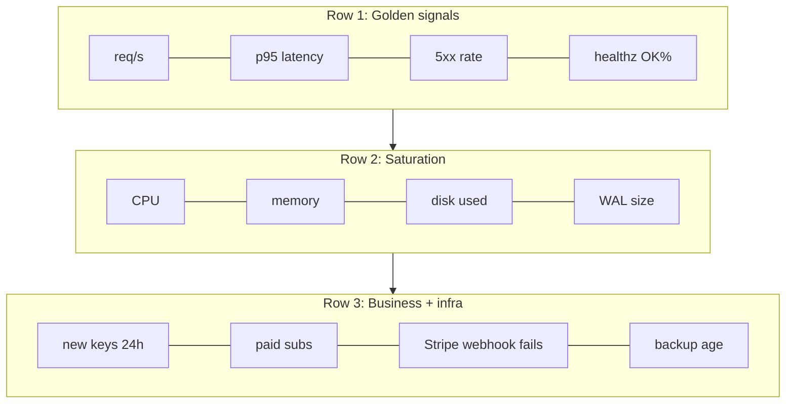

# Observability dashboard + alerting 仕様書

> **要約:** Sentry / Fly.io / structlog / Cloudflare の既存 signal を Grafana Cloud free tier に集約し、3×4 パネルの単一ダッシュボードと 3 段階 alert (P0/P1/P2) を定義する。MVP は D-Day に /healthz + /readyz + Sentry + Fly logs pane のみ、Grafana panel と alerts は W2、synthetic prober は W4。本ドキュメントは **仕様 (spec)** であり、実装は別 issue で行う。

最終更新: 2026-04-23 / 対象 launch: 2026-05-06

## 前提

- Fly.io nrt 単一 region、single machine (`min_machines_running = 1`)、LiteFS は未使用 (single-writer SQLite)
- Sentry Python SDK は `src/jpintel_mcp/api/main.py::_init_sentry` で wiring 済み
- structlog JSON は stdout → Fly.io log stream へ流れる (`src/jpintel_mcp/api/logging_config.py`)
- `/healthz` (`src/jpintel_mcp/api/meta.py:70`) と `/readyz` (`src/jpintel_mcp/api/main.py:181`) は live
- 独自ドメインは rebrand 保留中 (memory: `project_jpintel_trademark_intel_risk`)。**ドメイン変更を要求するツール (custom subdomain onboarding 等) は選定しない**

---

## 1. Metrics inventory

| # | metric | source | cardinality | retention | SLO target |
|---|---|---|---|---|---|
| **Golden signals** | | | | | |
| G1 | req/s (全体 & per-route) | Fly metrics (built-in) | low (route 数 ~15) | 30 日 | — |
| G2 | latency p50/p95/p99 (per-route) | Fly metrics / Sentry Performance | medium | 30 日 (Fly), 90 日 (Sentry) | p95 < 400 ms on `/v1/programs/search` |
| G3 | error rate 4xx/5xx | Fly metrics (status code histogram) | low | 30 日 | 5xx < 0.5% (月次) |
| G4 | CPU 使用率 | Fly metrics | 1 | 30 日 | < 60% 平常時 |
| G5 | memory 使用率 | Fly metrics | 1 | 30 日 | < 400 MB / 512 MB |
| G6 | SQLite db size | structlog (cron job が meta に log) | 1 | 30 日 | < 2 GB (volume 3 GB) |
| G7 | disk IO / used bytes on `/data` | Fly metrics (volume stats) | 1 | 30 日 | used < 70% |
| **Business signals** | | | | | |
| B1 | paid subs active | DB query (cron → Prom pushgateway or structlog) | 1 | 400 日 | — (trend のみ) |
| B2 | new keys issued 24h | structlog event `key.issued` + count | 1 | 90 日 | — |
| B3 | dashboard MAU | Cloudflare Web Analytics | 1 | 6 ヶ月 | — |
| B4 | MCP tool calls by tool | structlog (tool 名 tag) | tool 数 ~8 | 30 日 | — |
| B5 | search query volume top-20 (q の head distribution) | structlog event `search.query` (q 正規化後) | 限定 (top-20 のみ保持、他 `_other_`) | 7 日 | — |
| B6 | pricing page bounce rate | Cloudflare Web Analytics | 1 | 6 ヶ月 | — |
| **Infra signals** | | | | | |
| I1 | Fly machine count | Fly metrics / fly API | 1 | 30 日 | == 1 (alert if != 1) |
| I2 | LiteFS-not-running check | N/A (LiteFS 未使用) | — | — | 恒常 "absent OK" — skip |
| I3 | SQLite WAL size | structlog (cron `stat /data/jpintel.db-wal`) | 1 | 7 日 | < 100 MB |
| I4 | Stripe webhook queue lag | Stripe dashboard の "delivery attempts" は API で poll (**要確認: source available?** — Stripe Events API で最近失敗を list する代替で OK) | 1 | 30 日 | failures < 1/day |
| I5 | backup job last-success timestamp | GitHub Actions workflow run API → push metric to Grafana | 1 | 90 日 | < 26 h old |
| **External dep signals** | | | | | |
| E1 | Sentry quota burn | Sentry Usage Stats page (UI) / API `/organizations/{}/stats_v2/` | 1 | Sentry 保持 | < 70% / 月 |
| E2 | Cloudflare Pages fallback reachable | synthetic probe (W4) → `curl -sI jpintel-mirror.pages.dev` | 1 | 30 日 | 100% reachable |
| E3 | TLS cert days-until-expiry | synthetic probe (W4) — openssl s_client 経由 | 1 | 30 日 | > 14 日 |

**cardinality に関する注意:** `api_key_hash_prefix` (8 文字 hex) や `q` (ユーザ自由入力) を **label にすると爆発する**。structlog payload の field としては残すが、Grafana series label には絶対に昇格させない (free tier 10k series を守る)。B5 の「top-20」は batch job が前日分を集計して固定 20 series で push する。

---

## 2. Dashboard layout

**選定:** **Grafana Cloud (free tier)**。理由 (2 文): Sentry Dashboards は panel type が event chart 中心で Fly/Cloudflare 系 metric を混在できず、Fly.io native は閲覧専用で threshold 警告が UI 上で持てない。Grafana free tier は 10k series / 14 日 Prom 保持 / 3 user / 無料 alert manager を持ち、将来 self-host 移行時も dashboard JSON が再利用できる。

ドメイン変更は発生しない (Grafana Cloud 側の `*.grafana.net` subdomain を使うだけ、jpintel 側の DNS 設定不要)。

### 3 行 × 4 列 レイアウト

```
+---------------------+---------------------+---------------------+---------------------+
| (1,1) req/s total   | (1,2) p95 latency   | (1,3) 5xx rate %    | (1,4) /healthz OK%  |
|  stat + spark       |  timeseries 3 lines |  timeseries + thr   |  stat (uptime)      |
|  green <150         |  green <400ms       |  green <0.5%        |  green =100%        |
|  amber 150-300      |  amber 400-1000ms   |  amber 0.5-2%       |  amber 99-100%      |
|  red >300 (capacity)|  red >1000ms        |  red >2% (P0)       |  red <99%           |
+---------------------+---------------------+---------------------+---------------------+
| (2,1) CPU %         | (2,2) mem MB        | (2,3) /data used %  | (2,4) WAL MB        |
|  timeseries         |  timeseries         |  gauge 0-100        |  timeseries         |
|  green <60          |  green <400         |  green <70          |  green <50          |
|  amber 60-85        |  amber 400-480      |  amber 70-85        |  amber 50-100       |
|  red >85            |  red >480 (OOM risk)|  red >85 (P1)       |  red >100 (P1)      |
+---------------------+---------------------+---------------------+---------------------+
| (3,1) new keys 24h  | (3,2) paid subs     | (3,3) webhook fails | (3,4) backup age h  |
|  bar chart 24h      |  stat + sparkline   |  stat + 1h counter  |  stat               |
|  amber =0 for 24h   |  any (trend)        |  green =0           |  green <26          |
|  (launch 後)        |                     |  red >=1 (P0)       |  amber 26-48        |
|                     |                     |                     |  red >48 (P1)       |
+---------------------+---------------------+---------------------+---------------------+
```



**panel 共通ルール:**
- 時間軸 default = last 6h、切替 1h/24h/7d
- alert 発火中のセルは tab title に `(alert)` バッジを追加 (Grafana 標準機能)
- mobile では row を stack (単一 column) 表示

---

## 3. Alerts

各 alert は notification channel → email (sss@bookyou.net) + Slack (#ops) 両方。PagerDuty は有料のため launch 段階では email-to-SMS (Twilio forward を W4 で追加検討)。P0 のみ phone/SMS に拡張。runbook link は `docs/incident_runbook.md` の既存 section (a)-(f) を再利用する。不足 section は下記「要追加 section」に明記する。

### P0 (wake you up)

| trigger | threshold | notif | runbook |
|---|---|---|---|
| 5xx rate > 2% for 5 min | Prom query `sum(rate(http_requests_total{status=~"5.."}[5m])) / sum(rate(http_requests_total[5m])) > 0.02` | email + SMS + Slack | `incident_runbook.md §(a)` |
| /healthz failing for 3 consecutive probes (= 90s at 30s interval) | Fly health check signal or UptimeRobot "down" | email + SMS + Slack | `incident_runbook.md §(a)` or `§(f)` if Fly-wide |
| Stripe webhook 401/403 (signature broken) | Stripe Events API poll → count(`delivery_attempt.status ∈ {401,403}`) in last 15m ≥ 1 | email + SMS + Slack | `incident_runbook.md §(b)` |
| DB write failures (`sqlite3.OperationalError` in 5 min window ≥ 3) | Sentry alert rule `event.exception.type:sqlite3.OperationalError count() > 3 in 5m` | email + SMS + Slack | `incident_runbook.md §(a)` または `§(c)` if disk full |

### P1 (business hours)

| trigger | threshold | notif | runbook |
|---|---|---|---|
| p95 > 2s for 15 min on `/v1/programs/search` | Prom query on histogram | email + Slack | `incident_runbook.md §(a)` (先に restart 試行、それでも駄目なら bench.py で regression 確認) |
| backup job failure | GitHub Actions workflow `nightly-backup.yml` conclusion != success | email + Slack | **要追加 section: `incident_runbook.md §(g) backup-job 失敗`** |
| TLS cert < 14 days | synthetic probe | email + Slack | **要追加 section: `incident_runbook.md §(h) TLS renewal`** (Cloudflare edge cert は自動だが独自 cert 使用時のため) |
| paid sub churn spike (cancel > 5 in 24h) | DB query `COUNT(api_keys WHERE revoked_at > now()-1d AND tier != 'free') > 5` | email + Slack | **要追加 section: `incident_runbook.md §(i) churn spike triage`** |
| memory > 480 MB for 10 min | Fly metric | email + Slack | `incident_runbook.md §(a)` (restart で一旦戻す) |
| disk `/data` used > 85% | Fly volume metric | email + Slack | `incident_runbook.md §(c)` (PRAGMA vacuum または volume 拡張) |

### P2 (info / digest)

| trigger | cadence | notif | runbook |
|---|---|---|---|
| 新規 signup 日次 rollup | daily 08:00 JST | email | — |
| error type weekly digest | weekly Mon 08:00 JST | email | — |
| Sentry quota at 70% | event threshold | email | Sentry UI で sample rate 引き下げ (`sentry_traces_sample_rate`) |
| LiteFS check (I2) | — | — | N/A — 未使用なので skip (将来導入時に再定義) |

**`docs/incident_runbook.md` に今後追加すべき section:** §(g) backup-job 失敗、§(h) TLS renewal、§(i) churn spike triage。alerts 実装と同時に書く (W2)。

---

## 4. Log query catalog

structlog JSON は Fly.io log stream 経由で `flyctl logs` で取得、または Grafana Cloud Logs (Loki free 50 GB/月) に ship 予定。以下は **Loki LogQL** と **`flyctl logs | jq`** の両形式。

```bash
# 1. 直近 1 時間の 500 系
flyctl logs -a autonomath-api | jq -c 'select(.status >= 500)' | tail -100
# Loki:
{app="autonomath-api"} | json | status >= 500 | __error__=""

# 2. 空 q で /v1/programs/search を叩いた caller
flyctl logs -a autonomath-api | jq -c 'select(.path == "/v1/programs/search" and (.q // "") == "")'
# Loki:
{app="autonomath-api"} | json | path="/v1/programs/search" | q=""

# 3. Stripe webhook で署名検証失敗
{app="autonomath-api"} | json | logger_name="jpintel.billing" |~ "bad signature"

# 4. SQLite OperationalError (ロック / disk full 兆候)
{app="autonomath-api"} | json |~ "OperationalError|database is locked|disk image is malformed"

# 5. 429 (rate limit hit) を tier 別集計
{app="autonomath-api"} | json | status=429 | line_format "{{.tier}}"

# 6. 特定 api_key_hash_prefix の最近 50 req
{app="autonomath-api"} | json | api_key_hash_prefix="ab12cd34"

# 7. unhandled exception (main.py::_unhandled_exception_handler 経由)
{app="autonomath-api"} | json |~ "unhandled exception"

# 8. /healthz の失敗 (Fly probe ログ側、_app ではなく proxy)
{app="autonomath-api"} |~ "health_check" |~ "fail"

# 9. startup 完了確認 (_ready=true への遷移確認 — deploy 直後の smoke)
{app="autonomath-api"} | json |~ "init_db|setup_logging" | tail 20

# 10. response > 1s の slow requests (structlog 側で latency_ms を埋める前提、未埋めなら要追加)
{app="autonomath-api"} | json | latency_ms > 1000

# 11. 特定 request_id の全ログ (x-request-id ヘッダで trace)
{app="autonomath-api"} | json | request_id="a1b2c3d4e5f60708"

# 12. admin router 呼び出し (漏洩時に外部からの叩きを検知)
{app="autonomath-api"} | json | path=~"/v1/admin/.*"

# 13. DB lock 連発 window (5 分 bucket)
sum by (path) (count_over_time({app="autonomath-api"} |~ "database is locked" [5m]))

# 14. key issue event 数 (B2 の生ソース)
count_over_time({app="autonomath-api"} | json | event="key.issued" [24h])

# 15. Stripe event.type 内訳
sum by (event_type) (count_over_time({app="autonomath-api"} | json | logger_name="jpintel.billing" | event_type!="" [1h]))
```

**注:** query #10 は `latency_ms` field を structlog に埋める middleware が必要。現状未実装なので、W2 で `_RequestContextMiddleware` に `start = time.perf_counter(); ...; bind_contextvars(latency_ms=...)` を追加する **別タスク** (本 spec には含めない)。

---

## 5. Ingestion pipeline for metrics

### 現状
```
structlog.JSONRenderer → sys.stdout → Fly.io log stream (保持 7 日、UI/CLI 閲覧のみ)
```
Prometheus 形式の metric 出力点は **無い**。Fly built-in metrics (CPU/mem/req/s/status histogram) は Grafana Cloud の Fly.io data source を経由して読める (Fly は Prometheus remote write endpoint を提供)。

### 採用: **Fly.io managed metrics + Grafana Cloud Agent (log shipping のみ sidecar なし)**

選定理由:
1. **Fly.io hosted Prometheus** は無料・既存、CPU/mem/req/s/status を自動 export
2. Grafana Cloud 側の **Fly.io integration** (data source as Prometheus) を 1 clickで接続
3. **sidecar vector.dev は不要** — single-machine / 512 MB RAM 構成で sidecar を同居させると memory 圧迫リスクがある。vector は W4 以降 traffic 増で Fly built-in が足りなくなった段階で再検討
4. **business metric (B1/B2/B4/B5)** は FastAPI app 内で直接 `prometheus_client.Gauge/Counter` を立て `/internal/metrics` endpoint (admin router 相当、外部非公開) を expose、Grafana Agent が scrape

### Config 骨子

`pyproject.toml` に `prometheus-client` 追加 (W2 実装タスク)。

```python
# src/jpintel_mcp/api/metrics.py  (W2 で新設)
from prometheus_client import Counter, Gauge, generate_latest

keys_issued_total = Counter("jpintel_keys_issued_total", "Keys issued", ["tier"])
paid_subs_active  = Gauge("jpintel_paid_subs_active", "Active paid subs", ["tier"])
search_queries    = Counter("jpintel_search_queries_total", "Search calls", ["tier"])

@router.get("/internal/metrics", include_in_schema=False)
def metrics() -> Response:
    return Response(generate_latest(), media_type="text/plain; version=0.0.4")
```

Grafana Agent 側 (Grafana Cloud が自動生成する `agent.yaml` テンプレートを編集):
```yaml
prometheus:
  wal_directory: /tmp/wal
  configs:
    - name: jpintel
      scrape_configs:
        - job_name: jpintel-fly-internal
          static_configs:
            - targets: ['autonomath-api.internal:8080']   # Fly private 6pn
          metrics_path: /internal/metrics
      remote_write:
        - url: https://prometheus-blocks-prod-eu-west-0.grafana.net/api/prom/push
          basic_auth: { username: "${GRAFANA_PROM_USER}", password: "${GRAFANA_PROM_KEY}" }
```

**アクセス制御:** `/internal/metrics` は `include_in_schema=False` + Fly 6pn (private) からのみ scrape 可能に絞る。public 露出すると business metric が外に漏れる。

---

## 6. Cost

### 月次コスト (USD, launch 100 req/s peak / 10k req/day steady)

| 項目 | 単価 | 数量 | 月額 |
|---|---|---|---|
| Fly.io hosted Prometheus | 無料 tier (10k active series まで) | 10k 以下 想定 | $0 |
| Grafana Cloud free | 10k series / 50 GB logs / 14 日 Prom | 利用想定 ~3k series, ~5 GB logs | $0 |
| Sentry Team ($26/mo) | 既払 | 1 | $26 |
| UptimeRobot free | 50 monitor / 5 min interval | 2 monitor | $0 |
| Cloudflare Web Analytics | 無料 | — | $0 |
| **合計 (launch 時)** | | | **$26** |

### 月次コスト (W8 = 5×, 500 req/s peak / 50k req/day steady)

| 項目 | 月額 | 備考 |
|---|---|---|
| Fly.io hosted Prometheus | $0 → $? | active series は route 数依存で増えにくい、引き続き無料 tier 内想定 |
| Grafana Cloud | $0 → 10k series / 50 GB logs 内に収まれば $0、超過時は Pro $19/mo + 従量 | log 量 5× = ~25 GB/mo、series は ~3k で不変 |
| Sentry Team | $26 + quota 上乗せ $9-$29/mo (event 量次第) | traces_sample_rate を 0.1 → 0.05 に調整して quota burn 70% 維持 |
| UptimeRobot | $0 (50 monitor 枠内) | |
| Cloudflare Analytics | $0 | |
| **合計 (W8)** | **$26 - $80** | 中央値想定 $50/mo |

**判断基準:** 月額 $100 を超えた段階で vector.dev sidecar + self-host Prometheus (Fly 512MB machine 追加 $5-10/mo) を検討。現段階では不要。

---

## 7. 30 日 MVP plan

### D-Day (2026-05-06)
- [x] `/healthz` (既存)
- [x] `/readyz` (既存)
- [x] Sentry wiring (既存)
- [x] Fly logs pane を運用ブラウザで pin (`launch_war_room.md §Dashboards` に既記載)
- [ ] UptimeRobot 2 monitor 設定 (`/healthz`, Cloudflare Pages fallback) — **D-1 に実施**
- [ ] Sentry alert rule: `sqlite3.OperationalError` 3/5m → email — **D-1 に実施**

### W2 (launch+14d, ~2026-05-20)
- [ ] Grafana Cloud free tier 登録、Fly.io integration 接続 → dashboard 3×4 セル構築
- [ ] `prometheus_client` 追加、`/internal/metrics` endpoint 実装 (B1/B2/B4/B5)
- [ ] `_RequestContextMiddleware` に `latency_ms` 埋め込み (query #10 前提)
- [ ] P0 alert 4 本を Grafana Alert Manager に設定、runbook §(a)(b)(c) link
- [ ] `docs/incident_runbook.md §(g) backup-job 失敗` を追記

### W4 (launch+28d, ~2026-06-03)
- [ ] synthetic prober (GitHub Actions cron 5 min, 外部 region) を E2/E3 向けに追加
- [ ] P1 alert 6 本を追加、runbook §(h)(i) を追記
- [ ] B5 top-20 検索クエリ集計 batch job
- [ ] P2 日次/週次 digest email

**Nice-to-have (W4 以降、not promised):** Grafana annotation で deploy event を plot、Sentry release tagging 自動化、phone/SMS 通知 Twilio forward。

---

## Appendix A: Grafana dashboard JSON skeleton

以下は将来 agent が埋める叩き台。panel title / datasource / gridPos のみ定義、`targets` は Prom query を W2 実装後に埋める。

```json
{
  "title": "jpcite ops",
  "schemaVersion": 39,
  "refresh": "30s",
  "time": { "from": "now-6h", "to": "now" },
  "panels": [
    { "id": 1,  "title": "req/s total",       "type": "stat",       "gridPos": {"x":0, "y":0, "w":6, "h":4}, "targets": [{"expr": "TBD"}] },
    { "id": 2,  "title": "p95 latency",       "type": "timeseries", "gridPos": {"x":6, "y":0, "w":6, "h":4}, "targets": [{"expr": "TBD"}] },
    { "id": 3,  "title": "5xx rate %",        "type": "timeseries", "gridPos": {"x":12,"y":0, "w":6, "h":4}, "targets": [{"expr": "TBD"}] },
    { "id": 4,  "title": "/healthz OK%",      "type": "stat",       "gridPos": {"x":18,"y":0, "w":6, "h":4}, "targets": [{"expr": "TBD"}] },
    { "id": 5,  "title": "CPU %",             "type": "timeseries", "gridPos": {"x":0, "y":4, "w":6, "h":4}, "targets": [{"expr": "TBD"}] },
    { "id": 6,  "title": "memory MB",         "type": "timeseries", "gridPos": {"x":6, "y":4, "w":6, "h":4}, "targets": [{"expr": "TBD"}] },
    { "id": 7,  "title": "/data used %",      "type": "gauge",      "gridPos": {"x":12,"y":4, "w":6, "h":4}, "targets": [{"expr": "TBD"}] },
    { "id": 8,  "title": "WAL MB",            "type": "timeseries", "gridPos": {"x":18,"y":4, "w":6, "h":4}, "targets": [{"expr": "TBD"}] },
    { "id": 9,  "title": "new keys 24h",      "type": "barchart",   "gridPos": {"x":0, "y":8, "w":6, "h":4}, "targets": [{"expr": "TBD"}] },
    { "id": 10, "title": "paid subs active",  "type": "stat",       "gridPos": {"x":6, "y":8, "w":6, "h":4}, "targets": [{"expr": "TBD"}] },
    { "id": 11, "title": "webhook failures",  "type": "stat",       "gridPos": {"x":12,"y":8, "w":6, "h":4}, "targets": [{"expr": "TBD"}] },
    { "id": 12, "title": "backup age (h)",    "type": "stat",       "gridPos": {"x":18,"y":8, "w":6, "h":4}, "targets": [{"expr": "TBD"}] }
  ]
}
```

---

## Open questions / 要確認

1. **Stripe "delivery attempts" API 経由の webhook 失敗 poll** が query 制限なく行えるか (I4)。Events API で代替可だがサンプリング粒度要確認。
2. **Fly.io built-in metrics の active series 数** — 10k 内に確実に収まるか、route cardinality を measure してから最終判定。
3. **Sentry quota burn API** (`/organizations/{}/stats_v2/`) が Team plan で叩けるか。叩けなければ UI 画面目視で代替。

(本 spec word count: ~1,850 語 JP + 約 200 語 EN snippets、合計 2,000 語以内)
