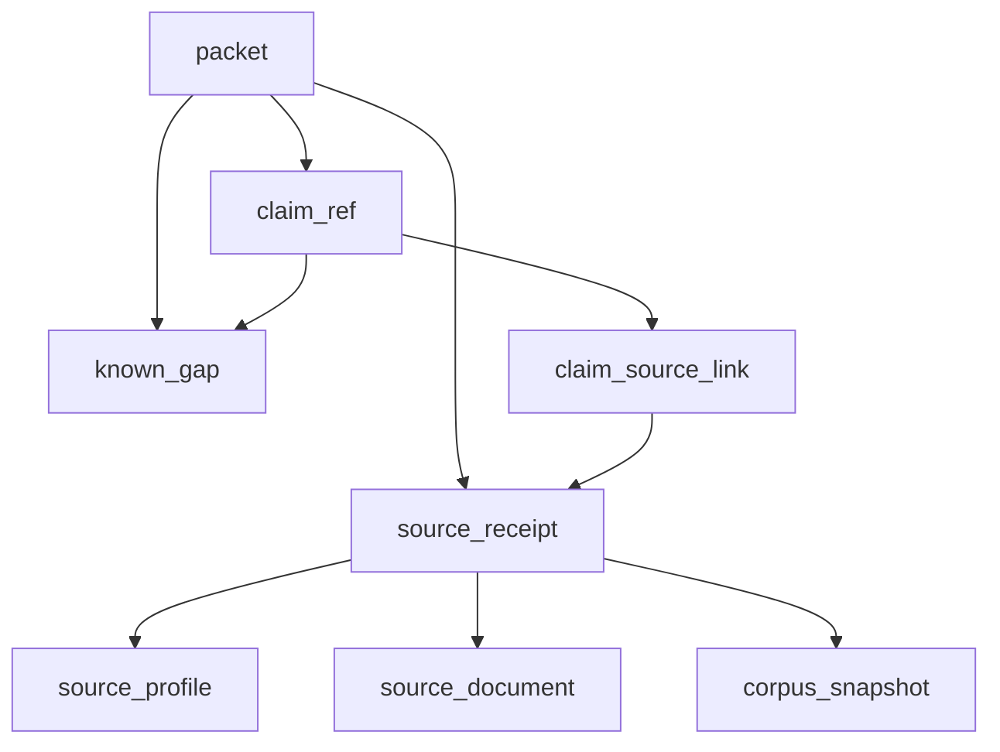

# Source receipt / claim graph details deep dive

Date: 2026-05-15  
担当: Source receipt / claim graph details  
Status: design deep dive only. 実装コードは触らない。  
Scope: `claim_ref`生成とdedupe、`claim -> source_receipt -> source_profile`グラフ、private CSV-derived claim namespace、no-hit receiptとpositive receiptの区別。

## 1. 結論

jpcite の価値は「AIが再利用できる主張」と「その主張を支える出典状態」を機械的に結べることにある。したがって、最小単位は文章ではなく `claim_ref`、出典単位はURLではなく `source_receipt`、出典の利用契約は `source_profile` として分離する。

設計上の最重要ルール:

1. `claim_ref` は、AIが回答へコピーまたは要約して再利用しうる最小 fact にだけ付ける。
2. `claim_ref` は deterministic ID で再生成可能にするが、private CSV-derived claim は public claim namespace と絶対に混ぜない。
3. `claim -> source_receipt` は N:M。1つのclaimが複数sourceで支えられることも、1つのreceiptが複数claimを支えることもある。
4. `source_receipt -> source_profile` は N:1。receiptは観測時点、profileは出典の契約・許可・更新ポリシー。
5. no-hit は「見つからなかったという検査結果」であり、positive receipt と同じ支持力を持たない。
6. private CSV-derived fact は tenant/private overlay 側の claim であり、public source foundation、public proof page、AI crawler向け公開面へ出してはいけない。

## 2. Canonical Vocabulary

| Term | Unit | Meaning | Persistent boundary |
|---|---|---|---|
| `claim_ref` | claim | AIが再利用できる最小主張 | public claim は public fact ledger、private claim は tenant/private overlay |
| `source_receipt` | observation/check | あるclaimに使った出典状態または検査結果 | public receipt は source ledger、private receipt は tenant-scoped packet/projection |
| `source_profile` | source contract | 出典の所有者、利用許諾、更新、引用ポリシー | public source registry |
| `source_document` | fetched object | 取得されたHTML/PDF/API payload等 | public source ledger。private CSV rawは保存禁止 |
| `claim_source_link` | edge | claim と receipt の多対多 link | public link table or packet-scoped link |
| `known_gap` | limitation | 支持不足、stale、no-hit、license制約等 | packet and audit surface |

## 3. `claim_ref` Generation

### 3.1 Claim granularity

`claim_ref` は「後続AIが1文、表セル、箇条書き、判断材料として再利用しうる単位」にする。表示文や段落全体にIDを付けない。

Good claim units:

| Claim example | Why valid |
|---|---|
| `program:abc` の `deadline` は `2026-06-30` | 単一subject、単一field、単一値 |
| `invoice:T123...` は `registered` | 登録状態という単一 fact |
| `company:101...` の所在地正規化値は `東京都...` | 法人単位の正規化 field |
| CSV profile の `row_count` は `653` | tenant private aggregate fact |
| CSV review fact に `future_date_count=2` | raw rowを出さない集計fact |

Bad claim units:

| Bad unit | Correct handling |
|---|---|
| 「この会社は安全」 | 禁止。複数factの判断であり、no-hitを安全に変換している |
| 「採択される可能性が高い」 | 禁止。予測・助言。similarityや条件一致factとして分解する |
| 「補助金Aはおすすめ」 | claimではなく artifact-level recommendation。根拠claimとは分離 |
| 「調査の結果、問題はなかった」 | no-hit receipt + known_gap に分解 |
| CSVの摘要・取引先・金額明細 | public/private問わず claim化しない。raw row再構成リスク |

### 3.2 Public claim ID formula

Public source fact の canonical ID:

```text
claim_id = "claim_" + sha256(
  namespace + "\x1f" +
  subject_kind + "\x1f" +
  subject_id + "\x1f" +
  field_name + "\x1f" +
  canonical_value_hash + "\x1f" +
  valid_time_scope + "\x1f" +
  corpus_snapshot_id
)[0:16]
```

Where:

| Field | Rule |
|---|---|
| `namespace` | `pub` for public source facts |
| `subject_kind` | stable enum: `company`, `program`, `invoice_registration`, `law`, `case`, `bid`, `statistic`, etc. |
| `subject_id` | canonical ID, not display name. Prefer houjin_bangou, invoice number, source-native ID |
| `field_name` | normalized field path, not UI label |
| `canonical_value_hash` | `sha256:` of canonicalized value, not raw excerpt |
| `valid_time_scope` | `as_of:YYYY-MM-DD`, `valid_from..valid_until`, or `unknown_time_scope` |
| `corpus_snapshot_id` | included so frozen packets remain reproducible |

Rationale:

- Including `canonical_value_hash` prevents different values for the same field from collapsing.
- Including `corpus_snapshot_id` makes packet replay/audit deterministic.
- Stable dedupe across snapshots is handled by `claim_stable_key`, not by reusing `claim_id`.

### 3.3 Stable key vs snapshot ID

Use two identifiers:

| ID | Formula | Use |
|---|---|---|
| `claim_stable_key` | hash of namespace + subject + field + canonical value + valid_time_scope | Cross-run dedupe and change detection |
| `claim_id` | stable key material + `corpus_snapshot_id` | Packet-local/audit reference |

Example:

```json
{
  "claim_id": "claim_6b2f1c5f2a4e9b10",
  "claim_stable_key": "csk_7b91c3c75f9610aa",
  "claim_kind": "public_source_fact",
  "subject_kind": "program",
  "subject_id": "program:jgrants:abc",
  "field_name": "deadline",
  "value_hash": "sha256:...",
  "value_display_policy": "normalized_fact_allowed",
  "valid_time_scope": "as_of:2026-05-15",
  "corpus_snapshot_id": "corpus-2026-05-15",
  "support_level": "direct",
  "source_receipt_ids": ["sr_8fd0d4b2960f4caa"],
  "visibility": "public"
}
```

## 4. Claim Dedupe Rules

### 4.1 Dedupe dimensions

Claims dedupe only when all semantic identity fields match:

```text
namespace
subject_kind
subject_id
field_name
canonical_value_hash
valid_time_scope
visibility class
```

Do not dedupe across:

- public and private namespaces
- different tenants
- different subject IDs, even if display names match
- different values
- different time scopes
- positive source claim and no-hit check claim
- source-backed fact and computed/recommendation summary

### 4.2 Dedupe within a packet

Within one packet:

1. Build `claim_stable_key`.
2. If duplicate keys appear, merge `source_receipt_ids[]`, `claim_paths[]`, `used_in[]`, and `known_gaps[]`.
3. Preserve the strongest `support_level` only if it is from a receipt that can legally support the field.
4. Preserve all weaker receipts in `source_receipt_ids[]` but do not upgrade the claim without a direct/derived support rule.
5. If values conflict, do not dedupe. Emit two claims and a `known_gap=source_conflict` or `numeric_unit_uncertain`.

Support precedence:

```text
direct > derived > weak > no_hit_not_absence
```

`no_hit_not_absence` never upgrades a substantive field claim. It can only support a `public_no_hit_check` claim such as "no matching row was found in checked corpus".

### 4.3 Dedupe across packets/snapshots

Across snapshots:

- Use `claim_stable_key` for "same claim value seen again".
- Use `claim_id` for "this exact packet/snapshot claim".
- If `claim_stable_key` is same but `source_receipt_ids` changed, record coverage change, not fact change.
- If subject + field same but `canonical_value_hash` changed, record fact change.
- If same display value but different normalized unit/date, do not dedupe until canonical value equivalence is proven.

### 4.4 Multi-source dedupe

When multiple receipts support the same claim:

```json
{
  "claim_id": "claim_...",
  "support_level": "direct",
  "source_receipt_ids": ["sr_jgrants_...", "sr_meti_pdf_..."],
  "support_summary": {
    "direct_count": 2,
    "weak_count": 0,
    "no_hit_count": 0,
    "freshest_verified_at": "2026-05-15T00:00:00Z",
    "stale_receipt_count": 0
  }
}
```

Rules:

- Multiple source receipts strengthen auditability, not truth guarantee.
- Conflicting receipts must not be hidden by majority vote.
- If one source is `license_boundary=metadata_only`, it can corroborate source discovery but cannot support the substantive claim as direct.

## 5. Claim Graph Structure

### 5.1 Canonical graph

```text
packet
  1:N claim_ref
  1:N source_receipt
  1:N known_gap

claim_ref
  N:M source_receipt via claim_source_link
  N:M known_gap via claim_gap_link
  N:1 subject entity or private aggregate subject

source_receipt
  N:1 source_profile
  N:0/1 source_document
  N:0/1 corpus_snapshot
  N:M claim_ref via claim_source_link

source_profile
  1:N source_document
  1:N source_receipt
```

Mermaid view:



### 5.2 Edge shape: `claim_source_link`

The edge is first-class because the same receipt may support different claims at different strengths.

```json
{
  "claim_id": "claim_...",
  "source_receipt_id": "sr_...",
  "support_level": "direct",
  "support_role": "primary",
  "field_supported": "deadline",
  "claim_path": "records[0].facts[2]",
  "used_in": ["sections[0].rows[3].deadline"],
  "evidence_span": {
    "source_document_id": "sd_...",
    "page_number": 2,
    "selector": null,
    "span_hash": "sha256:..."
  },
  "license_supports_claim": true,
  "created_at": "2026-05-15T00:00:00Z"
}
```

`support_role` enum:

| Value | Meaning |
|---|---|
| `primary` | claimの直接根拠 |
| `confirming` | 同じclaimを補強する別source |
| `context` | field自体ではなく背景・定義を支える |
| `negative_check` | no-hit check。不存在証明ではない |
| `freshness_check` | sourceの更新確認 |
| `identity_check` | subject同定を支える |

### 5.3 `source_receipt` to `source_profile`

`source_receipt` は観測結果。`source_profile` は出典の契約。receiptは必ず `source_id` で profile に接続する。

```json
{
  "source_receipt_id": "sr_8fd0d4b2960f4caa",
  "receipt_kind": "positive_source",
  "source_id": "jgrants_programs",
  "source_profile_ref": {
    "source_id": "jgrants_programs",
    "profile_version": "2026-05-15",
    "profile_hash": "sha256:..."
  },
  "source_document_id": "sd_...",
  "source_url": "https://...",
  "content_hash": "sha256:...",
  "corpus_snapshot_id": "corpus-2026-05-15",
  "license_boundary": "derived_fact",
  "freshness_bucket": "within_7d",
  "claim_refs": ["claim_..."]
}
```

Profile inheritance rules:

- `source_profile.license_boundary` is the default policy.
- `source_document.license_boundary` may be stricter for a specific document.
- `source_receipt.license_boundary` must be the strictest applicable boundary.
- A receipt cannot claim a more permissive boundary than its source profile.
- If profile is missing, emit `source_profile_missing` and do not mark claim audit-grade.

## 6. Positive Receipt

A positive receipt is a receipt that observed source material supporting a claim.

Required for audit-grade `positive_source`:

| Field | Requirement |
|---|---|
| `source_receipt_id` | deterministic or persisted ID |
| `receipt_kind` | `positive_source` |
| `source_id` | registered source profile ID |
| `source_url` | canonical URL or source-native API endpoint |
| `source_document_id` | when document/payload row exists |
| `source_fetched_at` or `last_verified_at` | at least one |
| `content_hash` or `source_checksum` | public integrity hash |
| `corpus_snapshot_id` | packet data point |
| `license_boundary` | strictest applicable enum |
| `freshness_bucket` | `within_7d`, `within_30d`, `within_90d`, `stale`, `unknown` |
| `verification_status` | normally `verified`, otherwise gap |
| `support_level` | `direct`, `derived`, or `weak` |
| `claim_refs[]` | claims supported by this receipt |

Positive receipt can support:

- factual public fields
- normalized values
- source freshness claims
- source identity claims
- derived facts when license permits derived fact exposure

Positive receipt cannot support:

- professional judgment
- guarantee of safety/eligibility/adoption
- claims outside its observed field
- raw excerpt exposure when `license_boundary` forbids it

## 7. No-hit Receipt

### 7.1 Definition

A no-hit receipt records that a specific query was run against specific checked sources and returned zero matching records. It is not proof of absence.

Canonical shape:

```json
{
  "source_receipt_id": "sr_nohit_2d0a79d11caa4baf",
  "receipt_kind": "no_hit_check",
  "source_kind": "invoice",
  "fact_visibility": "public_fact",
  "support_level": "no_hit_not_absence",
  "checked_sources": ["invoice_registrants", "houjin_master"],
  "checked_tables": ["invoice_registrants"],
  "query_fingerprint": "sha256:...",
  "query_subject": {
    "subject_kind": "invoice_registration",
    "subject_id_hash": "sha256:..."
  },
  "checked_at": "2026-05-15T00:00:00Z",
  "result_count": 0,
  "official_absence_proven": false,
  "corpus_snapshot_id": "corpus-2026-05-15",
  "verification_status": "no_hit",
  "claim_refs": ["claim_nohit_..."],
  "known_gaps": ["no_hit_not_absence"],
  "agent_instruction": "Say no matching record was found in the checked jpcite corpus. Do not say the record does not exist."
}
```

### 7.2 No-hit claim

No-hit can create only a `public_no_hit_check` claim:

```json
{
  "claim_id": "claim_nohit_a19499ce92d1180b",
  "claim_kind": "public_no_hit_check",
  "subject_kind": "invoice_registration",
  "subject_id": "invoice:T1234567890123",
  "field_name": "checked_corpus_match_count",
  "value_hash": "sha256:result_count=0;official_absence_proven=false",
  "support_level": "no_hit_not_absence",
  "source_receipt_ids": ["sr_nohit_2d0a79d11caa4baf"],
  "visibility": "public",
  "known_gaps": ["no_hit_not_absence"]
}
```

Allowed downstream wording:

- `jpciteの確認対象では一致するレコードを確認できませんでした`
- `確認対象、照合キー、確認時点は source_receipt を参照してください`
- `no-hitは不存在証明ではありません`

Forbidden downstream wording:

- `登録なし` as a definitive statement
- `行政処分なし`
- `問題なし`
- `安全`
- `反社なし`
- `リスクなし`
- `存在しない`

### 7.3 Difference from positive receipt

| Dimension | Positive receipt | No-hit receipt |
|---|---|---|
| `receipt_kind` | `positive_source` | `no_hit_check` |
| Observes | matching source material | zero matches for a query |
| Supports | factual field claim | checked-corpus no-match claim only |
| `support_level` | `direct`, `derived`, `weak` | `no_hit_not_absence` |
| Required gap | only if stale/incomplete/etc. | always `no_hit_not_absence` |
| Can say | "source says X" if license/freshness allow | "not found in checked corpus" |
| Cannot say | beyond observed fact | absence, safety, no risk |

## 8. Private CSV-derived Claim Namespace

### 8.1 Boundary

Private CSV-derived claim は、ユーザーが投入したCSVから作られる private overlay claim である。public source foundation に入れない。public `claim_` ID と混ぜない。公開 proof、SEO/GEO page、AI crawler向け sample に実データ由来の値・hash・件数が出てはいけない。

Allowed private CSV-derived claim kinds:

| `claim_kind` | Example | Persistence |
|---|---|---|
| `private_csv_profile_fact` | vendor family, row count, column count, date min/max | tenant-scoped aggregate only |
| `private_csv_aggregate_fact` | month-level count/amount bucket, account group count | tenant-scoped aggregate only, k-thresholded |
| `private_csv_review_fact` | future date count, parse error count, balance mismatch flag | tenant-scoped aggregate only |
| `computed_summary_fact` | non-judgment summary derived from allowed aggregates | packet-scoped or tenant-scoped |

Forbidden private CSV claim contents:

- raw row
- voucher ID
- memo/摘要 text
- counterparty name
- created_by / updated_by
- exact transaction amount tied to row or small group
- row-level date + amount + account combination that can reconstruct a transaction
- raw CSV bytes hash exposed publicly
- tenant-identifying file name
- customer-specific business plan/private note unless separately consented and tenant-scoped

### 8.2 Namespace and ID formula

Private CSV-derived claim IDs must use a separate prefix and tenant-scoped HMAC. Do not use plain SHA over private values where dictionary attacks are plausible.

Canonical private ID:

```text
private_claim_id = "pclaim_" + hmac_sha256(
  tenant_secret,
  namespace + "\x1f" +
  tenant_scope_hash + "\x1f" +
  intake_profile_id + "\x1f" +
  claim_kind + "\x1f" +
  aggregation_level + "\x1f" +
  field_name + "\x1f" +
  canonical_private_value_bucket_hash + "\x1f" +
  packet_or_retention_scope
)[0:20]
```

Where:

| Field | Rule |
|---|---|
| `namespace` | `tenant_csv` |
| `tenant_scope_hash` | HMAC or internal tenant id hash, never raw tenant id |
| `intake_profile_id` | private profile ID, not public |
| `aggregation_level` | `file`, `month`, `account`, `account_month`, `industry_signal`, etc. |
| `canonical_private_value_bucket_hash` | bucketed/suppressed value hash, not raw row value |
| `packet_or_retention_scope` | prevents unintended cross-retention reuse |

Private CSV-derived receipts use `psr_` or `sr_private_` prefix:

```text
private_source_receipt_id = "psr_" + hmac_sha256(tenant_secret, public_safe_receipt_projection)[0:20]
```

### 8.3 Visibility enum

Private CSV-derived claim must set one of:

| Visibility | Meaning | Public exposure |
|---|---|---|
| `tenant_private` | visible to authenticated tenant/request context | no |
| `ephemeral_only` | request memory only, not persisted | no |
| `redacted` | can show structure but not value | only redacted/synthetic |
| `private_aggregate_only` | aggregate fact after suppression | no public production exposure; synthetic examples only |

Never set private CSV-derived claim `visibility=public`.

### 8.4 Private CSV-derived receipt shape

```json
{
  "source_receipt_id": "psr_a78a8d2f48942ab90120",
  "receipt_kind": "private_csv_derived",
  "source_kind": "accounting_csv",
  "fact_visibility": "private_aggregate_only",
  "tenant_scope": "tenant_hmac:...",
  "intake_profile_id": "csvp_...",
  "source_file_profile_hash": "tenant_hmac:...",
  "source_url": null,
  "source_fetched_at": null,
  "last_verified_at": "2026-05-15T00:00:00Z",
  "content_hash": null,
  "source_checksum": "tenant_hmac:public_safe_projection",
  "license_boundary": "private_customer_data",
  "retrieval_method": "user_csv_derived",
  "support_level": "derived",
  "verification_status": "inferred",
  "claim_refs": ["pclaim_..."],
  "privacy_posture": {
    "raw_bytes_persisted": false,
    "row_level_records_persisted": false,
    "free_text_values_persisted": false,
    "counterparty_values_persisted": false,
    "small_cell_suppression_k": 3
  }
}
```

### 8.5 Public ban list

The following must not appear in public docs, public examples, crawler-facing pages, shared proof pages, or public source foundation exports when derived from real private CSV:

| Data | Reason |
|---|---|
| raw CSV content | private customer data |
| row-level normalized journal rows | transaction reconstruction risk |
| exact transaction amount/date/account tuple | re-identification risk |
| memo/counterparty/free text | PII/business secret risk |
| raw file hash | dictionary/leak correlation risk |
| tenant-scoped HMAC values | internal correlation artifact |
| private `pclaim_` IDs from production | can reveal retention/existence |
| private source receipt IDs from production | can reveal customer processing |
| rare account labels if customer-specific | business secret risk |

Public examples may include synthetic CSV packets only when:

- all values are generated fixtures;
- `fact_visibility=private_aggregate_only` is shown as a shape example;
- IDs are clearly synthetic;
- no production hash, tenant hash, file name, or count is reused.

## 9. Claim Kinds and Support Matrix

| Claim kind | Allowed receipt kind | Public? | Support level | Notes |
|---|---|---:|---|---|
| `public_source_fact` | `positive_source` | yes | `direct`, `derived`, `weak` | requires source profile/license |
| `public_no_hit_check` | `no_hit_check` | yes | `no_hit_not_absence` | always paired with known gap |
| `private_csv_profile_fact` | `private_csv_derived` | no | `derived` | tenant/private only |
| `private_csv_aggregate_fact` | `private_csv_derived` | no | `derived` | suppression required |
| `private_csv_review_fact` | `private_csv_derived` | no | `derived` | data quality, not accounting judgment |
| `computed_summary_fact` | `computed` or source-backed inputs | depends | `derived` or `weak` | must link to input claims |

Invalid combinations:

- `public_source_fact` supported only by `no_hit_check`
- `public_source_fact` supported by `private_csv_derived`
- private CSV-derived claim with `visibility=public`
- `positive_source` receipt with `license_boundary=link_only` and `support_level=direct`
- no-hit receipt without `known_gap=no_hit_not_absence`
- claim with `support_level=direct` and empty `source_receipt_ids[]`

## 10. Agent-facing Contract

Every packet that exposes claims should let an AI answer these questions without guessing:

1. What exact claim may I reuse?
2. Which receipt supports it?
3. Which source profile governs that receipt?
4. Is the source fresh enough?
5. Does the license allow the value/excerpt to be exposed?
6. Is this positive evidence, no-hit, private-derived, or computed?
7. Which gaps must I mention?
8. Is the claim public, tenant-private, ephemeral, or redacted?

Minimal packet-level shape:

```json
{
  "claims": [
    {
      "claim_id": "claim_...",
      "claim_kind": "public_source_fact",
      "subject_kind": "program",
      "subject_id": "program:jgrants:abc",
      "field_name": "deadline",
      "value_hash": "sha256:...",
      "value_display_policy": "normalized_fact_allowed",
      "support_level": "direct",
      "source_receipt_ids": ["sr_..."],
      "visibility": "public",
      "known_gaps": []
    }
  ],
  "source_receipts": [
    {
      "source_receipt_id": "sr_...",
      "receipt_kind": "positive_source",
      "source_id": "jgrants_programs",
      "source_profile_ref": {
        "source_id": "jgrants_programs",
        "profile_hash": "sha256:..."
      },
      "source_url": "https://...",
      "source_checksum": "sha256:...",
      "freshness_bucket": "within_7d",
      "license_boundary": "derived_fact",
      "claim_refs": ["claim_..."]
    }
  ],
  "known_gaps": []
}
```

## 11. Validation Rules

### 11.1 Hard fail for packet generation

Fail or downgrade to `known_gaps` when:

- supported public claim has no receipt;
- receipt has no source profile;
- `license_boundary=no_collect`;
- private CSV-derived claim is marked public;
- private raw/row/free-text appears in public projection;
- no-hit receipt is converted to absence/safety claim;
- direct support is claimed from metadata-only/link-only source;
- subject identity is ambiguous and claim is not scoped to the candidate entity.

### 11.2 Downgrade to review material

Emit claim but downgrade confidence / add gap when:

- source is stale;
- receipt lacks content hash;
- source profile license is unknown/review required;
- extraction is inferred rather than verified;
- multiple sources conflict;
- numeric unit or period is uncertain;
- private aggregate is below suppression threshold.

### 11.3 Metrics

Track these metrics per packet and per endpoint:

| Metric | Target direction |
|---|---|
| `claim_count` | context |
| `supported_claim_count` | high |
| `unsupported_claim_count` | zero |
| `claim_receipt_link_count` | context |
| `positive_receipt_count` | context |
| `no_hit_receipt_count` | context with gap |
| `private_claim_count` | never public |
| `public_private_namespace_mixing_count` | zero |
| `source_profile_missing_count` | zero |
| `license_blocked_claim_count` | zero |
| `stale_claim_count` | visible with gaps |
| `receipt_dedupe_merge_count` | context |

## 12. Implementation Notes for Later

No implementation is applied in this turn, but the later implementation should keep these seams:

1. `claim_ref` builder should be independent from packet rendering.
2. `source_receipt` builder should accept source document/profile rows and return a public-safe projection.
3. `claim_source_link` should be created before response rendering so `used_in[]` and `claim_paths[]` are consistent.
4. Private CSV processing should use a separate builder and tenant-scoped HMAC service.
5. Public proof fixtures should use synthetic private CSV examples only.
6. Tests should assert that no `pclaim_`, `psr_`, tenant HMAC, raw CSV hash, memo, counterparty, or row value leaks to public surfaces.

## 13. Open Decisions

| Decision | Recommendation |
|---|---|
| `claim_id` includes `corpus_snapshot_id` or not | Include it; add `claim_stable_key` for cross-snapshot dedupe |
| Use `claim_` for private claims | No. Use `pclaim_` to make leaks grep-detectable |
| Treat no-hit as a source receipt | Yes, but `receipt_kind=no_hit_check` and `support_level=no_hit_not_absence` |
| Allow metadata-only source to support fact | No. It can support discovery/freshness only |
| Store private normalized rows | No. Transient memory only |
| Public examples from real customer CSV | No. Synthetic fixtures only |

## 14. Acceptance Checklist

- [ ] Every AI-facing factual claim has `claim_id`, `claim_kind`, `visibility`, and `source_receipt_ids[]`.
- [ ] Every public supported claim links to at least one non-private `source_receipt`.
- [ ] Every receipt links to `source_profile_ref` or emits `source_profile_missing`.
- [ ] No-hit receipt always includes `official_absence_proven=false` unless a future source has formal absence proof semantics.
- [ ] No-hit claim text is constrained to "not found in checked corpus".
- [ ] Private CSV-derived claims use `pclaim_` and never `claim_`.
- [ ] Private CSV-derived receipts use tenant-scoped HMAC and never public SHA over raw private bytes.
- [ ] Public surfaces block production private CSV IDs, hashes, raw rows, memo, counterparty, and row-level amounts.
- [ ] Dedupe merges receipts, paths, and gaps without hiding conflicts.
- [ ] License boundary can only become stricter from profile to document to receipt.

